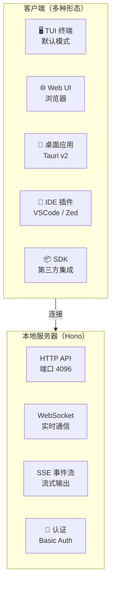
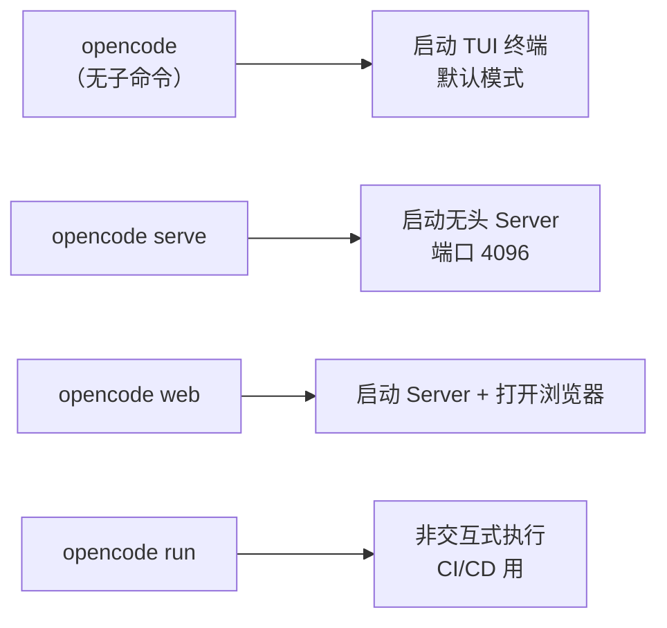
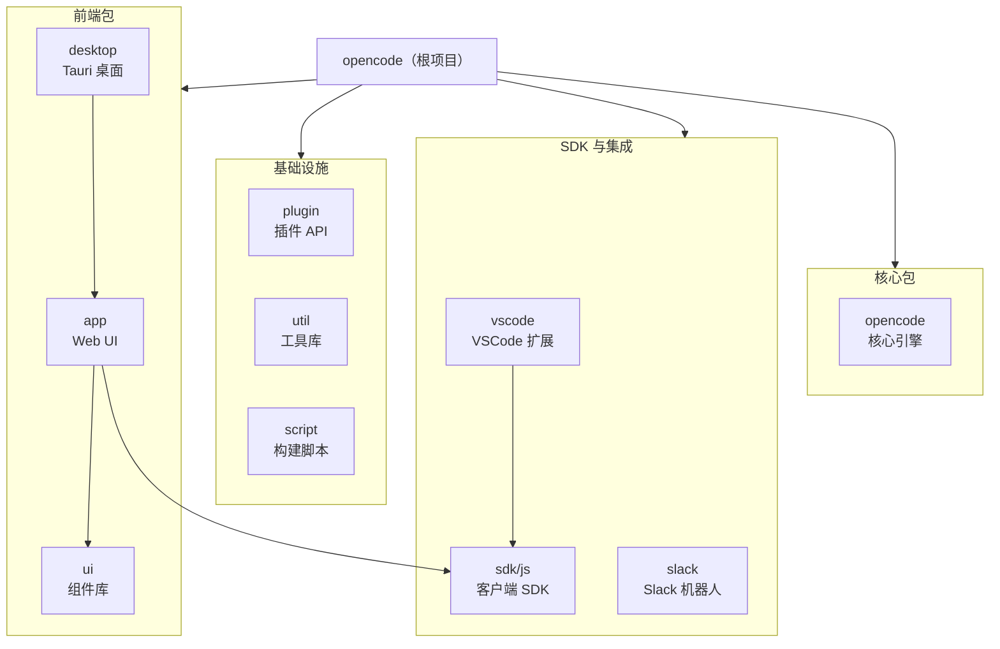
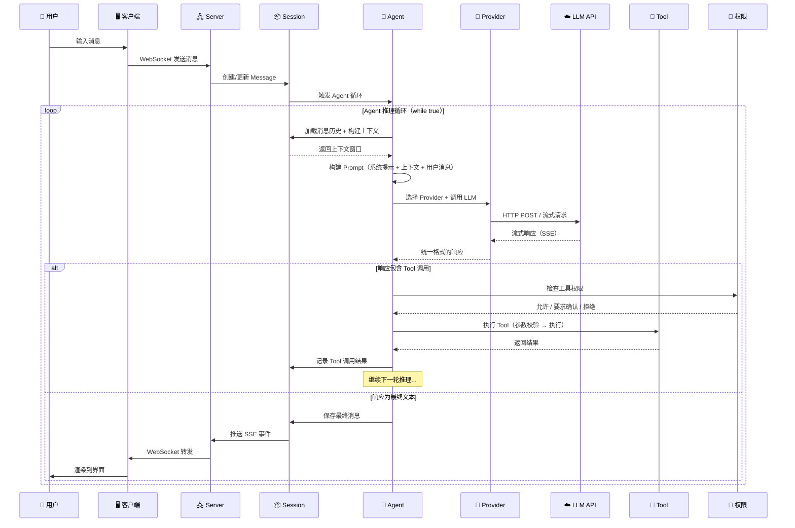

# 00 · 源码学习路线图与架构总览

> 这是阅读整套指南的起点。读完本文后，你将理解 OpenCode 的整体架构和"一条消息的完整旅程"。

**源码版本**: v1.3.17 | **核心包**: `packages/opencode` | **语言**: TypeScript 57.8%

---

## 1. C/S 架构详解

OpenCode 采用 **客户端/服务器架构**，这是理解整个系统的第一步。

### 关键设计点

| 设计 | 说明 |
|------|------|
| **本地运行** | Server 运行在开发者本机（不是云端），端口默认 4096 |
| **多客户端** | TUI、Web、桌面、IDE 插件都是客户端，共享同一个 Server |
| **WebSocket** | 客户端通过 WebSocket 与 Server 保持长连接，接收实时事件 |
| **SSE 事件流** | AI 响应通过 Server-Sent Events 流式推送给客户端 |
| **嵌入式 UI** | Server 内嵌编译好的 Web UI，无需额外部署前端服务 |
| **mDNS 发现** | 通过 Bonjour 实现局域网内的服务发现 |

### 启动模式

> **Java 类比**：这和 Spring Boot 应用非常像 — Server 就是一个嵌入式 Web 服务器（类似 Tomcat），客户端就像前端 SPA 或 REST Client。

---

## 2. Monorepo 包结构

OpenCode 使用 Turborepo 管理 18+ 个子包，类似 Java 的多模块 Maven 项目。

### 关键子包说明

| 包名 | 路径 | 职责 | Java 类比 |
|------|------|------|-----------|
| `opencode` | `packages/opencode` | 核心引擎：CLI、Server、Agent、Provider、Tool、Session | 主应用模块 |
| `@opencode-ai/app` | `packages/app` | Web 前端：SolidJS SPA | 前端 WAR 包 |
| `@opencode-ai/sdk` | `packages/sdk/js` | 客户端 SDK | Feign Client / RestTemplate |
| `@opencode-ai/ui` | `packages/ui` | 共享 UI 组件库 | 公共组件模块 |
| `@opencode-ai/plugin` | `packages/plugin` | 插件 API 定义 | SPI 接口 |
| `@opencode-ai/desktop` | `packages/desktop` | Tauri 桌面应用 | JavaFX 打包 |

---

## 3. 核心模块一览

`packages/opencode/src/` 下有 **44 个功能模块**，以下是按职责分类的全景图：

### 引擎核心

| 模块 | 目录 | 职责 | Java 类比 |
|------|------|------|-----------|
| Agent | `agent/` | AI Agent 定义、执行循环、Prompt 构建 | Controller + Service |
| Provider | `provider/` | 多 LLM 提供商适配（25+） | Strategy 模式 + Adapter |
| Tool | `tool/` | 工具定义、注册、执行（18 个内置） | SPI + Plugin |
| Session | `session/` | 会话管理、消息处理、上下文构建 | HttpSession |
| Permission | `permission/` | 基于规则的权限引擎 | Spring Security |

### 服务层

| 模块 | 目录 | 职责 |
|------|------|------|
| Server | `server/` | HTTP/WebSocket 服务器（Hono） |
| Bus | `bus/` | 类型化事件总线（发布/订阅） |
| Storage | `storage/` | Drizzle ORM + SQLite 持久化 |
| Config | `config/` | 配置加载与验证 |
| Plugin | `plugin/` | 插件加载与生命周期管理 |

### 集成层

| 模块 | 目录 | 职责 |
|------|------|------|
| LSP | `lsp/` | Language Server Protocol 集成 |
| MCP | `mcp/` | Model Context Protocol 集成 |
| ACP | `acp/` | Agent Client Protocol |
| Skill | `skill/` | 技能系统 |

### 基础设施

| 模块 | 目录 | 职责 |
|------|------|------|
| Effect | `effect/` | Effect TS 运行时封装 |
| CLI | `cli/` | 命令行界面 + TUI |
| Shell | `shell/` | Shell 命令执行 |
| PTY | `pty/` | 伪终端（node-pty / bun-pty） |
| Git | `git/` | Git 操作 |
| File | `file/` | 文件读写操作 |
| Snapshot | `snapshot/` | 文件快照与 diff |
| Format | `format/` | 代码格式化 |
| Worktree | `worktree/` | Git worktree 管理 |
| ID | `id/` | ULID ID 生成器 |
| Flag | `flag/` | 功能开关 |

---

## 4. 一条消息的完整旅程

这是理解 OpenCode 的核心主线。以下时序图展示了从用户输入到最终输出的完整过程：

### 旅程拆解

| 阶段 | 发生了什么 | 对应文档 |
|------|-----------|----------|
| **① 输入** | 用户在终端输入消息，客户端通过 WebSocket 发送到 Server | [Part 1: CLI 启动](part-1-输入阶段/01-CLI入口与启动流程.md) |
| **② 上下文** | Session 加载历史消息，构建上下文窗口（含截断/压缩） | [Part 1: Session](part-1-输入阶段/02-Session与上下文构建.md) |
| **③ Prompt** | Agent 根据类型（build/plan/general）组装系统提示 + 上下文 | [Part 2: Agent](part-2-推理阶段/03-Agent系统与Prompt构建.md) |
| **④ 推理** | Provider 适配层将请求发送到选定的 LLM API | [Part 2: Provider](part-2-推理阶段/04-Provider适配与API调用.md) |
| **⑤ 执行** | 如果 LLM 要求调用工具，权限检查后执行 | [Part 3: Tool](part-3-执行阶段/05-Tool系统详解.md) |
| **⑥ 输出** | 最终响应通过 SSE 流式推送到客户端渲染 | [Part 4: TUI](part-4-输出阶段/08-响应渲染与TUI界面.md) |
| **⑦ 扩展** | 插件、MCP、自定义 Provider 扩展能力 | [Part 5: 扩展](part-5-扩展阶段/10-插件系统与二次开发.md) |

---

## 5. 技术栈与 Java 生态类比速查

| 概念 | OpenCode (TS) | Java 生态 | 关键差异 |
|------|---------------|-----------|----------|
| 运行时 | Bun | JVM | Bun 更轻量，启动更快，原生支持 TS |
| 包管理 | Bun workspaces | Maven modules | 类似多模块项目 |
| 构建 | Turborepo | Maven/Gradle | 任务编排 + 增量构建 |
| Web 框架 | Hono | Spring Boot / Javalin | 更轻量，中间件模式 |
| 依赖注入 | Effect Layer | Spring IoC | 函数式管道组合，非反射 |
| 异步编程 | Effect / async-await | CompletableFuture | Effect 更强大，内置错误处理 |
| Schema 验证 | Zod | Bean Validation | 编译期类型推断，非注解驱动 |
| ORM | Drizzle ORM | MyBatis-Plus / JPA | SQL-first，类型安全 |
| 数据库 | SQLite | H2 / Derby | 内嵌式，零配置 |
| 前端框架 | SolidJS | React（概念类似） | 更细粒度的响应式 |
| 终端 UI | OpenTUI | — | 基于 SolidJS 的终端渲染 |
| AI SDK | Vercel AI SDK | — | 统一 20+ LLM 的调用接口 |
| 配置 | opencode.json | application.yml | JSON 格式 |
| CLI 框架 | yargs | Picocli / JCommander | 参数解析 + 子命令 |
| ID 生成 | ULID | UUID / Snowflake | 时间有序 |
| 事件总线 | Effect PubSub | Spring ApplicationEvent | 类型化，支持通配符 |
| 插件系统 | @opencode-ai/plugin | Java SPI | 更灵活，支持 Hook/Tool/Provider |

---

## 下一步

现在你已经建立了全局认知，按以下顺序深入阅读：

1. 📥 [CLI 入口与启动流程](part-1-输入阶段/01-CLI入口与启动流程.md) — 理解程序如何启动
2. 📥 [Session 与上下文构建](part-1-输入阶段/02-Session与上下文构建.md) — 理解消息如何管理
3. 🤖 [Agent 系统与 Prompt 构建](part-2-推理阶段/03-Agent系统与Prompt构建.md) — **核心中的核心**
