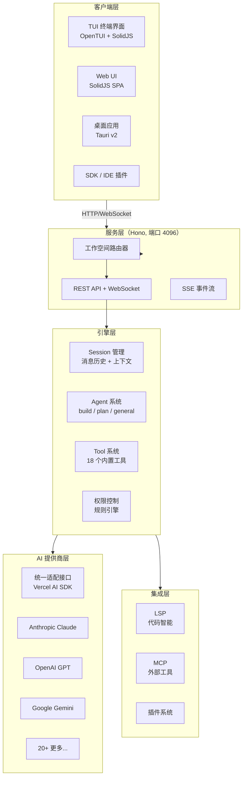
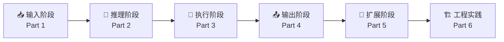

# OpenCode 源码学习指南

> **面向 Java 开发者的 OpenCode v1.3.17 源码深度学习路线**
> 不看源码也能理解每个模块的运转机制 — 图表优先，伪代码驱动

---

## OpenCode 是什么

OpenCode 是一个 **100% 开源的 AI 编码代理**（对标 Claude Code），提供提供商无关的多模型支持和终端优先的 TUI 体验。GitHub 139k Star，采用 TypeScript + Bun 运行时构建。

**一句话理解**：想象一个用 TypeScript 写的、支持 20+ AI 模型的、可以在终端和浏览器中运行的智能编程助手。

---

## 技术栈速览

| 类别 | 技术 | Java 类比 |
|------|------|-----------|
| 运行时 | Bun | JVM |
| 语言 | TypeScript 5.8 | Java |
| 效果系统 | Effect 4.0 | RxJava / Vavr |
| Schema 验证 | Zod 4 | Bean Validation |
| ORM | Drizzle ORM | MyBatis-Plus |
| Web 框架 | Hono | Spring Boot |
| 前端框架 | SolidJS | React（类似） |
| 终端 UI | OpenTUI | — |
| AI SDK | Vercel AI SDK 6 | — |
| 构建工具 | Turborepo | Maven/Gradle |
| 桌面应用 | Tauri v2 | Electron |

---

## 整体架构

---

## 学习路径

以 **"一条消息的完整旅程"** 为主线，从输入到输出逐步深入：

**建议阅读顺序**：
1. 先读 **00 架构总览** 建立全局认知
2. 按 Part 1 → 6 顺序阅读，理解完整请求链路
3. 遇到不熟悉的 TS 语法时查阅 **附录 A**
4. 想深入某个模块时，点击文档中的 **📦 源码锚点** 进入源码

---

## 文档索引

### Part 1 — 输入阶段：消息从哪里来

| # | 文档 | 一句话简介 |
|---|------|-----------|
| 01 | [CLI 入口与启动流程](part-1-输入阶段/01-CLI入口与启动流程.md) | 从命令行输入到 Server 就绪的完整启动链路 |

| 02 | [Session 与上下文构建](part-1-输入阶段/02-Session与上下文构建.md) | 消息历史管理、上下文窗口构建、数据持久化 |

### Part 2 — 推理阶段：Agent 如何思考

| # | 文档 | 一句话简介 |
|---|------|-----------|
| 03 | [Agent 系统与 Prompt 构建](part-2-推理阶段/03-Agent系统与Prompt构建.md) | build/plan/general 三种 Agent 的推理循环与 Prompt 组装 |
| 04 | [Provider 适配与 API 调用](part-2-推理阶段/04-Provider适配与API调用.md) | 统一适配 20+ AI 提供商的抽象设计与流式响应 |

### Part 3 — 执行阶段：Agent 如何行动

| # | 文档 | 一句话简介 |
|---|------|-----------|
| 05 | [Tool 系统详解](part-3-执行阶段/05-Tool系统详解.md) | 18 个内置工具的注册、校验、调用机制 |
| 06 | [文件操作与 Shell 执行](part-3-执行阶段/06-文件操作与Shell执行.md) | 虚拟文件系统、PTY 伪终端、安全沙箱 |
| 07 | [LSP 集成](part-3-执行阶段/07-LSP集成.md) | 语言服务器协议集成，为 Agent 提供代码智能 |

### Part 4 — 输出阶段：结果如何呈现

| # | 文档 | 一句话简介 |
|---|------|-----------|
| 08 | [响应渲染与 TUI 界面](part-4-输出阶段/08-响应渲染与TUI界面.md) | 从 LLM 流式输出到终端绘制的完整渲染链路 |
| 09 | [权限控制与安全模型](part-4-输出阶段/09-权限控制与安全模型.md) | 基于规则的权限引擎，保护系统安全 |

### Part 5 — 扩展阶段：如何扩展能力

| # | 文档 | 一句话简介 |
|---|------|-----------|
| 10 | [插件系统与二次开发](part-5-扩展阶段/10-插件系统与二次开发.md) | 插件架构、生命周期、开发入门 |
| 11 | [MCP 协议集成](part-5-扩展阶段/11-MCP协议集成.md) | Model Context Protocol，连接外部工具 |
| 12 | [自定义 Provider 开发](part-5-扩展阶段/12-自定义Provider开发.md) | 如何为 OpenCode 添加新的 AI 提供商 |

### Part 6 — 工程实践：怎么做到的

| # | 文档 | 一句话简介 |
|---|------|-----------|
| 13 | [Effect 框架实战指南](part-6-工程实践/13-Effect框架实战指南.md) | TypeScript 函数式编程框架的核心用法 |
| 14 | [构建系统与 Monorepo](part-6-工程实践/14-构建系统与Monorepo.md) | Bun + Turborepo 管理 18 个子包的工程化实践 |
| 15 | [存储与数据模型](part-6-工程实践/15-存储与数据模型.md) | Drizzle ORM + SQLite 的数据持久化方案 |

### 附录

| 附录 | 文档 | 用途 |
|------|------|------|
| A | [Java 开发者 TS 速查](appendix/A-Java开发者TS速查.md) | TS 语法与 Java 的快速对照 |
| B | [设计模式总结](appendix/B-设计模式总结.md) | OpenCode 使用的架构设计模式索引 |
| C | [核心 API 参考索引](appendix/C-核心API参考索引.md) | 核心模块 API 与配置速查 |

---

## 给 Java 开发者的阅读提示

1. **TypeScript 不是 Java**：TS 有类型推断、联合类型、可选链等 Java 没有的特性，遇到不懂的语法先查 [附录 A](appendix/A-Java开发者TS速查.md)
2. **Effect ≠ Spring**：Effect 是函数式编程框架，不是依赖注入容器，用"管道组合"思维而非"对象装配"思维来理解
3. **不要逐行读源码**：每篇文档的伪代码已提取核心逻辑，源码锚点用于深入探索时参考
4. **从架构图开始**：先理解模块间的关系，再深入单个模块的实现
5. **运行起来试试**：`bun dev` 启动 TUI，亲自体验后再看源码会更有感觉
