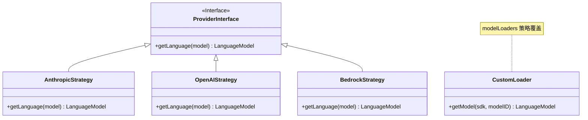
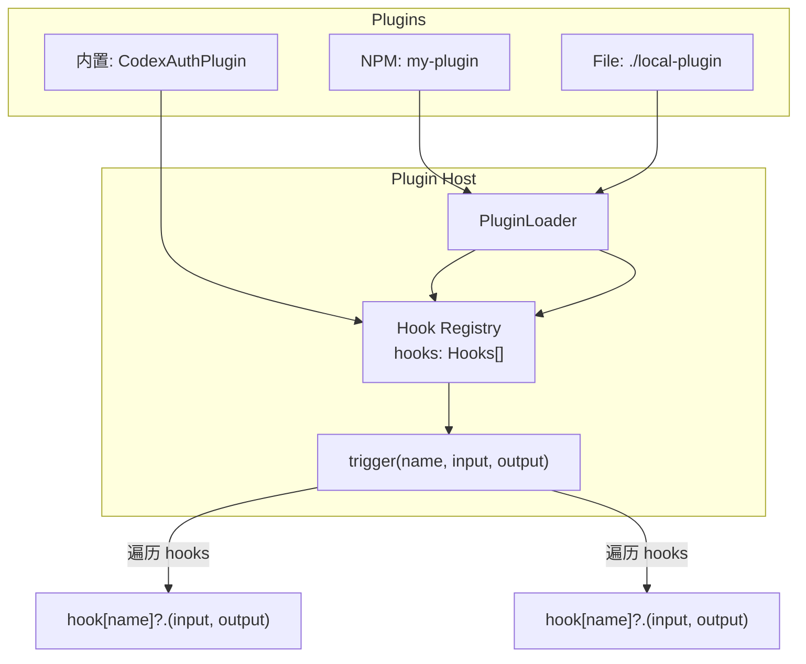
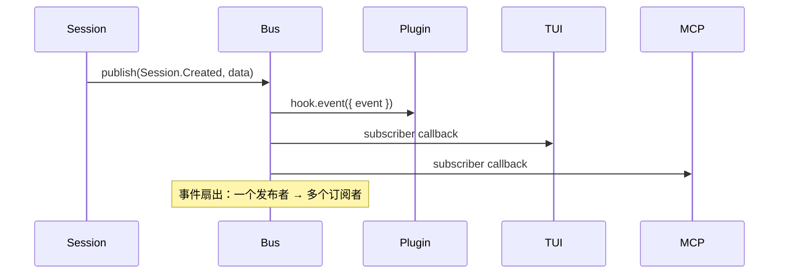
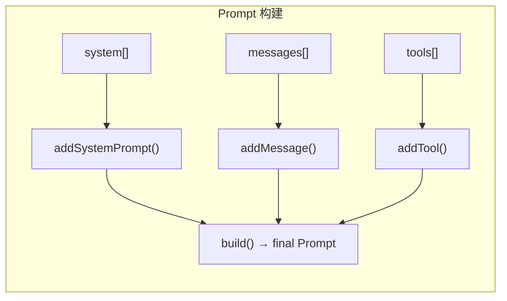
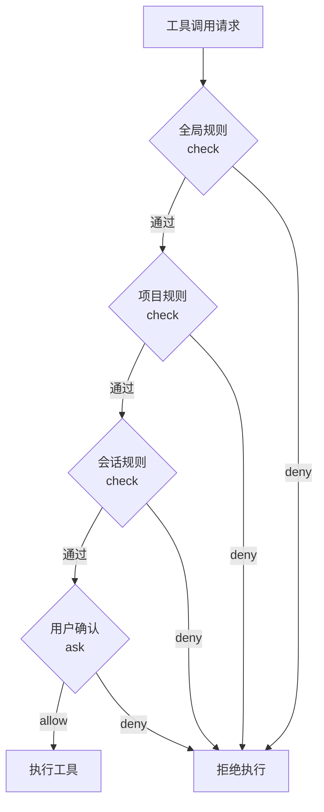
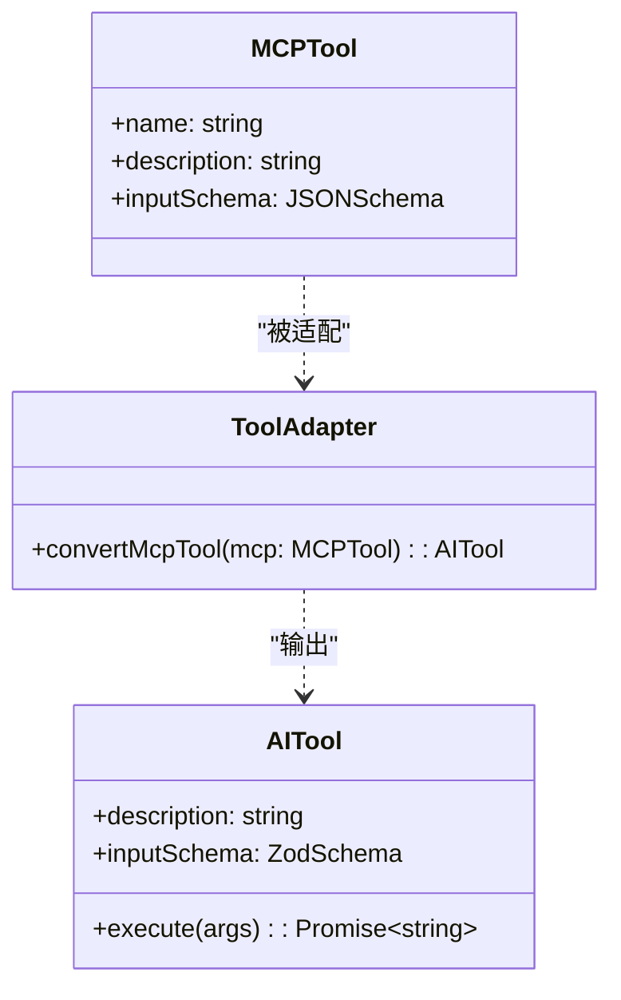
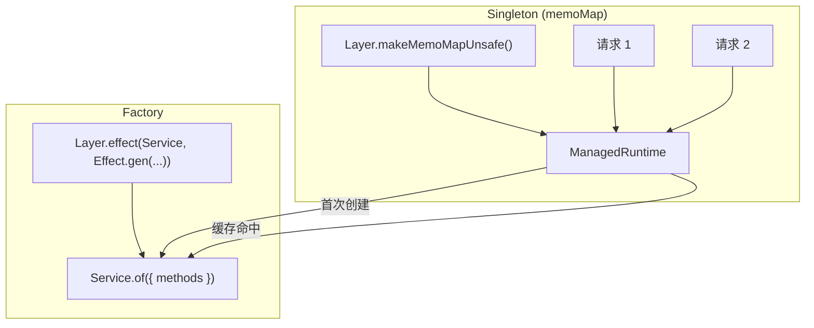

# B - 设计模式总结

> OpenCode v1.3.17 · 源码学习 · 附录
> 手机可读 · GitHub 原生渲染

---

## 一、OpenCode 设计模式清单

| 模式 | 使用位置 | 简要说明 |
|------|---------|---------|
| **Strategy** | `Provider` | 多种 LLM Provider 可互换 |
| **Plugin** | `Plugin` 系统 | 运行时加载外部扩展 |
| **Observer** | `Bus` 事件总线 | 发布-订阅事件通信 |
| **Builder** | `Prompt` 构建 | 链式构建复杂提示词 |
| **Chain of Responsibility** | `Permission` | 权限检查链 |
| **Factory** | `Effect Layer` | 服务实例创建 |
| **Singleton** | `Effect.cached` | 全局单例服务 |
| **Adapter** | `MCP` 集成 | MCP Tool → AI SDK Tool |
| **Facade** | `Database.use()` | 统一数据库访问接口 |
| **Template Method** | `custom(dep)` | Provider 特殊处理模板 |
| **Registry** | `BUNDLED_PROVIDERS` | SDK 实例注册表 |
| **Decorator** | `Plugin Hook` | 运行时增强行为 |
| **Mediator** | `Bus` | 组件间解耦通信 |
| **Proxy** | `Auth Hook loader` | 拦截/修改 Provider 认证 |

---

## 二、重点模式详解

### 2.1 Strategy（策略模式）

**场景**：Provider 系统中，不同的 LLM 提供商使用不同的 API 调用策略。



**核心逻辑**：
```typescript
// modelLoaders 是策略映射表
type CustomModelLoader = (sdk, modelID, options) => Promise<LanguageModel>

// 不同 Provider 有不同的加载策略
const strategies: Record<string, CustomLoader> = {
  "openai": async (sdk, modelID) => sdk.responses(modelID),
  "github-copilot": async (sdk, modelID) =>
    useLanguageModel(sdk) ? sdk.languageModel(modelID) : sdk.responses(modelID),
  "amazon-bedrock": async (sdk, modelID) => sdk.languageModel(addRegionPrefix(modelID)),
}
```

> 💡 **GoF 对比**：标准 Strategy 模式使用接口 + 实现类。OpenCode 使用 `Record<string, Function>` 作为策略注册表，更轻量。

---

### 2.2 Plugin（插件模式）

**场景**：运行时动态加载扩展，注册 Hook/Tool/Auth。



**核心逻辑**：
```typescript
// 顺序触发所有注册的 Hook（保证确定性）
const trigger = (name, input, output) => {
  for (const hook of state.hooks) {
    const fn = hook[name]
    if (!fn) continue
    await fn(input, output)
  }
  return output  // 每个 Hook 都可以修改 output
}
```

> 💡 **GoF 对比**：标准 Plugin 模式有明确的生命周期（install → activate → deactivate）。OpenCode 简化为 load → register → trigger。

---

### 2.3 Observer（观察者模式）

**场景**：Bus 事件总线实现组件间解耦通信。



**核心逻辑**：
```typescript
// 发布事件（扇出）
bus.publish(EventName, payload) → 所有订阅者收到

// 订阅事件
bus.subscribeAll() → 收到所有事件

// 插件订阅
bus.subscribeAll().pipe(
  Stream.runForEach((event) => {
    for (const hook of hooks) {
      hook.event?.({ event })  // 转发给插件
    }
  })
)
```

> 💡 **GoF 对比**：标准 Observer 有 Subject + Observer 接口。OpenCode 的 Bus 更像 RxJava 的 `PublishSubject`——支持类型化事件和 Effect Stream。

---

### 2.4 Builder（构建者模式）

**场景**：Prompt 构建、MCP 连接配置。



**核心逻辑**：
```typescript
// Effect.gen 本身就是一种 Builder 模式
const prompt = Effect.gen(function* () {
  const system = yield* buildSystemPrompt(config)
  const messages = yield* buildMessages(session)
  const tools = yield* getTools(session)
  return { system, messages, tools }
})
```

> 💡 **GoF 对比**：OpenCode 使用 `Effect.gen()` 替代传统 Builder 类。`yield*` 类似 Builder 的 `.withXxx()` 方法链。

---

### 2.5 Chain of Responsibility（责任链模式）

**场景**：Permission 权限检查链。



**核心逻辑**：
```typescript
// 权限 Hook — 插件可以拦截和修改权限决策
"permission.ask": async (input: Permission, output: { status: "ask" | "deny" | "allow" }) => {
  // 插件可以:
  // 1. output.status = "allow"  // 自动允许
  // 2. output.status = "deny"   // 自动拒绝
  // 3. 不修改                  // 继续默认流程
}
```

> 💡 **GoF 对比**：标准 CoR 有明确的 Handler 链。OpenCode 的权限链通过 Hook 的 `permission.ask` 实现隐式责任链。

---

### 2.6 Adapter（适配器模式）

**场景**：MCP Tool → AI SDK Tool 转换。



**核心逻辑**：
```typescript
function convertMcpTool(mcpTool: MCPToolDef, client: MCPClient): Tool {
  return dynamicTool({
    description: mcpTool.description,
    inputSchema: jsonSchema(mcpTool.inputSchema),  // JSON Schema → AI SDK Schema
    execute: async (args) => {
      return client.callTool({ name: mcpTool.name, arguments: args })
    },
  })
}
```

---

### 2.7 Factory + Singleton（工厂 + 单例模式）

**场景**：Effect Layer 组装服务实例。



**核心逻辑**：
```typescript
// Layer = 工厂（创建服务实例）
// memoMap = 单例（保证全局唯一）
const memoMap = Layer.makeMemoMapUnsafe()
const rt = ManagedRuntime.make(layer, { memoMap })

// 每次 runPromise 都复用同一个服务实例
rt.runPromise(svc => svc.method())
```

---

## 三、与 GoF 模式对比

| GoF 模式 | OpenCode 实现 | 差异 |
|---------|-------------|------|
| Abstract Factory | Effect Layer | 使用函数组合代替类继承 |
| Builder | Effect.gen / Zod Schema | 使用 `yield*` 代替方法链 |
| Factory Method | `BUNDLED_PROVIDERS` 注册表 | 使用 Record 代替 switch |
| Prototype | ModelsDev 模型克隆 | 使用 JSON 深拷贝 |
| Singleton | Effect.cached / memoMap | 使用缓存代替私有构造器 |
| Adapter | MCP Tool 转换 | 使用函数包装代替类适配 |
| Bridge | Provider ↔ SDK 解耦 | 使用配置驱动代替继承 |
| Composite | Message → Part 树 | 使用 JSON 嵌套 |
| Decorator | Plugin Hook | 使用函数组合代替装饰器类 |
| Facade | Database.use() | 使用 Effect Context 代替 |
| Flyweight | SDK 实例缓存 | 使用 Map 键值缓存 |
| Chain of Resp. | Permission 检查 | 使用 Hook 拦截代替链 |
| Observer | Bus 事件总线 | 使用 Effect Stream |
| Strategy | Provider 策略 | 使用 Record 映射代替接口 |
| Template Method | custom(dep) | 使用函数参数化代替继承 |
| Visitor | N/A | 未使用 |
| Mediator | Bus | 统一事件分发 |
| Memento | Session.revert | JSON 快照回滚 |
