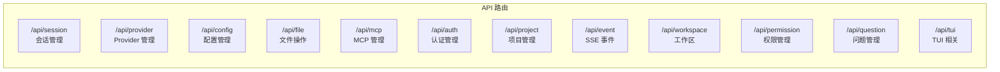
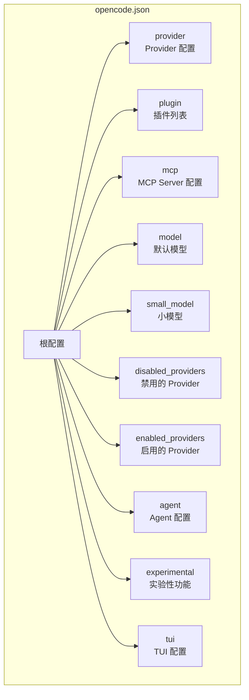
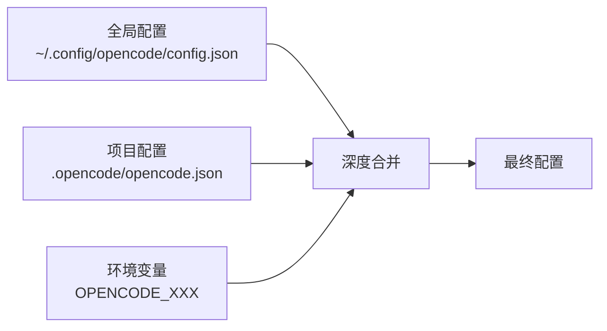

# C - 核心 API 参考索引

> OpenCode v1.3.17 · 源码学习 · 附录
> 手机可读 · GitHub 原生渲染

---

## 一、核心模块 API 速查表

### 1.1 服务模块

| 模块名 | 路径 | 主要导出 | 用途 |
|--------|------|---------|------|
| **Provider** | `src/provider/provider.ts` | `list()`, `getModel()`, `getLanguage()`, `defaultModel()` | LLM 模型管理 |
| **Session** | `src/session/index.ts` | `create()`, `get()`, `list()`, `chat()` | 会话生命周期 |
| **Plugin** | `src/plugin/index.ts` | `trigger()`, `list()`, `init()` | 插件管理 |
| **MCP** | `src/mcp/index.ts` | `tools()`, `status()`, `connect()`, `authenticate()` | MCP 协议集成 |
| **Config** | `src/config/config.ts` | `get()`, `set()`, `watch()` | 配置管理 |
| **Bus** | `src/bus/index.ts` | `publish()`, `subscribe()`, `subscribeAll()` | 事件总线 |
| **Auth** | `src/auth/index.ts` | `get()`, `set()`, `all()`, `remove()` | 认证管理 |
| **Storage** | `src/storage/storage.ts` | `read()`, `write()`, `update()`, `list()` | JSON 文件存储 |
| **Database** | `src/storage/db.ts` | `use()`, `transaction()`, `Client()` | SQLite 数据库 |

### 1.2 Effect 服务

| 模块名 | 路径 | 用途 |
|--------|------|------|
| **InstanceState** | `src/effect/instance-state.ts` | 按目录隔离状态 |
| **makeRuntime** | `src/effect/run-service.ts` | 创建 Effect 运行时 |
| **InstanceRef** | `src/effect/instance-ref.ts` | Instance 上下文引用 |
| **registerDisposer** | `src/effect/instance-registry.ts` | 注册实例清理回调 |

### 1.3 工具模块

| 模块名 | 路径 | 用途 |
|--------|------|------|
| **Log** | `src/util/log.ts` | 结构化日志 |
| **Hash** | `src/util/hash.ts` | 哈希计算 |
| **Filesystem** | `src/util/filesystem.ts` | 文件系统操作 |
| **Flock** | `src/util/flock.ts` | 文件锁 |
| **Flag** | `src/flag/flag.ts` | 命令行标志 |
| **Env** | `src/env/index.ts` | 环境变量管理 |
| **Npm** | `src/npm/index.ts` | npm 包管理 |
| **Git** | `src/git/index.ts` | Git 操作 |

---

## 二、HTTP API 端点列表

### 2.1 路由前缀分组

### 2.2 会话 API（/api/session）

| 方法 | 路径 | 说明 |
|------|------|------|
| GET | `/api/session` | 列出会话 |
| POST | `/api/session` | 创建会话 |
| GET | `/api/session/:id` | 获取会话详情 |
| PATCH | `/api/session/:id` | 更新会话 |
| DELETE | `/api/session/:id` | 删除会话 |
| GET | `/api/session/:id/message` | 获取消息列表 |
| POST | `/api/session/:id/message` | 发送消息 |
| GET | `/api/session/:id/summary` | 获取会话摘要 |

### 2.3 Provider API（/api/provider）

| 方法 | 路径 | 说明 |
|------|------|------|
| GET | `/api/provider` | 列出所有 Provider |
| GET | `/api/provider/:id` | 获取 Provider 详情 |
| GET | `/api/provider/:id/model` | 获取 Provider 模型列表 |

### 2.4 认证 API（/api/auth）

| 方法 | 路径 | 说明 |
|------|------|------|
| GET | `/api/auth` | 列出认证信息 |
| GET | `/api/auth/:id` | 获取特定认证 |
| POST | `/api/auth/:id` | 设置认证 |
| DELETE | `/api/auth/:id` | 删除认证 |

### 2.5 MCP API（/api/mcp）

| 方法 | 路径 | 说明 |
|------|------|------|
| GET | `/api/mcp` | MCP 状态列表 |
| POST | `/api/mcp/:name/connect` | 连接 MCP Server |
| POST | `/api/mcp/:name/disconnect` | 断开 MCP Server |
| POST | `/api/mcp/:name/auth` | 启动 OAuth 认证 |
| GET | `/api/mcp/tools` | 列出所有 MCP 工具 |

### 2.6 事件 API（SSE）

| 方法 | 路径 | 说明 |
|------|------|------|
| GET | `/api/event` | SSE 事件流（订阅所有事件） |
| GET | `/api/event/:sessionId` | 特定会话的 SSE 事件 |

---

## 三、opencode.json 配置字段索引

### 3.1 顶层配置

### 3.2 配置字段说明

| 字段路径 | 类型 | 说明 |
|---------|------|------|
| `provider` | `Record<ProviderID, ProviderConfig>` | Provider 自定义配置 |
| `provider.[id].name` | `string` | Provider 显示名称 |
| `provider.[id].api` | `string` | API 端点 URL |
| `provider.[id].npm` | `string` | SDK npm 包名 |
| `provider.[id].env` | `string[]` | 环境变量名列表 |
| `provider.[id].options` | `Record` | Provider 选项 |
| `provider.[id].models` | `Record<ModelID, ModelConfig>` | 模型自定义配置 |
| `provider.[id].blacklist` | `string[]` | 模型黑名单 |
| `provider.[id].whitelist` | `string[]` | 模型白名单 |
| `plugin` | `(string \| [string, options])[]` | 插件列表 |
| `mcp` | `Record<string, McpConfig>` | MCP Server 配置 |
| `mcp.[name].type` | `"local" \| "remote"` | 连接类型 |
| `mcp.[name].command` | `string[]` | 启动命令（local） |
| `mcp.[name].url` | `string` | 服务 URL（remote） |
| `mcp.[name].timeout` | `number` | 超时时间（ms） |
| `mcp.[name].enabled` | `boolean` | 是否启用 |
| `mcp.[name].oauth` | `object \| false` | OAuth 配置 |
| `model` | `string` | 默认模型（`provider/model` 格式） |
| `small_model` | `string` | 小模型（用于辅助任务） |
| `disabled_providers` | `string[]` | 禁用的 Provider 列表 |
| `enabled_providers` | `string[]` | 启用的 Provider 列表（白名单） |
| `agent` | `Record<string, AgentConfig>` | Agent 配置 |
| `experimental` | `object` | 实验性功能开关 |
| `experimental.mcp_timeout` | `number` | MCP 默认超时 |

### 3.3 配置文件位置

| 文件 | 位置 | 优先级 |
|------|------|--------|
| 全局配置 | `~/.config/opencode/config.json` | 最低 |
| 项目配置 | `.opencode/opencode.json` | 最高 |

### 3.4 配置合并策略

---

## 四、事件类型索引

### 4.1 核心事件

| 事件名 | 类型 | 说明 |
|--------|------|------|
| `session.created` | SessionEvent | 会话创建 |
| `session.updated` | SessionEvent | 会话更新 |
| `session.deleted` | SessionEvent | 会话删除 |
| `message.created` | MessageEvent | 消息创建 |
| `message.updated` | MessageEvent | 消息更新（流式） |
| `part.created` | PartEvent | 部件创建（流式） |
| `part.updated` | PartEvent | 部件更新（流式） |
| `todo.updated` | TodoEvent | 待办更新 |
| `permission.request` | PermissionEvent | 权限请求 |
| `question.request` | QuestionEvent | 问题请求 |
| `mcp.tools.changed` | McpEvent | MCP 工具列表变更 |
| `session.error` | ErrorEvent | 会话错误 |

---

## 五、Plugin Hook 类型索引

| Hook 名称 | 输入 | 输出 | 说明 |
|-----------|------|------|------|
| `event` | `{ event }` | `void` | 任意事件监听 |
| `config` | `Config` | `void` | 配置变更通知 |
| `tool` | N/A（注册表） | N/A | 工具注册 |
| `auth` | N/A（注册表） | N/A | 认证方式注册 |
| `provider` | N/A（注册表） | N/A | Provider 扩展 |
| `chat.message` | `{ sessionID, agent, model }` | `{ message, parts }` | 消息拦截 |
| `chat.params` | `{ sessionID, agent, model }` | `{ temperature, topP, ... }` | 参数修改 |
| `chat.headers` | `{ sessionID, agent, model }` | `{ headers }` | 请求头修改 |
| `permission.ask` | `Permission` | `{ status }` | 权限拦截 |
| `command.execute.before` | `{ command, sessionID, arguments }` | `{ parts }` | 命令前置拦截 |
| `tool.execute.before` | `{ tool, sessionID, callID }` | `{ args }` | 工具参数修改 |
| `tool.execute.after` | `{ tool, sessionID, callID, args }` | `{ title, output, metadata }` | 工具结果修改 |
| `shell.env` | `{ cwd, sessionID }` | `{ env }` | Shell 环境变量注入 |
| `tool.definition` | `{ toolID }` | `{ description, parameters }` | 工具定义修改 |
