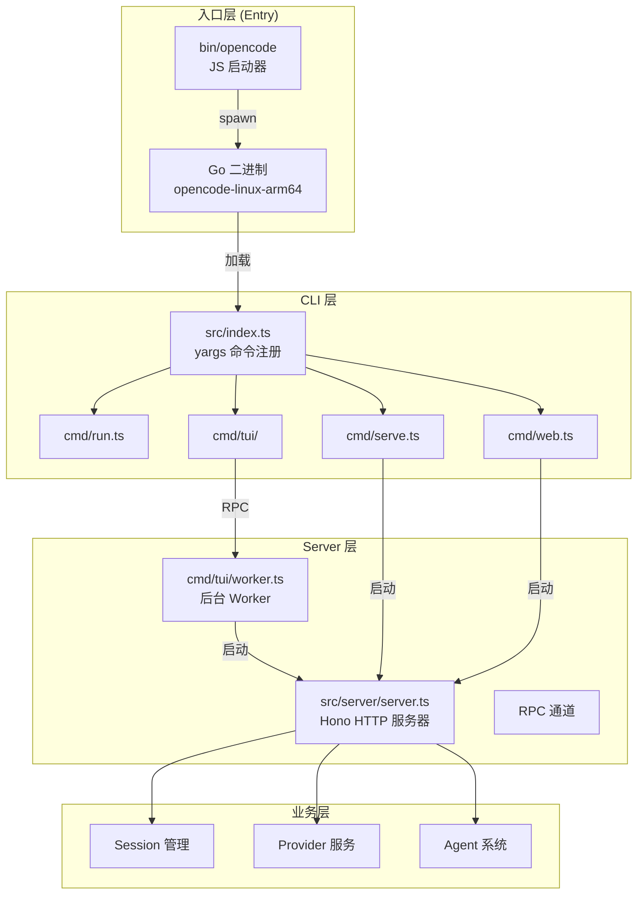
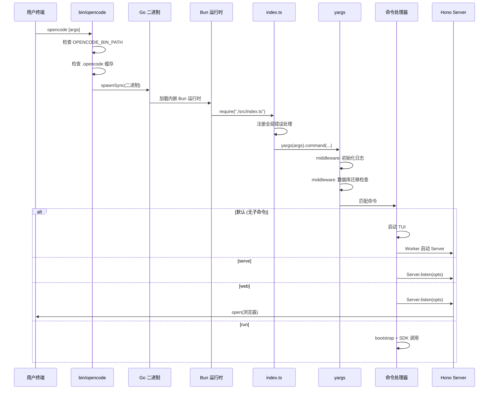
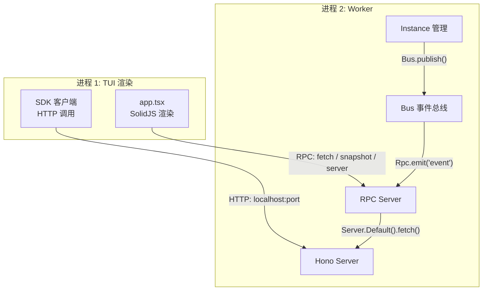
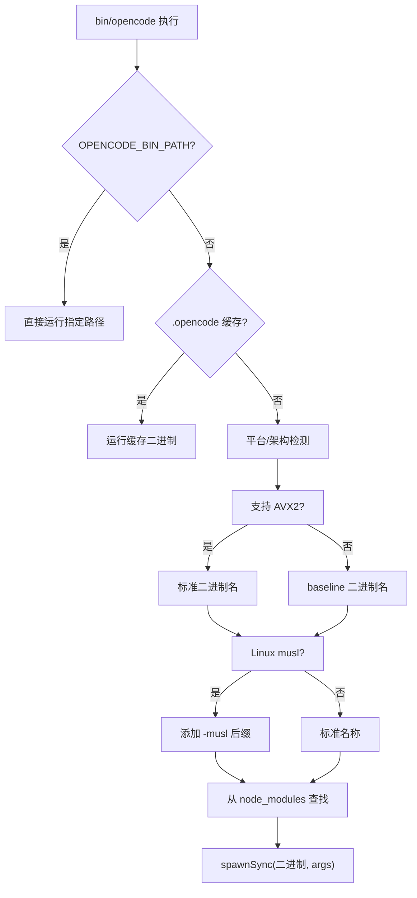
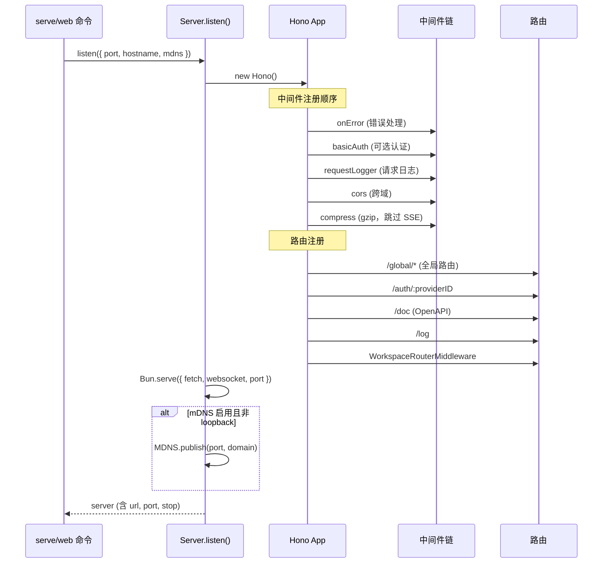
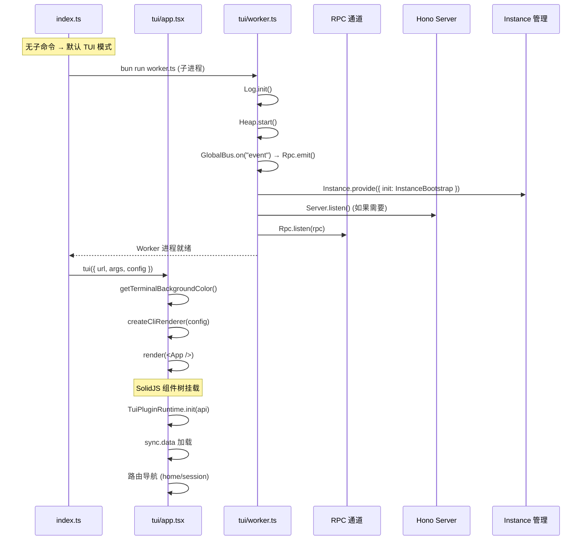

# 01 · CLI 入口与启动流程

> 本文拆解 OpenCode 从 `opencode` 命令敲下到 Server 就绪的全过程。读完本文，你将理解双运行时架构、yargs 命令注册机制以及三种启动模式的差异。

**源码版本**: v1.3.17 | **核心包**: `packages/opencode`

---

## 1. 模块在整体架构中的位置



---

## 2. 解决什么问题

**为什么需要 CLI + Server 分离？**

> 💡 **Java 类比**：这和 Spring Boot 的架构类似 — `spring-boot-maven-plugin` 打包的可执行 JAR 里嵌入了 Tomcat 容器。OpenCode 的 Go 二进制嵌入 Bun 运行时，TUI/CLI 是"启动器"，Server 是"容器"。

| 问题 | 解决方案 |
|------|----------|
| **跨平台分发** | Go 编译的单二进制 + JS 运行时自动检测平台/架构/AVX2/musl |
| **多客户端共享** | Server 作为独立进程运行，TUI/Web/IDE 都通过 HTTP 连接 |
| **TUI 性能隔离** | TUI 运行在独立进程，通过 RPC 与 Worker 通信，避免 UI 卡顿 |
| **嵌入式部署** | Web UI 编译进 Server，`opencode web` 一条命令启动全栈 |
| **CI/CD 管道** | `opencode run` 无需交互，可直接在管道中使用 |

---

## 3. 启动流程全览



---

## 4. 三种启动模式对比

| 特性 | **TUI** (默认) | **serve** | **web** | **run** |
|------|----------------|-----------|---------|---------|
| **命令** | `opencode` | `opencode serve` | `opencode web` | `opencode run "msg"` |
| **UI** | 终端 SolidJS TUI | 无 (headless) | 浏览器 Web UI | 命令行输出 |
| **Server** | Worker 进程内嵌 | 当前进程 | 当前进程 | 内嵌 (fetch 拦截) |
| **端口** | 随机 | 默认 4096 | 默认 4096 | 随机 / --port |
| **认证** | 不需要 | 可选 Basic Auth | 可选 Basic Auth | 不需要 |
| **交互** | 全功能交互 | API 客户端 | 全功能交互 | 单次执行 |
| **进程模型** | TUI 进程 + Worker 进程 | 单进程 | 单进程 | 单进程 |
| **mDNS** | 不支持 | 可选 | 可选 | 不支持 |

### TUI 模式的进程模型



> 💡 **Java 类比**：TUI 进程类似 Android 的 UI 线程，Worker 进程类似后台 Service。通过 RPC（类似 AIDL/Binder）通信。

---

## 5. Go 二进制启动器详解

`bin/opencode` 是一个 Node.js 脚本，但实际执行的是 Go 编译的原生二进制。



### 伪代码

```javascript
// bin/opencode 核心逻辑（简化）
function run(target) {
  const result = childProcess.spawnSync(target, process.argv.slice(2), {
    stdio: "inherit",  // 直接透传 stdin/stdout/stderr
  })
  process.exit(result.status)
}

// 1. 环境变量覆盖
if (process.env.OPENCODE_BIN_PATH) run(envPath)

// 2. 缓存查找
if (fs.existsSync(path.join(scriptDir, ".opencode"))) run(cached)

// 3. 平台检测 → 构建二进制名称候选列表
const names = buildPlatformBinaryNames()  // 如 ["opencode-linux-arm64", "opencode-linux-arm64-baseline"]

// 4. 从 node_modules 向上递归查找
const resolved = findBinary(scriptDir)  // 在 node_modules 中查找匹配的二进制
run(resolved)
```

---

## 6. yargs 命令注册

`src/index.ts` 是 CLI 的核心入口，负责注册所有命令和全局中间件。

### 命令注册伪代码

```typescript
// src/index.ts 核心结构（简化）
const cli = yargs(args)
  .scriptName("opencode")
  .wrap(100)
  .help("help")
  .version("version", undefined, Installation.VERSION)

  // ===== 全局中间件 =====
  .middleware(async (opts) => {
    // 1. 设置环境变量
    if (opts.pure) process.env.OPENCODE_PURE = "1"
    process.env.AGENT = "1"
    process.env.OPENCODE = "1"
    process.env.OPENCODE_PID = String(process.pid)

    // 2. 初始化日志系统
    await Log.init({ print: opts.printLogs, dev: isLocal(), level: ... })

    // 3. 启动堆内存监控
    Heap.start()

    // 4. 首次运行时执行数据库迁移（JSON → SQLite）
    if (!exists(opencode.db)) {
      await JsonMigration.run(Database.Client().$client, { progress })
    }
  })

  // ===== 注册命令（20+ 个） =====
  .command(RunCommand)        // opencode run [message..]
  .command(GenerateCommand)  // opencode generate
  .command(ServeCommand)      // opencode serve
  .command(WebCommand)        // opencode web
  .command(AcpCommand)        // opencode acp
  .command(McpCommand)        // opencode mcp
  .command(AgentCommand)      // opencode agent
  .command(ProvidersCommand)  // opencode providers
  .command(ModelsCommand)     // opencode models
  .command(SessionCommand)    // opencode session
  .command(PluginCommand)     // opencode plug
  // ... 更多命令

  .strict()  // 未知参数报错
```

### 命令工厂函数

```typescript
// src/cli/cmd/cmd.ts — 极简的命令包装器
type WithDoubleDash<T> = T & { "--"?: string[] }

export function cmd<T, U>(input: CommandModule<T, WithDoubleDash<U>>) {
  return input  // 类型标注，支持 -- 分隔符
}
```

---

## 7. Server 启动流程

`src/server/server.ts` 基于 **Hono** 框架构建 HTTP 服务器。

### Server 初始化时序图



### Hono 应用构建伪代码

```typescript
// src/server/server.ts 核心结构（简化）
export namespace Server {
  // 懒加载单例 — Worker 进程首次 RPC 调用时初始化
  export const Default = lazy(() => ControlPlaneRoutes())

  export function ControlPlaneRoutes(opts?: { cors?: string[] }): Hono {
    const app = new Hono()

    return app
      // 1. 错误处理中间件
      .onError(errorHandler(log))

      // 2. Basic Auth（可选）
      .use((c, next) => {
        if (!Flag.OPENCODE_SERVER_PASSWORD) return next()
        return basicAuth({ username, password })(c, next)
      })

      // 3. 请求日志（跳过 /log 自身，避免死循环）
      .use(async (c, next) => {
        if (c.req.path !== "/log") log.info("request", { method, path })
        const timer = log.time("request")
        await next()
        timer.stop()
      })

      // 4. CORS（白名单策略）
      .use(cors({
        maxAge: 86_400,
        origin(input) {
          if (input?.startsWith("http://localhost:")) return input
          if (/^https:\/\/([a-z0-9-]+\.)*opencode\.ai$/.test(input)) return input
          return undefined  // 非白名单拒绝
        }
      }))

      // 5. 压缩（跳过 SSE 流式端点）
      .use((c, next) => {
        if (skipCompress(c.req.path, c.req.method)) return next()
        return compress()(c, next)
      })

      // 6. 路由注册
      .route("/global", GlobalRoutes())
      .put("/auth/:providerID", ...)
      .delete("/auth/:providerID", ...)
      .get("/doc", openAPIRouteHandler(app))
      .use(WorkspaceRouterMiddleware)  // 动态路由挂载
  }
}
```

### 压缩跳过策略

```typescript
// SSE 和流式端点不应被 gzip 压缩
const skipCompress = (path: string, method: string) => {
  // WebSocket/SSE 事件端点
  if (path === "/event" || path === "/global/event" || path === "/global/sync-event")
    return true
  // 消息发送和异步 prompt 端点
  if (method === "POST" && /\/session\/[^/]+\/(message|prompt_async)$/.test(path))
    return true
  return false
}
```

---

## 8. TUI 启动详解

TUI 是 OpenCode 最复杂的启动模式，涉及进程间通信。

### TUI 启动时序



### Worker RPC 接口

```typescript
// src/cli/cmd/tui/worker.ts — Worker 对外暴露的 RPC 接口
export const rpc = {
  // 代理 HTTP 请求到内嵌 Server
  async fetch(input: { url, method, headers, body }) {
    const response = await Server.Default().fetch(request)
    return { status, headers, body }
  },

  // 堆快照（调试用）
  snapshot() {
    return writeHeapSnapshot("server.heapsnapshot")
  },

  // 启动/重启 Server
  async server(input: { port, hostname, mdns, cors }) {
    if (server) await server.stop(true)
    server = await Server.listen(input)
    return { url: server.url.toString() }
  },

  // 检查升级
  async checkUpgrade(input: { directory }) { ... },

  // 重新加载配置
  async reload() { await Config.invalidate(true) },

  // 切换工作区
  async setWorkspace(input: { workspaceID }) { ... },

  // 关闭
  async shutdown() {
    await Instance.disposeAll()
    if (server) await server.stop(true)
  },
}
```

---

## 9. 关键设计决策

### 双运行时架构 (Go + Bun)

```
┌─────────────────────────────────────┐
│  Go Binary (opencode-linux-arm64)   │
│  ┌───────────────────────────────┐  │
│  │  Embedded Bun Runtime         │  │
│  │  ┌─────────────────────────┐  │  │
│  │  │  packages/opencode/src  │  │  │
│  │  │  (TypeScript → Bun)     │  │  │
│  │  └─────────────────────────┘  │  │
│  └───────────────────────────────┘  │
└─────────────────────────────────────┘
```

| 设计点 | 原因 |
|--------|------|
| Go 外壳 | 跨平台单二进制分发，无需用户安装 Node.js |
| Bun 内核 | 比 Node.js 更快的启动速度，原生支持 SQLite |
| JS 启动器 (`bin/opencode`) | 开发模式直接用 Node.js，无需编译 Go |
| AVX2 检测 | x64 平台自动选择最优指令集 |
| musl 检测 | Alpine Linux 等环境使用 musl libc |

### 嵌入式 Web UI

- Web UI 在构建时预编译，嵌入 Server
- 通过 `@opencode/ui` 包提供
- `opencode web` 一条命令 = Server + 浏览器

### mDNS 服务发现

```typescript
// 仅在非 loopback 且 hostname 不是 localhost 时发布
const shouldPublishMDNS =
  opts.mdns &&
  server.port &&
  opts.hostname !== "127.0.0.1" &&
  opts.hostname !== "localhost" &&
  opts.hostname !== "::1"
```

这使得同一局域网内的其他设备可以通过 `.local` 域名发现 OpenCode 服务。

### 错误处理策略

```typescript
// index.ts — 全局未捕获异常处理
process.on("unhandledRejection", (e) => {
  Log.Default.error("rejection", { e: errorMessage(e) })
})
process.on("uncaughtException", (e) => {
  Log.Default.error("exception", { e: errorMessage(e) })
})

// finally 块确保进程退出（避免悬挂子进程）
try {
  await cli.parse()
} catch (e) {
  FormatError(e)
  process.exitCode = 1
} finally {
  process.exit()  // 强制退出，杀死所有子进程
}
```

> 💡 **Java 类比**：`process.exit()` 类似 `System.exit()`，确保 JVM 进程及其所有非守护线程终止。

---

## 📦 源码锚点表

| 文件路径 | 核心职责 | 关键行号 |
|----------|----------|----------|
| `packages/opencode/bin/opencode` | 二进制启动器，平台检测，Go 二进制查找 | L8-18 (run), L56-104 (AVX2), L151-167 (findBinary) |
| `packages/opencode/src/index.ts` | yargs 命令注册，全局中间件，入口解析 | L64-186 (cli 构建), L85-147 (middleware), L187-239 (parse) |
| `packages/opencode/src/cli/cmd/cmd.ts` | 命令工厂函数，类型标注 | L5-7 |
| `packages/opencode/src/cli/cmd/serve.ts` | `serve` 命令：headless Server | L9-24 |
| `packages/opencode/src/cli/cmd/web.ts` | `web` 命令：Server + 浏览器 | L31-81 |
| `packages/opencode/src/cli/cmd/run.ts` | `run` 命令：单次执行，CI/CD | L221-676 |
| `packages/opencode/src/cli/cmd/tui/app.tsx` | TUI 主界面，SolidJS 组件树 | L167-251 (tui 函数), L253-941 (App 组件) |
| `packages/opencode/src/cli/cmd/tui/worker.ts` | Worker 进程，RPC 服务，事件转发 | L116-168 (rpc 接口), L52-112 (事件流) |
| `packages/opencode/src/server/server.ts` | Hono 服务器构建，中间件，路由 | L39-238 (ControlPlaneRoutes), L267-311 (listen) |
| `packages/opencode/src/server/router.ts` | 工作区路由中间件 | — |
| `packages/opencode/src/cli/bootstrap.ts` | Instance 初始化引导 | — |
| `packages/opencode/src/cli/network.ts` | 网络选项解析 | — |
| `packages/opencode/src/global.ts` | 全局路径定义 | — |
| `packages/opencode/src/installation/` | 版本信息，安装检测 | — |
