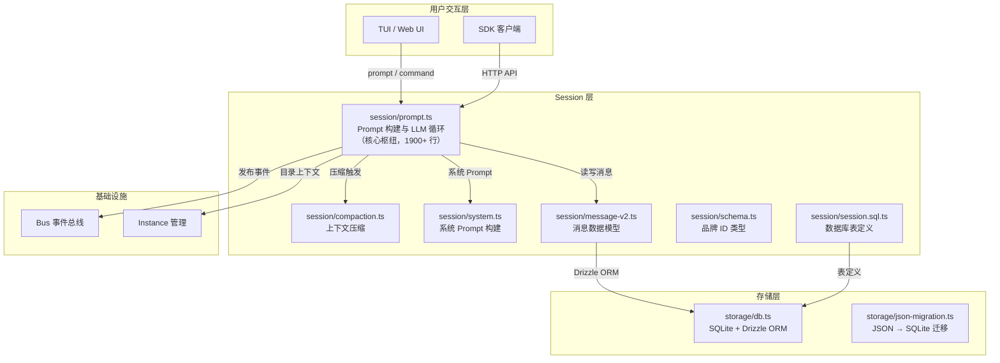
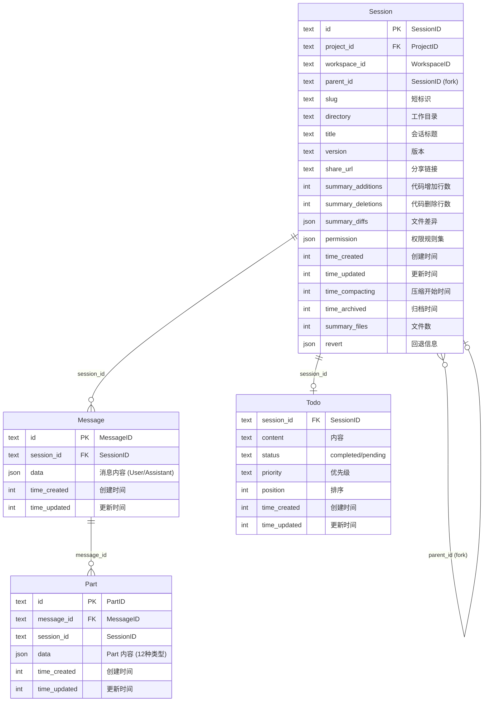
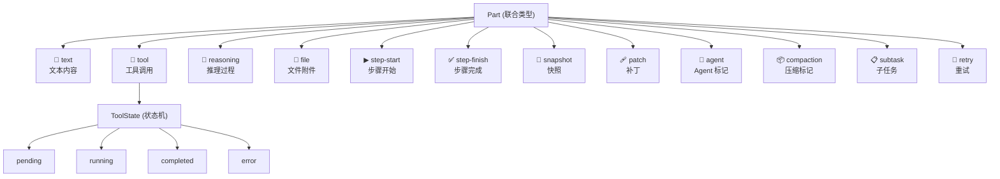
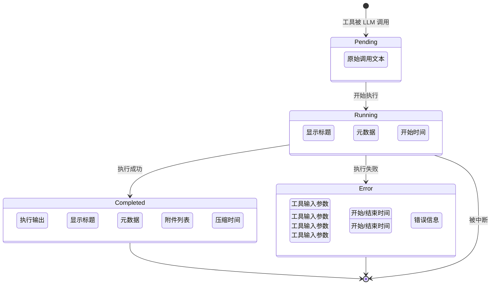
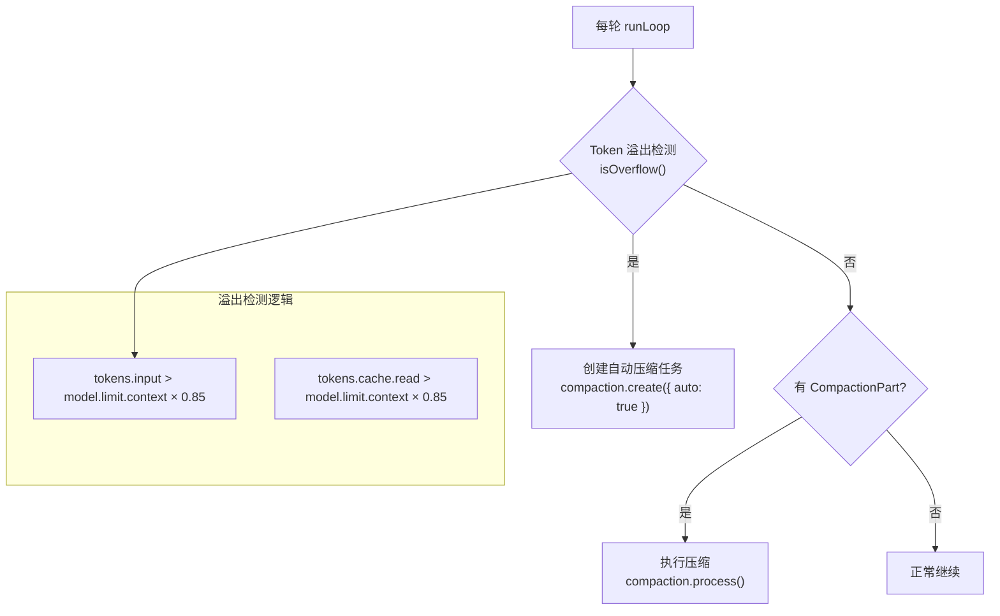
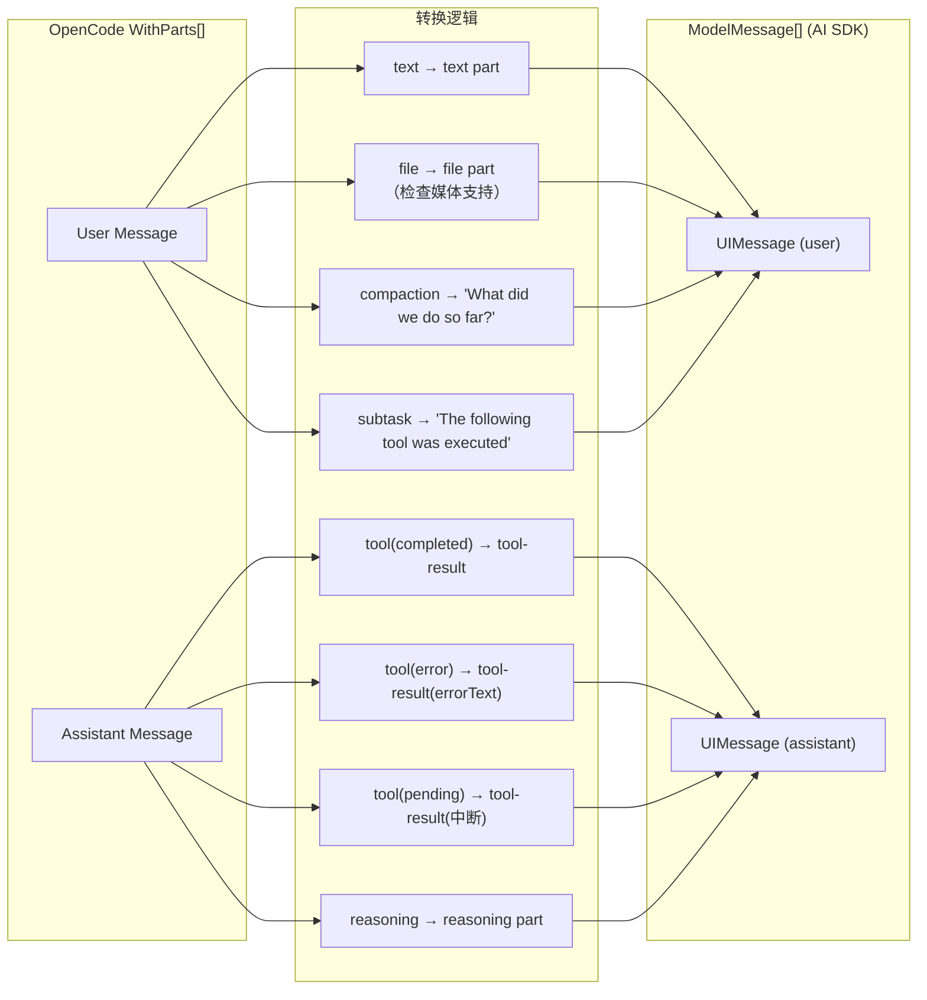

# 02 · Session 与上下文构建

> 本文拆解 OpenCode 的会话管理系统——如何存储对话历史、构建 LLM 上下文、以及上下文压缩机制。读完本文，你将理解 OpenCode 的"记忆系统"如何工作。

**源码版本**: v1.3.17 | **核心包**: `packages/opencode`

---

## 1. 模块在整体架构中的位置



---

## 2. 为什么需要 Session 管理

> 💡 **Java 类比**：Session 管理类似 Spring 的 `HttpSession`——维护有状态的对话上下文。但 OpenCode 的 Session 更复杂，因为它需要管理多轮 Tool 调用、子任务委派和上下文压缩。

| 需求 | 解决方案 |
|------|----------|
| **多轮对话** | Session 持久化到 SQLite，跨进程共享 |
| **Token 限制** | 上下文压缩（Compaction）自动摘要历史 |
| **子任务隔离** | Subtask Part 支持嵌套对话 |
| **多客户端同步** | Bus 事件 + SyncEvent 实现实时同步 |
| **分页加载** | Cursor-based 分页，避免一次性加载全部历史 |
| **权限管理** | 每个 Session 独立的 Permission Ruleset |

---

## 3. Session 数据模型

### ER 关系图



> 完整 ER 图（含 Project、Permission、SessionShare、Account）请参见 [15-存储与数据模型](../part-6-工程实践/15-存储与数据模型.md)。

### 品牌类型 (Branded Types)

```typescript
// src/session/schema.ts — 使用 Effect Schema 创建品牌类型
// 类似 Java 的 @NonNull 注解，在类型层面防止 ID 混用

export const SessionID = Schema.String.pipe(
  Schema.brand("SessionID"),  // 运行时品牌标记
  withStatics((s) => ({
    make: (id) => s.makeUnsafe(id),
    descending: (id?) => Identifier.descending("session", id),  // 降序 ULID
    zod: Identifier.schema("session").pipe(z.custom<SessionID>()),
  })),
)

export const MessageID = Schema.String.pipe(
  Schema.brand("MessageID"),
  withStatics((s) => ({
    make: (id) => s.makeUnsafe(id),
    ascending: (id?) => Identifier.ascending("message", id),  // 升序 ULID
    zod: Identifier.schema("message").pipe(z.custom<MessageID>()),
  })),
)

export const PartID = Schema.String.pipe(
  Schema.brand("PartID"),
  withStatics((s) => ({
    ascending: (id?) => Identifier.ascending("part", id),
  })),
)
```

> 💡 **Java 类比**：品牌类型类似 Lombok 的 `@NonNull` + 自定义 Value Object。`SessionID` 和 `MessageID` 虽然底层都是 `string`，但类型系统会阻止你把 `MessageID` 传给需要 `SessionID` 的函数。

---

## 4. MessageV2 的 Part 类型联合

Part 是消息的最小组成单元，OpenCode 定义了 **12 种 Part 类型**：



### Part 类型详解

| Part 类型 | 用途 | 关键字段 |
|-----------|------|----------|
| `text` | 用户/助手文本 | `text`, `synthetic`, `ignored`, `time` |
| `tool` | 工具调用 | `tool`, `callID`, `state: ToolState` |
| `reasoning` | 模型推理 | `text`, `time` |
| `file` | 文件附件 | `mime`, `filename`, `url`, `source` |
| `step-start` | 步骤开始标记 | `snapshot?` |
| `step-finish` | 步骤完成标记 | `reason`, `cost`, `tokens` |
| `snapshot` | 文件快照 | `snapshot` (git diff) |
| `patch` | 代码补丁 | `hash`, `files[]` |
| `agent` | Agent 调用标记 | `name`, `source?` |
| `compaction` | 上下文压缩 | `auto`, `overflow?` |
| `subtask` | 子任务 | `prompt`, `description`, `agent`, `model?` |
| `retry` | 重试记录 | `attempt`, `error`, `time` |

### ToolState 状态机



---

## 5. 消息模型 (User vs Assistant)

```mermaid
classDiagram
    class MessageInfo {
        <<discriminated union>>
    }
    class User {
        +role: "user"
        +time: { created }
        +format?: OutputFormat
        +agent: string
        +model: { providerID, modelID }
        +system?: string
        +tools?: Record
        +variant?: string
    }
    class Assistant {
        +role: "assistant"
        +time: { created, completed? }
        +error?: DiscriminatedError
        +parentID: MessageID
        +modelID: ModelID
        +providerID: ProviderID
        +agent: string
        +path: { cwd, root }
        +summary?: boolean
        +cost: number
        +tokens: TokenUsage
        +variant?: string
        +finish?: string
    }

    MessageInfo <|-- User
    MessageInfo <|-- Assistant
```

### Assistant 消息的 Token 统计

```typescript
tokens: {
  total?: number,        // 总 Token 数
  input: number,          // 输入 Token
  output: number,         // 输出 Token
  reasoning: number,      // 推理 Token
  cache: {
    read: number,          // 缓存读取
    write: number,         // 缓存写入
  },
}
```

---

## 6. 上下文构建流程

当用户发送消息时，`prompt.ts` 中的 `runLoop` 函数负责完整的 Agent 推理循环。核心流程包括：消息历史加载 → 过滤已压缩消息 → 子任务/压缩处理 → 上下文构建 → LLM 调用。

> 详细的 runLoop 执行循环、Prompt 层次结构和工具解析逻辑，请参见 [03-Agent 系统与 Prompt 构建](../part-2-推理阶段/03-Agent系统与Prompt构建.md)。

### 消息历史管理伪代码

```typescript
// session/message-v2.ts — 过滤已压缩的消息
export function filterCompacted(msgs: Iterable<MessageV2.WithParts>) {
  const result = []
  const completed = new Set<string>()

  for (const msg of msgs) {
    result.push(msg)

    // 找到压缩标记 + 对应的压缩完成标记，截断
    if (
      msg.info.role === "user" &&
      completed.has(msg.info.id) &&
      msg.parts.some((part) => part.type === "compaction")
    ) {
      break  // 丢弃更早的消息
    }

    // 记录完成压缩的 assistant 消息
    if (
      msg.info.role === "assistant" &&
      msg.info.summary &&      // summary=true 表示压缩完成
      msg.info.finish &&        // 有结束标记
      !msg.info.error           // 无错误
    ) {
      completed.add(msg.info.parentID)
    }
  }

  result.reverse()  // 恢复时间顺序
  return result
}
```

### 分页加载伪代码

```typescript
// session/message-v2.ts — Cursor-based 分页
export function page(input: { sessionID, limit, before? }) {
  // 1. 解码游标（base64url 编码的 { id, time }）
  const before = input.before ? cursor.decode(input.before) : undefined

  // 2. 构建查询条件：按时间倒序 + ID 倒序
  const where = before
    ? and(eq(session_id, sessionID), older(before))
    : eq(session_id, sessionID)

  // 3. 多查一条判断是否有更多
  const rows = db.select()
    .from(MessageTable)
    .where(where)
    .orderBy(desc(time_created), desc(id))
    .limit(input.limit + 1)  // +1 用于分页判断
    .all()

  // 4. 水化（批量加载 Parts）
  const items = hydrate(slice)
  items.reverse()  // 恢复时间正序

  return { items, more, cursor }
}
```

---

## 7. Drizzle ORM + SQLite 存储方案

### 数据库初始化

数据库通过 `Database.Client()` 延迟初始化，首次访问时执行路径解析、PRAGMA 性能配置和自动迁移。PRAGMA 配置采用 WAL 模式 + 异步刷盘策略，在并发读写和持久性之间取得平衡。

> 完整的 PRAGMA 配置、迁移策略和存储路径说明，请参见 [15-存储与数据模型](../part-6-工程实践/15-存储与数据模型.md)。

### 数据库路径

```typescript
// 默认路径: ~/.local/share/opencode/opencode.db
// 可通过 OPENCODE_DB 环境变量覆盖
// 可通过 OPENCODE_DB=:memory: 使用内存数据库
export const Path = iife(() => {
  if (Flag.OPENCODE_DB) {
    if (Flag.OPENCODE_DB === ":memory:" || isAbsolute(Flag.OPENCODE_DB))
      return Flag.OPENCODE_DB
    return path.join(Global.Path.data, Flag.OPENCODE_DB)
  }
  return getChannelPath()
})
```

### 事务上下文

```typescript
// storage/db.ts — 支持 Context 事务传播
export function use<T>(callback: (trx: TxOrDb) => T): T {
  try {
    // 如果已在事务中，直接使用当前事务
    return callback(ctx.use().tx)
  } catch (err) {
    if (err instanceof Context.NotFound) {
      // 不在事务中，使用默认客户端
      const effects = []
      const result = ctx.provide({ effects, tx: Client() }, () => callback(Client()))
      for (const effect of effects) effect()
      return result
    }
    throw err
  }
}
```

> 💡 **Java 类比**：`Database.use()` 类似 Spring 的 `TransactionTemplate`，自动检测当前是否在事务中，避免嵌套事务。

---

## 8. 上下文压缩 (Compaction) 机制

### 压缩触发条件



### 压缩流程

```mermaid
sequenceDiagram
    participant Loop as runLoop
    participant Compact as SessionCompaction
    participant Agent as compaction Agent
    participant LLM as LLM.stream
    participant DB as Database

    Loop->>Compact: create({ auto: true, overflow: true })
    Compact->>Compact: 创建 CompactionPart<br/>标记压缩开始
    Compact->>Compact: 更新 session.time_compacting

    Compact->>DB: 加载消息历史
    DB-->>Compact: messages[]

    Compact->>Compact: 使用 compaction Agent
    Compact->>LLM: stream({ agent: "compaction", messages })
    Note over LLM: compaction.txt 系统提示:<br/>"你是对话摘要专家..."

    LLM-->>Compact: 摘要文本

    Compact->>Compact: 创建新的 User 消息<br/>role="user", 带有 CompactionPart
    Compact->>Compact: 创建新的 Assistant 消息<br/>role="assistant", summary=true

    Compact->>DB: 保存压缩后的消息
    Compact->>Compact: 发布 session.compacted 事件

    Note over Compact: 后台 prune 清理<br/>超过 40K Token 的旧工具结果
```

### Prune（清理）机制

```typescript
// session/compaction.ts
export const PRUNE_MINIMUM = 20_000   // 最少保留 20K Token
export const PRUNE_PROTECT = 40_000    // 40K 以内的工具结果不清理
const PRUNE_PROTECTED_TOOLS = ["skill"]  // skill 工具结果永远不清理

// prune 在 runLoop 结束后异步执行
// 它会遍历历史消息，将超过 PRUNE_PROTECT 的工具输出标记为压缩
// 设置 part.state.time.compacted = Date.now()
```

---

## 9. 消息转 LLM 格式

`toModelMessages` 将 OpenCode 内部消息格式转换为 Vercel AI SDK 的 `ModelMessage` 格式。



### 媒体兼容处理

```typescript
// 不同 Provider 对工具结果中的媒体支持不同
const supportsMediaInToolResults = (() => {
  if (model.api.npm === "@ai-sdk/anthropic") return true
  if (model.api.npm === "@ai-sdk/openai") return true
  if (model.api.npm === "@ai-sdk/amazon-bedrock") return true
  if (model.api.npm === "@ai-sdk/google-vertex/anthropic") return true
  // Gemini 3.x 支持
  if (model.api.npm === "@ai-sdk/google") {
    const id = model.api.id.toLowerCase()
    return id.includes("gemini-3") && !id.includes("gemini-2")
  }
  return false  // 其他 Provider 需要将媒体提取为独立 user 消息
})()
```

---

## 10. 关键设计决策

| 决策 | 原因 |
|------|------|
| **JSON 列存储消息** | Message.data 和 Part.data 用 JSON 列存储完整消息，避免关系型反范式化 |
| **ULID 作为 ID** | 时间排序 + 唯一性，比 UUID 更适合消息排序 |
| **品牌类型** | 防止 SessionID/MessageID/PartID 混用 |
| **WAL 模式** | 支持并发读写（TUI 和 Server 可能同时访问） |
| **Cursor 分页** | 比 offset 分页更高效，避免跳过大量数据 |
| **异步 Prune** | 压缩后的清理不阻塞主循环 |
| **媒体提取** | 不支持媒体工具结果的 Provider 需要将图片/PDF 提取为独立消息 |

---

## 📦 源码锚点表

| 文件路径 | 核心职责 | 关键行号 |
|----------|----------|----------|
| `src/session/session.sql.ts` | Drizzle 表定义 (session/message/part/todo/permission) | L14-44 (SessionTable), L46-58 (MessageTable), L60-76 (PartTable) |
| `src/session/message-v2.ts` | 消息数据模型，Part 类型联合，消息转换 | L87-350 (Part 类型), L357-455 (User/Assistant), L576-812 (toModelMessages), L903-919 (filterCompacted) |
| `src/session/schema.ts` | 品牌 ID 类型 (SessionID/MessageID/PartID) | L7-38 |
| `src/session/system.ts` | 系统 Prompt 构建（Provider 差异化 + 环境信息 + Skills） | L20-34 (provider), L36-61 (environment), L63-75 (skills) |
| `src/session/prompt.ts` | **核心枢纽**：Prompt 构建、LLM 循环、Tool 解析 | L67-78 (Interface), L1337-1566 (runLoop), L388-551 (resolveTools), L949-1303 (createUserMessage) |
| `src/session/compaction.ts` | 上下文压缩与 Prune | L23-59 (Interface), PRUNE_MINIMUM/PRUNE_PROTECT |
| `src/session/llm.ts` | LLM 流式调用封装 | L25-48 (StreamInput), L80+ (stream 函数) |
| `src/session/processor.ts` | 消息处理器（Part 流式更新） | — |
| `src/session/status.ts` | Session 状态管理 (idle/busy) | — |
| `src/session/instruction.ts` | 指令注入 | — |
| `src/storage/db.ts` | 数据库客户端，事务管理，PRAGMA | L30-174 |
| `src/storage/schema.sql.ts` | Timestamps 公共字段 | L1-10 |
| `src/storage/json-migration.ts` | JSON → SQLite 迁移 | — |
| `src/session/prompt/` | Provider-specific Prompt 模板 (13 个 txt) | — |
