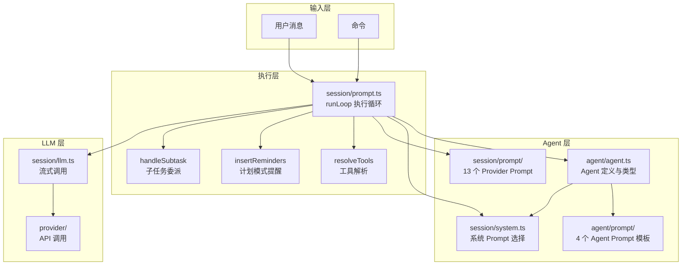
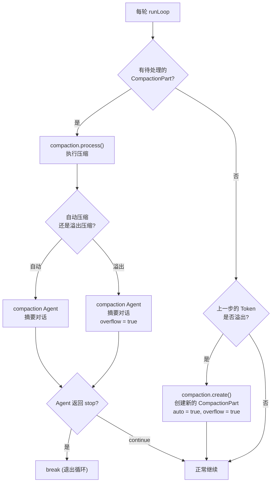
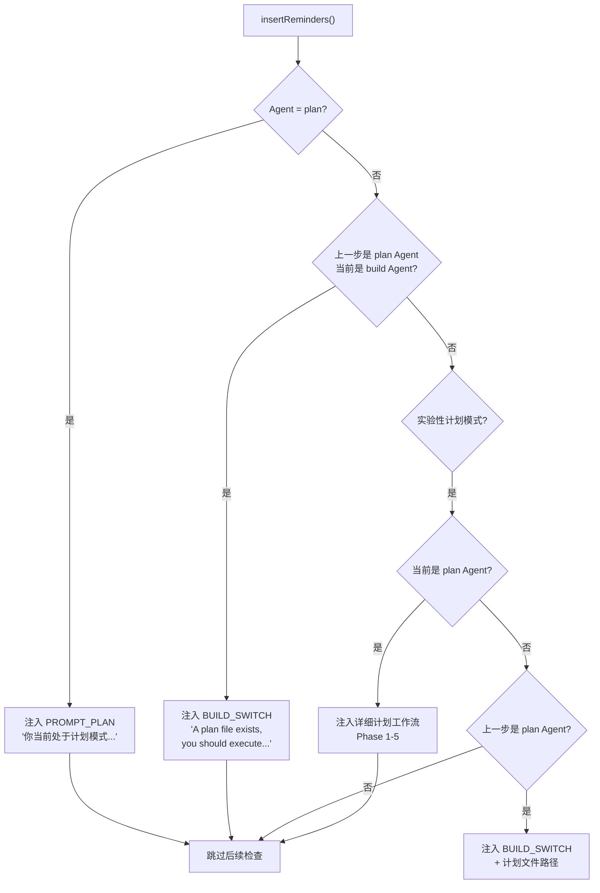

# 03 · Agent 系统与 Prompt 构建

> 本文拆解 OpenCode 的 Agent 系统——Agent 的类型定义、权限隔离、Prompt 模板机制以及核心的 Agent 执行循环。读完本文，你将理解 OpenCode 如何让 LLM "扮演不同角色"。

**源码版本**: v1.3.17 | **核心包**: `packages/opencode`

---

## 1. 模块在整体架构中的位置



---

## 2. Agent 类型对比表

OpenCode 内置了 **6 个原生 Agent**，用户可通过配置扩展。

| Agent | 模式 | 可见 | 权限特点 | Prompt 模板 | 用途 |
|-------|------|------|----------|-------------|------|
| **build** | `primary` | ✅ | 全权限 + question + plan_enter | 无 (使用 Provider Prompt) | 默认 Agent，执行工具 |
| **plan** | `primary` | ✅ | 只读 + 仅允许编辑 plan 文件 | 无 (使用 Provider Prompt) | 计划模式，禁止修改代码 |
| **general** | `subagent` | ✅ | 全权限 - todowrite | 无 (使用 Provider Prompt) | 通用子任务，多步执行 |
| **explore** | `subagent` | ✅ | 仅搜索工具 (glob/grep/read/bash) | `explore.txt` | 代码库搜索，快速定位 |
| **compaction** | `primary` | ❌ | 全部禁止 | `compaction.txt` | 上下文压缩摘要 |
| **title** | `primary` | ❌ | 全部禁止 | `title.txt` | 生成会话标题 |
| **summary** | `primary` | ❌ | 全部禁止 | `summary.txt` | 生成会话摘要 |

> 💡 **Java 类比**：Agent 的权限系统类似 Spring Security 的 `@PreAuthorize`——每个 Agent 有独立的权限规则集（`Permission.Ruleset`），在执行工具前进行权限校验。explore Agent 只能"读"，plan Agent 只能"编辑特定文件"，build Agent 可以"读写所有"。

### Agent 配置结构

```mermaid
classDiagram
    class AgentInfo {
        +name: string
        +description?: string
        +mode: "primary" | "subagent" | "all"
        +native?: boolean
        +hidden?: boolean
        +topP?: number
        +temperature?: number
        +color?: string
        +permission: Ruleset
        +model?: { providerID, modelID }
        +variant?: string
        +prompt?: string
        +options: Record
        +steps?: number
    }
```

### 模式 (mode) 说明

| 模式 | 说明 | 示例 |
|------|------|------|
| `primary` | 主 Agent，用户可直接选择 | build, plan |
| `subagent` | 子 Agent，只能被 Task Tool 委派 | general, explore |
| `all` | 两种模式都支持（用户自定义 Agent） | 用户配置的 Agent |

> 💡 **Java 类比**：Agent 模式类似 Spring Security 的角色层级——`primary` 类似 `ROLE_USER`（直接登录），`subagent` 类似 `ROLE_SERVICE`（只能内部调用），`all` 类似自定义权限组合。

---

## 3. Agent 执行循环 (runLoop)

`runLoop` 是 OpenCode 最核心的函数，实现了"接收消息 → 构建 Prompt → 调用 LLM → 解析响应 → Tool 调用/终止"的完整循环。

```mermaid
flowchart TD
    START(["runLoop(sessionID)"]) --> CHECK{Session 已存在<br/>的活跃 Runner?}
    CHECK -->|是| ENSURE["runner.ensureRunning()"]
    CHECK -->|否| NEW["创建新 Runner"]
    NEW --> ENSURE
    ENSURE --> LOOP

    subgraph LOOP["主循环 while(true)"]
        direction TB
        A["status.set(busy)"] --> B["filterCompactedEffect<br/>加载过滤后的消息历史"]
        B --> C["提取 lastUser / lastAssistant / lastFinished"]
        C --> D{lastAssistant.finish<br/>且非 tool-calls?}
        D -->|是| BREAK["break (退出循环)"]
        D -->|否| E["step++"]
        E --> F{step == 1?}
        F -->|是| G["title() 异步生成标题"]
        G --> H["getModel()"]
        F -->|否| H
        H --> I{有 SubtaskPart?}
        I -->|是| J["handleSubtask()"]
        J --> LOOP
        I -->|否| K{有 CompactionPart?}
        K -->|是| L["compaction.process()"]
        L --> M{结果 = stop?}
        M -->|是| BREAK
        M -->|continue| LOOP
        K -->|否| N{Token 溢出?}
        N -->|是| O["compaction.create(auto=true)"]
        O --> LOOP
        N -->|否| P["agents.get(lastUser.agent)"]
        P --> Q["insertReminders()"]
        Q --> R["resolveTools()"]
        R --> S["SystemPrompt.skills + environment"]
        S --> T["MessageV2.toModelMessages()"]
        T --> U["handle.process()<br/>调用 LLM 流式推理"]
        U --> V{finish 且无错误?}
        V -->|是| W{result = stop?}
        W -->|是| BREAK
        W -->|compact| X["compaction.create()"]
        X --> LOOP
        W -->|continue| LOOP
        V -->|否| LOOP
    end

    BREAK --> PRUNE["compaction.prune() 异步清理"]
    PRUNE --> LAST["lastAssistant() 返回最终消息"]
```

### runLoop 伪代码

```typescript
// session/prompt.ts — 核心执行循环（简化）
const runLoop = async (sessionID: SessionID) => {
  let step = 0

  while (true) {
    // 1. 加载过滤后的消息历史（跳过已压缩部分）
    let msgs = await MessageV2.filterCompactedEffect(sessionID)

    // 2. 提取关键消息引用
    let lastUser, lastAssistant, lastFinished
    let tasks: (CompactionPart | SubtaskPart)[] = []
    for (let i = msgs.length - 1; i >= 0; i--) {
      if (!lastUser && msgs[i].info.role === "user") lastUser = msgs[i].info
      if (!lastAssistant && msgs[i].info.role === "assistant") lastAssistant = msgs[i].info
      if (!lastFinished && msgs[i].info.role === "assistant" && msgs[i].info.finish)
        lastFinished = msgs[i].info
      if (lastUser && lastFinished) break
      // 收集 compaction/subtask 任务
      tasks.push(...msgs[i].parts.filter(p => p.type === "compaction" || p.type === "subtask"))
    }

    // 3. 退出条件：assistant 已完成且不是工具调用
    if (lastAssistant?.finish && !["tool-calls"].includes(lastAssistant.finish) && !hasToolCalls) {
      break
    }

    step++

    // 4. 第一步异步生成标题
    if (step === 1) title({ session, history: msgs }).pipe(ignore, forkIn(scope))

    // 5. 处理子任务
    const task = tasks.pop()
    if (task?.type === "subtask") { await handleSubtask({ task, model, lastUser, sessionID, session, msgs }); continue }
    if (task?.type === "compaction") { const result = await compaction.process(...); if (result === "stop") break; continue }

    // 6. 溢出检测
    if (await compaction.isOverflow({ tokens: lastFinished.tokens, model })) {
      await compaction.create({ sessionID, auto: true })
      continue
    }

    // 7. 获取 Agent 配置
    const agent = await agents.get(lastUser.agent)

    // 8. 最大步数检测
    const isLastStep = step >= (agent.steps ?? Infinity)

    // 9. 插入计划模式提醒
    msgs = await insertReminders({ messages: msgs, agent, session })

    // 10. 创建 Assistant 消息占位
    const msg = createAssistantMessage({ sessionID, agent, model, parentID: lastUser.id })
    const handle = await processor.create({ assistantMessage: msg, sessionID, model })

    // 11. 解析工具
    const tools = await resolveTools({ agent, session, model, tools: lastUser.tools, processor: handle })

    // 12. 构建 Prompt
    const [skills, env, instructions, modelMsgs] = await Promise.all([
      SystemPrompt.skills(agent),
      SystemPrompt.environment(model),
      instruction.system(),
      MessageV2.toModelMessages(msgs, model),
    ])
    const system = [...env, ...(skills ? [skills] : []), ...instructions]

    // 13. 调用 LLM
    const result = await handle.process({
      user: lastUser, agent, sessionID, system,
      messages: [...modelMsgs, ...(isLastStep ? [{ role: "assistant", content: MAX_STEPS }] : [])],
      tools, model,
    })

    // 14. 判断是否退出
    if (result === "stop") break
    if (result === "compact") await compaction.create({ sessionID, auto: true, overflow: !handle.message.finish })
    continue
  }

  // 15. 异步清理旧消息
  compaction.prune({ sessionID }).pipe(ignore, forkIn(scope))
  return await lastAssistant(sessionID)
}
```

---

## 4. Prompt 构建过程

### Prompt 层次结构

```mermaid
graph TB
    subgraph SystemPrompt["系统提示 (System)"]
        A1["1. Provider Prompt<br/>（13 个 txt，按模型选择）"]
        A2["2. 环境信息<br/>（目录、平台、日期等）"]
        A3["3. Skills 列表<br/>（可用技能描述）"]
        A4["4. 自定义指令<br/>（.opencode/instructions/）"]
        A5["5. 计划模式提醒<br/>（plan Agent 注入）"]
        A6["6. 结构化输出提示<br/>（json_schema 模式）"]
        A7["7. Agent 自定义 Prompt<br/>（explore/compaction 等）"]
    end

    subgraph Messages["消息列表 (Messages)"]
        B1["历史消息 (ModelMessage[])"]
        B2["用户最新消息"]
        B3["系统提醒注入<br/>（step > 1 时）"]
        B4["最大步数提醒<br/>（最后一步）"]
    end

    subgraph Tools["工具定义"]
        C1["内置工具 (Read/Write/Bash...)"]
        C2["MCP 工具"]
        C3["StructuredOutput 工具<br/>（json_schema 模式）"]
    end

    A1 --> LLM
    A2 --> LLM
    A3 --> LLM
    A4 --> LLM
    A5 --> LLM
    A6 --> LLM
    A7 --> LLM
    B1 --> LLM
    B2 --> LLM
    B3 --> LLM
    B4 --> LLM
    C1 --> LLM
    C2 --> LLM
    C3 --> LLM

    LLM["LLM API 调用"]
```



### Provider Prompt 选择

```typescript
// session/system.ts — 根据模型选择不同的 Provider Prompt
export function provider(model: Provider.Model) {
  // GPT-4 / o1 / o3 → beast.txt（最强提示）
  if (model.api.id.includes("gpt-4") || model.api.id.includes("o1") || model.api.id.includes("o3"))
    return [PROMPT_BEAST]
  // GPT Codex → codex.txt
  if (model.api.id.includes("gpt") && model.api.id.includes("codex"))
    return [PROMPT_CODEX]
  // GPT → gpt.txt
  if (model.api.id.includes("gpt"))
    return [PROMPT_GPT]
  // Gemini → gemini.txt
  if (model.api.id.includes("gemini-"))
    return [PROMPT_GEMINI]
  // Claude → anthropic.txt
  if (model.api.id.includes("claude"))
    return [PROMPT_ANTHROPIC]
  // Trinity → trinity.txt
  if (model.api.id.toLowerCase().includes("trinity"))
    return [PROMPT_TRINITY]
  // Kimi → kimi.txt
  if (model.api.id.toLowerCase().includes("kimi"))
    return [PROMPT_KIMI]
  // 其他 → default.txt
  return [PROMPT_DEFAULT]
}
```

### Provider Prompt 文件清单

| 文件 | 适用模型 | 特点 |
|------|----------|------|
| `anthropic.txt` | Claude 系列 | 通用提示 |
| `beast.txt` | GPT-4, o1, o3 | 最强推理提示 |
| `gpt.txt` | GPT 系列 | 通用提示 |
| `codex.txt` | GPT Codex | 编码专用提示 |
| `gemini.txt` | Gemini 系列 | 通用提示 |
| `trinity.txt` | Trinity 模型 | 专用提示 |
| `kimi.txt` | Kimi 模型 | 专用提示 |
| `default.txt` | 其他所有模型 | 兜底提示 |
| `copilot-gpt-5.txt` | GitHub Copilot GPT-5 | Copilot 专用 |
| `build-switch.txt` | plan → build 切换 | 提醒 Agent 从计划模式切换到执行模式 |
| `plan.txt` | plan Agent | 计划模式指令 |
| `max-steps.txt` | 最后一步 | 提醒 Agent 已到最大步数 |
| `plan-reminder-anthropic.txt` | Claude plan 模式 | Anthropic 专用计划提醒 |

### Agent Prompt 模板

```typescript
// agent/agent.ts — Agent Prompt 注册
const agents = {
  explore: {
    name: "explore",
    prompt: PROMPT_EXPLORE,  // "You are a file search specialist..."
    mode: "subagent",
    // 权限：仅搜索工具
    permission: Permission.merge(defaults, {
      "*": "deny",
      grep: "allow", glob: "allow", list: "allow",
      bash: "allow", webfetch: "allow", read: "allow",
    }),
  },
  compaction: {
    name: "compaction",
    prompt: PROMPT_COMPACTION,  // "You are a helpful AI assistant tasked with summarizing..."
    mode: "primary",
    hidden: true,
    // 权限：全部禁止
    permission: Permission.merge(defaults, { "*": "deny" }),
  },
  title: {
    name: "title",
    prompt: PROMPT_TITLE,
    mode: "primary",
    hidden: true,
    temperature: 0.5,  // 标题生成使用较低温度
  },
}
```

### 环境信息注入

```typescript
// session/system.ts — 注入运行环境信息
export async function environment(model: Provider.Model) {
  const project = Instance.project
  return [[
    `You are powered by the model named ${model.api.id}`,
    `<env>`,
    `  Working directory: ${Instance.directory}`,
    `  Workspace root folder: ${Instance.worktree}`,
    `  Is directory a git repo: ${project.vcs === "git" ? "yes" : "no"}`,
    `  Platform: ${process.platform}`,
    `  Today's date: ${new Date().toDateString()}`,
    `</env>`,
  ].join("\n")]
}
```

---

## 5. Sub-agent 委派机制

```mermaid
sequenceDiagram
    participant Main as 主 Agent (build)
    participant Loop as runLoop
    participant Handle as SessionProcessor
    participant Task as TaskTool
    participant Sub as 子 Agent (general/explore)
    participant LLM as LLM.stream

    Main->>Handle: process() 返回 tool_call
    Handle->>Handle: 创建 ToolPart (type=tool, tool=task)
    Note over Handle: tool.input = { prompt, description, subagent_type }

    Loop->>Loop: handleSubtask()
    Loop->>Loop: 创建 Assistant 消息占位
    Loop->>Loop: 创建 ToolPart (running)
    Loop->>Loop: 发布 Bus 事件

    Loop->>Task: taskTool.execute(args, ctx)
    Task->>Task: 创建子 Session
    Task->>Sub: 获取子 Agent 配置
    Sub-->>Task: agent.info

    Task->>Loop: 子 runLoop(sessionID)
    Note over Loop: 子循环独立执行<br/>使用子 Agent 的权限和工具

    Loop->>LLM: stream({ agent: sub, messages, tools })
    LLM-->>Loop: 流式响应
    Loop->>Loop: 工具调用 / 终止

    Loop-->>Task: 子循环完成
    Task-->>Loop: 返回 { output, title, metadata }

    Loop->>Loop: 更新 ToolPart (completed)
    Loop->>Loop: 更新 Assistant 消息
    Loop->>Loop: 如果有 command，创建 synthetic User 消息

    Loop->>Loop: continue (主循环继续)
```

### 子任务 Part 结构

```typescript
// 用户消息中的 SubtaskPart
const SubtaskPart = {
  type: "subtask",
  prompt: "请搜索所有使用 React Hook 的文件",  // 给子 Agent 的提示
  description: "搜索 React Hook 使用",         // 显示描述
  agent: "explore",                          // 子 Agent 名称
  model: {                                   // 可选：指定模型
    providerID: "anthropic",
    modelID: "claude-haiku-4-5",
  },
  command: undefined,                        // 可选：关联的命令
}
```

---

## 6. 上下文压缩触发逻辑



### 溢出检测

```typescript
// session/compaction.ts
export async function isOverflow(input: { tokens: TokenUsage; model: Model }) {
  return overflow(input.tokens, input.model)
}

// session/overflow.ts — 溢出检测阈值
export function isOverflow(tokens: TokenUsage, model: Model): boolean {
  const contextLimit = model.limit.context
  const threshold = contextLimit * 0.85  // 85% 阈值

  // 检查输入 Token 是否接近上下文限制
  if (tokens.input >= threshold) return true
  // 检查缓存读取 Token（某些 Provider 的缓存也算上下文）
  if (tokens.cache.read >= threshold) return true
  return false
}
```

---

## 7. 计划模式 (Plan Mode) 提醒



---

## 8. 关键设计决策

| 决策 | 原因 |
|------|------|
| **Agent 权限隔离** | explore 只能搜索，plan 只能编辑 plan 文件，防止误操作 |
| **Prompt 模型差异化** | 不同模型需要不同的指令风格（如 Claude vs GPT） |
| **最大步数限制** | `agent.steps` 防止 LLM 无限循环（Doom loop） |
| **子任务独立 Session** | Subtask 在独立 Session 中执行，有独立的上下文和权限 |
| **异步标题生成** | 标题生成不阻塞主循环，使用小模型节省成本 |
| **结构化输出** | 通过 `StructuredOutput` 工具实现 JSON Schema 约束 |
| **计划模式 5 阶段** | 探索 → 设计 → 审查 → 最终计划 → plan_exit |
| **compaction Agent** | 专门的 Agent 做摘要，不受用户工具干扰 |
| **temperature 差异化** | title 使用 0.5 低温度，探索 Agent 继承默认 |

### Doom Loop 检测

```typescript
// 每轮循环都会检查是否到达最大步数
const maxSteps = agent.steps ?? Infinity
const isLastStep = step >= maxSteps

// 到达最大步数时，注入提示要求 Agent 停止
if (isLastStep) {
  messages.push({
    role: "assistant",
    content: MAX_STEPS,  // "You have reached the maximum number of steps..."
  })
}
```

---

## 📦 源码锚点表

| 文件路径 | 核心职责 | 关键行号 |
|----------|----------|----------|
| `src/agent/agent.ts` | Agent 定义、类型、内置 Agent 配置、动态 Agent 加载 | L27-52 (Info schema), L107-234 (内置 agents), L236-263 (配置覆盖) |
| `src/agent/prompt/explore.txt` | explore Agent 的系统提示 | L1-18 |
| `src/agent/prompt/compaction.txt` | compaction Agent 的系统提示 | L1-15 |
| `src/agent/prompt/summary.txt` | summary Agent 的系统提示 | — |
| `src/agent/prompt/title.txt` | title Agent 的系统提示 | — |
| `src/session/system.ts` | 系统 Prompt 选择（Provider 差异化 + 环境信息 + Skills） | L20-34 (provider), L36-61 (environment), L63-75 (skills) |
| `src/session/prompt.ts` | **核心枢纽**：runLoop 执行循环、工具解析、子任务处理 | L1337-1566 (runLoop), L388-551 (resolveTools), L553-741 (handleSubtask), L252-386 (insertReminders) |
| `src/session/prompt/plan.txt` | plan Agent 的默认提示 | — |
| `src/session/prompt/build-switch.txt` | plan → build 切换提醒 | — |
| `src/session/prompt/max-steps.txt` | 最大步数提醒 | — |
| `src/session/prompt/default.txt` | 默认 Provider Prompt | — |
| `src/session/prompt/anthropic.txt` | Claude 系列 Prompt | — |
| `src/session/prompt/beast.txt` | GPT-4/o1/o3 Prompt | — |
| `src/session/prompt/gpt.txt` | GPT 系列 Prompt | — |
| `src/session/prompt/gemini.txt` | Gemini Prompt | — |
| `src/session/prompt/codex.txt` | Codex Prompt | — |
| `src/session/llm.ts` | LLM 流式调用封装 | L25-48 (StreamInput), L80+ (stream) |
| `src/session/compaction.ts` | 上下文压缩机制 | L35-36 (阈值常量) |
| `src/session/overflow.ts` | Token 溢出检测 | — |
| `src/permission/` | 权限系统（evaluate/merge/fromConfig） | — |
