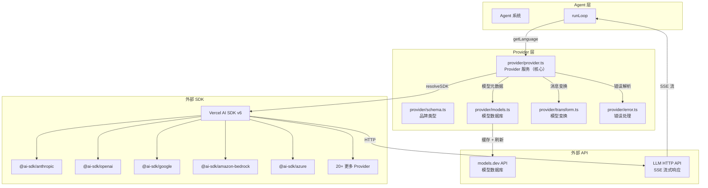
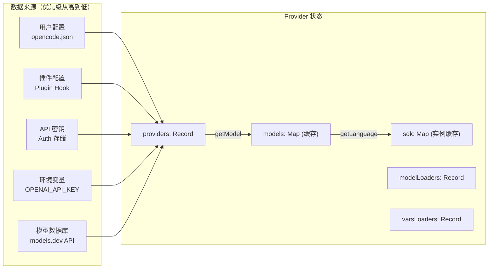
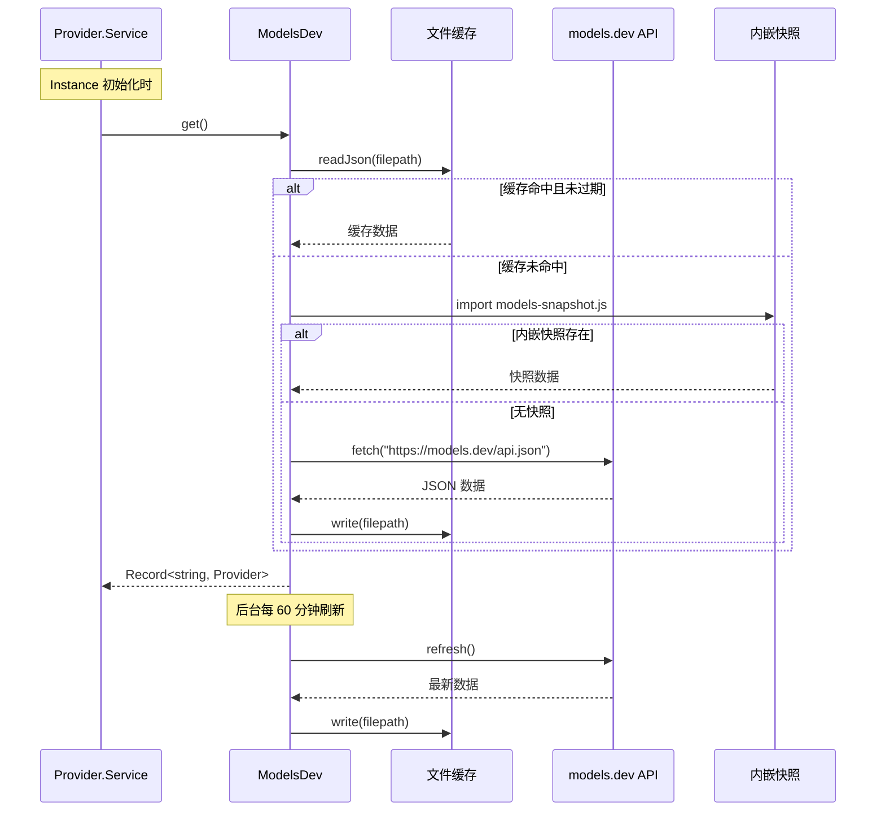
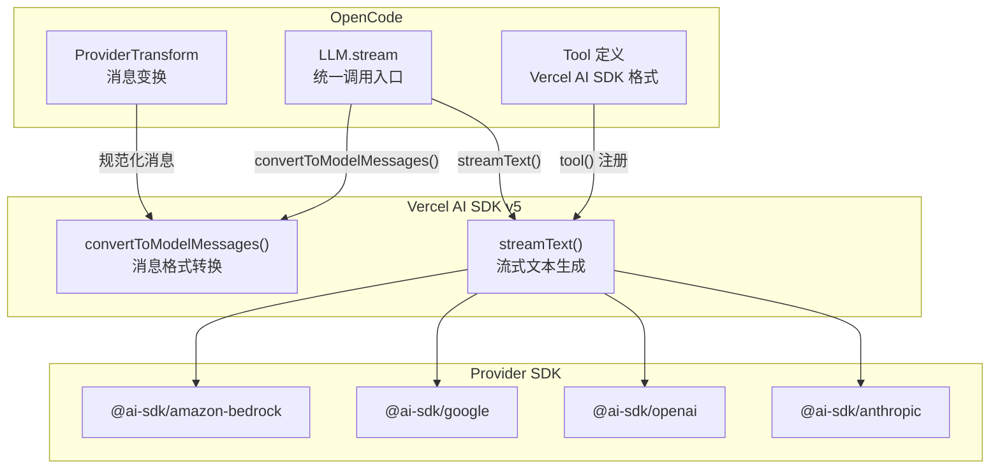
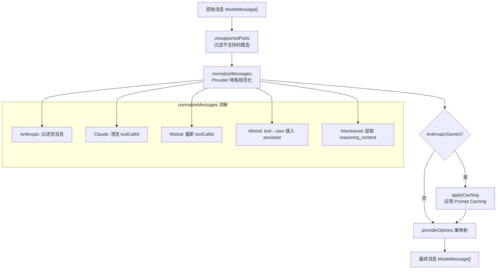
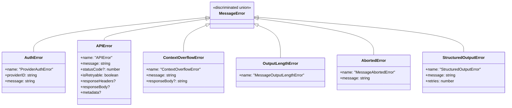

# 04 · Provider 适配与 API 调用

> 本文拆解 OpenCode 的 Provider 抽象层——如何统一 23+ 个 LLM 提供商、模型数据库机制、以及 API 调用与流式响应处理。读完本文，你将理解 OpenCode 如何做到"一套代码，接所有模型"。

**源码版本**: v1.3.17 | **核心包**: `packages/opencode`

---

## 1. 模块在整体架构中的位置



---

## 2. Provider 抽象层架构

### 接口定义

```mermaid
classDiagram
    class ProviderInterface {
        +list() Record~ProviderID, Info~
        +getProvider(providerID) Info
        +getModel(providerID, modelID) Model
        +getLanguage(model) LanguageModelV3
        +closest(providerID, query) ModelRef
        +getSmallModel(providerID) Model
        +defaultModel() ModelRef
    }

    class ProviderInfo {
        +id: ProviderID
        +name: string
        +source: "env" | "config" | "custom" | "api"
        +env: string[]
        +key?: string
        +options: Record
        +models: Record~string, Model~
    }

    class Model {
        +id: ModelID
        +providerID: ProviderID
        +api: { id, url, npm }
        +name: string
        +family?: string
        +capabilities: Capabilities
        +cost: Cost
        +limit: Limit
        +status: "alpha" | "beta" | "deprecated" | "active"
        +options: Record
        +headers: Record
        +variants?: Record
    }

    ProviderInterface --> ProviderInfo : "getProvider"
    ProviderInterface --> Model : "getModel"
    ProviderInfo --> Model : "models"
```

### 数据流



---

## 3. 内置 Provider 清单 (20+)

| Provider ID | SDK 包 | 认证方式 | 特殊处理 |
|-------------|--------|----------|----------|
| `openai` | `@ai-sdk/openai` | API Key / OAuth | Responses API |
| `anthropic` | `@ai-sdk/anthropic` | API Key | Interleaved thinking headers |
| `google` | `@ai-sdk/google` | API Key | Gemini 专用 Prompt |
| `google-vertex` | `@ai-sdk/google-vertex` | Service Account | Google Auth |
| `google-vertex-anthropic` | `@ai-sdk/google-vertex/anthropic` | Service Account | Claude on Vertex |
| `amazon-bedrock` | `@ai-sdk/amazon-bedrock` | AWS Credentials | 跨区域前缀、凭证链 |
| `azure` | `@ai-sdk/azure` | API Key | Responses API / Chat API |
| `azure-cognitive-services` | `@ai-sdk/azure` | API Key | Cognitive Services 端点 |
| `openrouter` | `@openrouter/ai-sdk-provider` | API Key | HTTP-Referer header |
| `mistral` | `@ai-sdk/mistral` | API Key | toolCallId 截断 |
| `xai` | `@ai-sdk/xai` | API Key | Responses API |
| `github-copilot` | `@ai-sdk/github-copilot` | OAuth | Copilot Responses API |
| `gitlab` | `gitlab-ai-provider` | Token / OAuth | Workflow 模型发现 |
| `groq` | `@ai-sdk/groq` | API Key | — |
| `deepinfra` | `@ai-sdk/deepinfra` | API Key | — |
| `cerebras` | `@ai-sdk/cerebras` | API Key | 3rd-party header |
| `cohere` | `@ai-sdk/cohere` | API Key | — |
| `togetherai` | `@ai-sdk/togetherai` | API Key | — |
| `perplexity` | `@ai-sdk/perplexity` | API Key | — |
| `vercel` | `@ai-sdk/vercel` | API Key | HTTP-Referer header |
| `venice` | `venice-ai-sdk-provider` | API Key | — |
| `opencode` | `@ai-sdk/openai-compatible` | API Key / 免费 | 官方托管模型 |
| `openai-compatible` | `@ai-sdk/openai-compatible` | API Key | 通用兼容层 |
| `cloudflare-workers-ai` | `@ai-sdk/openai-compatible` | API Key | Account ID 检测 |
| `cloudflare-ai-gateway` | `ai-gateway-provider` | API Token | Unified API |
| `sap-ai-core` | `@jerome-benoit/sap-ai-provider-v2` | Service Key | SAP AI Core |
| `kilo` | `@ai-sdk/openai-compatible` | API Key | — |

> 💡 **Java 类比**：Provider 抽象层类似 Java 的 JDBC 驱动管理——`DriverManager` 管理多个 `Driver`，每个 `Driver` 连接不同的数据库。这里 `Provider.Service` 管理多个 SDK，每个 SDK 连接不同的 LLM 服务。

---

## 4. 模型数据库机制

### 数据获取流程



### 缓存策略

```typescript
// provider/models.ts — 缓存配置
const ttl = 5 * 60 * 1000  // 5 分钟 TTL

function fresh() {
  return Date.now() - Filesystem.stat(filepath)?.mtimeMs ?? 0 < ttl
}

// 启动时立即后台刷新
if (!Flag.OPENCODE_DISABLE_MODELS_FETCH) {
  ModelsDev.refresh()  // 首次刷新
  setInterval(() => ModelsDev.refresh(), 60 * 1000 * 60).unref()  // 每小时刷新
}
```

### 模型数据结构

```typescript
// provider/models.ts — 从 models.dev 获取的模型结构
const Model = z.object({
  id: z.string(),                    // 如 "claude-sonnet-4-5"
  name: z.string(),                  // 如 "Claude Sonnet 4.5"
  family: z.string().optional(),     // 如 "claude"
  release_date: z.string(),          // 如 "2025-05-22"
  attachment: z.boolean(),            // 支持附件
  reasoning: z.boolean(),             // 支持推理
  temperature: z.boolean(),           // 支持温度调节
  tool_call: z.boolean(),             // 支持工具调用
  interleaved: z.union([...]),        // 交错推理
  cost: z.object({                   // 费用（每百万 Token）
    input: z.number(),
    output: z.number(),
    cache_read: z.number().optional(),
    cache_write: z.number().optional(),
    context_over_200k: z.object({...}).optional(),
  }),
  limit: z.object({                   // Token 限制
    context: z.number(),              // 上下文窗口
    input: z.number().optional(),
    output: z.number(),               // 最大输出
  }),
  modalities: z.object({              // 输入/输出模态
    input: z.array(z.enum(["text", "audio", "image", "video", "pdf"])),
    output: z.array(z.enum(["text", "audio", "image", "video", "pdf"])),
  }),
  status: z.enum(["alpha", "beta", "deprecated"]).optional(),
  options: z.record(z.string(), z.any()),
  headers: z.record(z.string(), z.string()).optional(),
  provider: z.object({ npm: z.string().optional(), api: z.string().optional() }),
  variants: z.record(z.string(), z.record(z.string(), z.any())).optional(),
})
```

---

## 5. Provider 注册与选择

### 初始化流程伪代码

```typescript
// provider/provider.ts — Provider 状态初始化（简化）
async function initState() {
  // 1. 从 models.dev 加载模型数据库
  const modelsDev = await ModelsDev.get()
  const database = mapValues(modelsDev, fromModelsDevProvider)

  const providers = {} as Record<ProviderID, Info>
  const sdk = new Map<string, BundledSDK>()

  // 2. 合并用户配置（opencode.json）
  for (const [providerID, config] of Object.entries(cfg.provider ?? {})) {
    database[providerID] = mergeDeep(database[providerID], config)
  }

  // 3. 加载环境变量中的 API Key
  const env = Env.all()
  for (const [id, provider] of Object.entries(database)) {
    const apiKey = provider.env.map(e => env[e]).find(Boolean)
    if (apiKey) mergeProvider(id, { source: "env", key: apiKey })
  }

  // 4. 加载已存储的认证信息
  const auths = await auth.all()
  for (const [id, info] of Object.entries(auths)) {
    if (info.type === "api") mergeProvider(id, { source: "api", key: info.key })
  }

  // 5. 加载插件认证
  for (const plugin of plugins) {
    if (plugin.auth?.loader) {
      const options = await plugin.auth.loader(auth.get, database[plugin.auth.provider])
      mergeProvider(plugin.auth.provider, { options })
    }
  }

  // 6. 自定义 Provider 处理（特殊逻辑）
  for (const [id, fn] of Object.entries(custom(dep))) {
    const data = database[id]
    const result = await fn(data)  // 返回 { autoload, getModel, vars, options }
    if (result?.autoload || providers[id]) {
      if (result.getModel) modelLoaders[id] = result.getModel
      if (result.vars) varsLoaders[id] = result.vars
      mergeProvider(id, { options: result.options })
    }
  }

  // 7. 应用启用/禁用列表
  for (const [id, provider] of Object.entries(providers)) {
    if (!isProviderAllowed(id)) delete providers[id]
    // 过滤 alpha/deprecated 模型
    for (const [modelID, model] of Object.entries(provider.models)) {
      if (model.status === "alpha" && !Flag.OPENCODE_ENABLE_EXPERIMENTAL_MODELS)
        delete provider.models[modelID]
      if (model.status === "deprecated") delete provider.models[modelID]
    }
  }

  return { providers, sdk, modelLoaders, varsLoaders }
}
```

### 默认模型选择

```typescript
// 优先级：配置 > 最近使用 > 内置优先级
async function defaultModel() {
  // 1. 用户配置的默认模型
  if (cfg.model) return parseModel(cfg.model)

  // 2. 最近使用的模型
  const recent = await readJson(path.join(Global.Path.state, "model.json"))
  for (const entry of recent.recent) {
    if (providers[entry.providerID]?.models[entry.modelID]) return entry
  }

  // 3. 按优先级排序选择
  const provider = Object.values(providers).find(p => ...)
  const model = sort(Object.values(provider.models))[0]
  return { providerID: provider.id, modelID: model.id }
}

// 内置优先级
const priority = ["gpt-5", "claude-sonnet-4", "big-pickle", "gemini-3-pro"]
```

---

## 6. API 调用流程

```mermaid
sequenceDiagram
    participant Loop as runLoop
    participant Handle as SessionProcessor
    participant LLM as LLM.stream
    participant Prov as Provider.getLanguage
    participant SDK as AI SDK
    participant API as LLM API

    Loop->>Handle: handle.process({ system, messages, tools, model })
    Handle->>LLM: stream({ agent, user, model, system, messages, tools })

    LLM->>Prov: getLanguage(model)
    Prov->>Prov: 检查缓存 Map
    alt 缓存命中
        Prov-->>LLM: LanguageModelV3
    else 缓存未命中
        Prov->>Prov: resolveSDK(model)
        Prov->>Prov: 构建 SDK 选项<br/>（apiKey, baseURL, headers, fetch）
        Prov->>Prov: 自定义 fetch（超时、SSE 包装）
        alt 内置 SDK
            Prov->>SDK: BUNDLED_PROVIDERS[npm](options)
        else 外部 SDK
            Prov->>Prov: Npm.add(npm)
            Prov->>SDK: import(entrypoint)
        end
        Prov->>Prov: sdk.languageModel(modelID)
        Prov-->>LLM: LanguageModelV3
    end

    LLM->>LLM: ProviderTransform.message(msgs, model)
    Note over LLM: 消息规范化 + 缓存控制 +<br/>Provider 特殊处理

    LLM->>SDK: streamText({ model, system, messages, tools, ... })
    SDK->>API: POST /chat/completions<br/>或 /responses
    API-->>SDK: SSE 流式响应
    SDK-->>LLM: fullStream (AsyncIterable)
    LLM-->>Handle: Event 流
    Handle-->>Loop: Part 更新 (Bus 事件)
```

### 自定义 fetch 包装

```typescript
// provider/provider.ts — 自定义 fetch 实现
options["fetch"] = async (input, init) => {
  const signals = []

  // 1. 组合多个 AbortSignal
  if (init.signal) signals.push(init.signal)
  if (chunkAbortCtl) signals.push(chunkAbortCtl.signal)
  if (options.timeout) signals.push(AbortSignal.timeout(options.timeout))
  const combined = signals.length === 1 ? signals[0] : AbortSignal.any(signals)

  // 2. 发送请求（禁用 Bun 内置超时）
  const res = await fetchFn(input, { ...init, timeout: false })

  // 3. 对 SSE 流添加超时包装
  if (chunkAbortCtl) return wrapSSE(res, chunkTimeout, chunkAbortCtl)
  return res
}
```

---

## 7. 流式响应 (SSE) 处理

### SSE 超时包装

```typescript
// provider/provider.ts — SSE 读取超时保护
function wrapSSE(res: Response, ms: number, ctl: AbortController) {
  const reader = res.body.getReader()
  const body = new ReadableStream({
    async pull(ctrl) {
      // 每次读取设置超时
      const part = await Promise.race([
        reader.read(),
        new Promise((_, reject) =>
          setTimeout(() => reject(new Error("SSE read timed out")), ms)
        ),
      ])
      if (part.done) ctrl.close()
      ctrl.enqueue(part.value)
    },
    async cancel(reason) {
      ctl.abort(reason)
      await reader.cancel(reason)
    },
  })
  return new Response(body, { headers: res.headers, status: res.status })
}
```

### LLM 流式调用伪代码

```typescript
// session/llm.ts — 核心流式调用（简化）
export async function stream(input: StreamRequest) {
  // 1. 获取 LanguageModel 实例
  const language = await Provider.getLanguage(input.model)

  // 2. 构建模型选项
  const providerOptions = ProviderTransform.options({
    model: input.model,
    sessionID: input.sessionID,
    userOptions: input.user.options,
  })

  // 3. 消息变换（规范化、缓存控制、Provider 特殊处理）
  const messages = ProviderTransform.message(input.messages, input.model, providerOptions)

  // 4. 调用 Vercel AI SDK 的 streamText
  const result = streamText({
    model: language,
    system: input.system,
    messages,
    tools: input.tools,
    providerOptions,
    maxTokens: ProviderTransform.maxOutputTokens(input.model),
    temperature: input.agent.temperature ?? ProviderTransform.temperature(input.model),
    topP: input.agent.topP ?? ProviderTransform.topP(input.model),
    toolChoice: input.toolChoice,
    abortSignal: input.abort,
    experimental_telemetry: { isEnabled: cfg.experimental?.openTelemetry },
  })

  return result
}
```

---

## 8. Vercel AI SDK 集成方式

### 集成架构



### 内置 SDK 映射

```typescript
// provider/provider.ts — 20+ 个内置 SDK
const BUNDLED_PROVIDERS: Record<string, (options: any) => BundledSDK> = {
  "@ai-sdk/amazon-bedrock": createAmazonBedrock,
  "@ai-sdk/anthropic": createAnthropic,
  "@ai-sdk/azure": createAzure,
  "@ai-sdk/google": createGoogleGenerativeAI,
  "@ai-sdk/google-vertex": createVertex,
  "@ai-sdk/google-vertex/anthropic": createVertexAnthropic,
  "@ai-sdk/openai": createOpenAI,
  "@ai-sdk/openai-compatible": createOpenAICompatible,
  "@openrouter/ai-sdk-provider": createOpenRouter,
  "@ai-sdk/xai": createXai,
  "@ai-sdk/mistral": createMistral,
  "@ai-sdk/groq": createGroq,
  "@ai-sdk/deepinfra": createDeepInfra,
  "@ai-sdk/cerebras": createCerebras,
  "@ai-sdk/cohere": createCohere,
  "@ai-sdk/gateway": createGateway,
  "@ai-sdk/togetherai": createTogetherAI,
  "@ai-sdk/perplexity": createPerplexity,
  "@ai-sdk/vercel": createVercel,
  "gitlab-ai-provider": createGitLab,
  "@ai-sdk/github-copilot": createGitHubCopilotOpenAICompatible,
  "venice-ai-sdk-provider": createVenice,
}
```

---

## 9. ProviderTransform 模型变换

`ProviderTransform` 是一个关键的适配层，解决不同 Provider 之间的消息格式差异。

### 变换流程



### Prompt Caching 策略

```typescript
// provider/transform.ts — 对特定 Provider 应用 Prompt Caching
function applyCaching(msgs: ModelMessage[], model: Model): ModelMessage[] {
  const system = msgs.filter(m => m.role === "system").slice(0, 2)   // 前两条系统消息
  const final = msgs.filter(m => m.role !== "system").slice(-2)     // 最后两条消息

  const providerOptions = {
    anthropic: { cacheControl: { type: "ephemeral" } },
    openrouter: { cacheControl: { type: "ephemeral" } },
    bedrock: { cachePoint: { type: "default" } },
    openaiCompatible: { cache_control: { type: "ephemeral" } },
    copilot: { copilot_cache_control: { type: "ephemeral" } },
  }

  // 对系统消息和最后消息添加缓存控制
  for (const msg of unique([...system, ...final])) {
    msg.providerOptions = mergeDeep(msg.providerOptions ?? {}, providerOptions)
  }
  return msgs
}
```

### Variants (推理强度) 支持

```typescript
// provider/transform.ts — 根据模型和 SDK 生成 variants
export function variants(model: Model): Record<string, Record<string, any>> {
  if (!model.capabilities.reasoning) return {}  // 非推理模型不支持

  switch (model.api.npm) {
    case "@ai-sdk/anthropic":
      return {
        high: { thinking: { type: "enabled", budgetTokens: 16000 } },
        max: { thinking: { type: "enabled", budgetTokens: 31999 } },
      }
    case "@ai-sdk/openai":
      return {
        none: { reasoningEffort: "none" },
        minimal: { reasoningEffort: "minimal" },
        low: { reasoningEffort: "low" },
        medium: { reasoningEffort: "medium" },
        high: { reasoningEffort: "high" },
        xhigh: { reasoningEffort: "xhigh" },
      }
    case "@ai-sdk/google-vertex":
    case "@ai-sdk/google":
      return {
        low: { thinkingConfig: { includeThoughts: true, thinkingLevel: "low" } },
        high: { thinkingConfig: { includeThoughts: true, thinkingLevel: "high" } },
      }
    // ... 其他 Provider
  }
}
```

---

## 10. 错误处理

### 错误类型层次



### 上下文溢出检测

```typescript
// provider/error.ts — 20 种溢出模式匹配（+ 1 个非正则 4xx 检测）
const OVERFLOW_PATTERNS = [
  /prompt is too long/i,                          // Anthropic
  /input is too long for requested model/i,          // Amazon Bedrock
  /exceeds the context window/i,                  // OpenAI
  /input token count.*exceeds the maximum/i,       // Google
  /maximum prompt length is \d+/i,                  // xAI
  /reduce the length of the messages/i,            // Groq
  /maximum context length is \d+ tokens/i,         // OpenRouter
  /exceeds the limit of \d+/i,                     // GitHub Copilot
  /exceeds the available context size/i,            // llama.cpp
  /greater than the context length/i,               // LM Studio
  /context_window_exceeded/i,                      // z.ai
  /prompt too long; exceeded.*context length/i,      // Ollama
  /too large for model with \d+.*context length/i,   // Mistral
  /model_context_window_exceeded/i,                 // z.ai
]
```

### 错误分类

```typescript
// provider/error.ts — 将 API 错误分为两类
export function parseAPICallError(input): ParsedAPICallError {
  if (isOverflow(message) || statusCode === 413) {
    return { type: "context_overflow", message, responseBody }
  }
  return { type: "api_error", message, statusCode, isRetryable, ... }
}

// context_overflow → 触发自动压缩
// api_error → 记录错误，可能重试
```

---

## 11. 关键设计决策

| 决策 | 原因 |
|------|------|
| **统一抽象 vs 直接集成** | 通过 Vercel AI SDK 统一接口，避免为每个 Provider 写适配代码 |
| **模型数据库 (models.dev)** | 集中管理 200+ 模型的元数据，无需硬编码 |
| **SDK 实例缓存** | 相同配置的 SDK 实例只创建一次，避免重复初始化 |
| **fetch 包装** | 统一超时控制、SSE 超时保护、请求追踪 |
| **Prompt Caching** | 对 Anthropic/OpenRouter/Bedrock 自动应用缓存控制 |
| **Variant 机制** | 统一的推理强度控制，屏蔽底层 API 差异 |
| **Provider-specific Prompt** | 不同模型需要不同的指令风格，提升输出质量 |
| **错误分类** | 区分上下文溢出（可恢复）和其他 API 错误（可能重试） |
| **模糊搜索推荐** | 模型名错误时，使用 fuzzysort 推荐相似模型 |

---

## 📦 源码锚点表

| 文件路径 | 核心职责 | 关键行号 |
|----------|----------|----------|
| `src/provider/provider.ts` | **Provider 服务核心**：SDK 管理、模型注册、LanguageModel 创建 | L60-1709 全文 |
| `src/provider/provider.ts` | BUNDLED_PROVIDERS (20+ SDK 映射) | L127-150 |
| `src/provider/provider.ts` | resolveSDK (SDK 实例化) | L1333-1468 |
| `src/provider/provider.ts` | getLanguage (LanguageModel 获取) | L1492-1533 |
| `src/provider/provider.ts` | getModel (模型查询 + 模糊推荐) | L1474-1490 |
| `src/provider/provider.ts` | Model Zod Schema | L819-888 |
| `src/provider/provider.ts` | Info Zod Schema | L890-903 |
| `src/provider/provider.ts` | fromModelsDevProvider (数据库转换) | L995-1004 |
| `src/provider/provider.ts` | closest (模糊匹配) | L1535-1545 |
| `src/provider/provider.ts` | defaultModel (默认选择) | L1603-1632 |
| `src/provider/provider.ts` | sort (模型排序优先级) | L1677-1684 |
| `src/provider/schema.ts` | ProviderID / ModelID 品牌类型 + 静态常量 | L1-38 |
| `src/provider/models.ts` | models.dev 数据获取、缓存、刷新 | L16-162 |
| `src/provider/models.ts` | Model / Provider Zod Schema | L25-89 |
| `src/provider/transform.ts` | **模型变换**：消息规范化、缓存控制、Variant 生成 | L21-1052 全文 |
| `src/provider/transform.ts` | message (消息变换入口) | L278-322 |
| `src/provider/transform.ts` | normalizeMessages (Provider 特殊处理) | L49-190 |
| `src/provider/transform.ts` | applyCaching (缓存策略) | L192-238 |
| `src/provider/transform.ts` | variants (推理强度) | L364-744 |
| `src/provider/transform.ts` | options (Provider 选项) | L746-864 |
| `src/provider/transform.ts` | providerOptions (选项路由) | L907-946 |
| `src/provider/transform.ts` | schema (JSON Schema 适配) | L952-1051 |
| `src/provider/error.ts` | 错误解析：溢出检测、错误分类 | L1-197 |
| `src/provider/error.ts` | OVERFLOW_PATTERNS (28 种模式) | L9-29 |
| `src/session/llm.ts` | LLM 流式调用封装 | L80-358 |
| `src/npm/` | NPM 包动态安装 | — |
