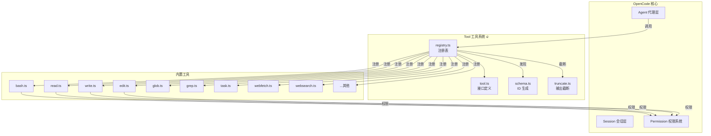
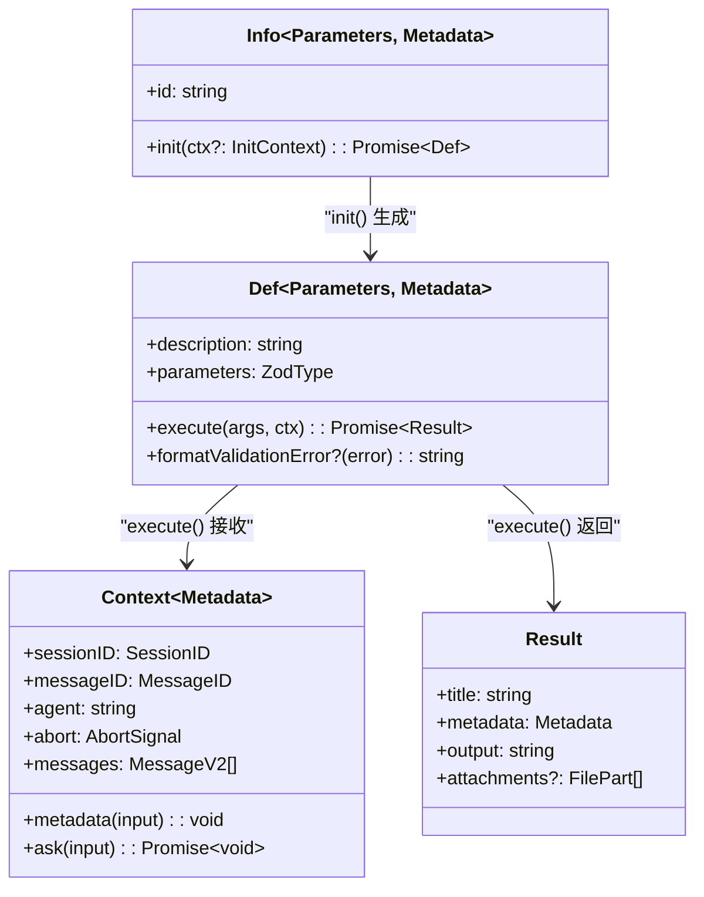
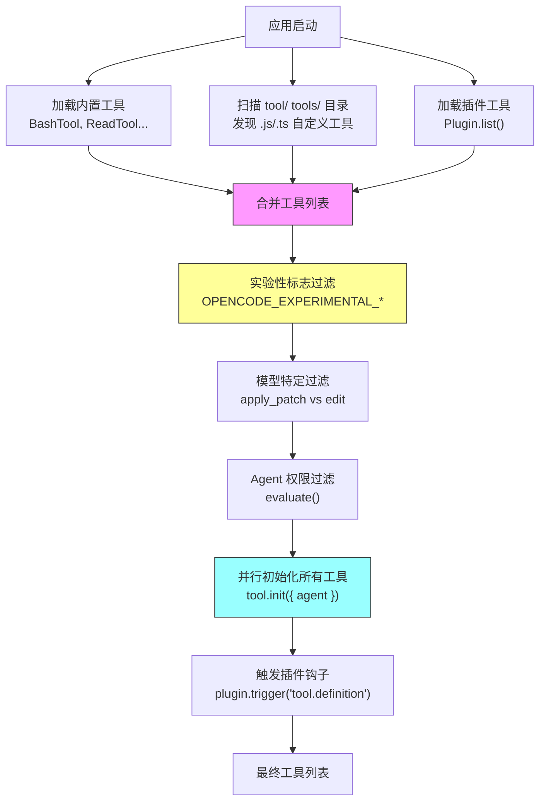
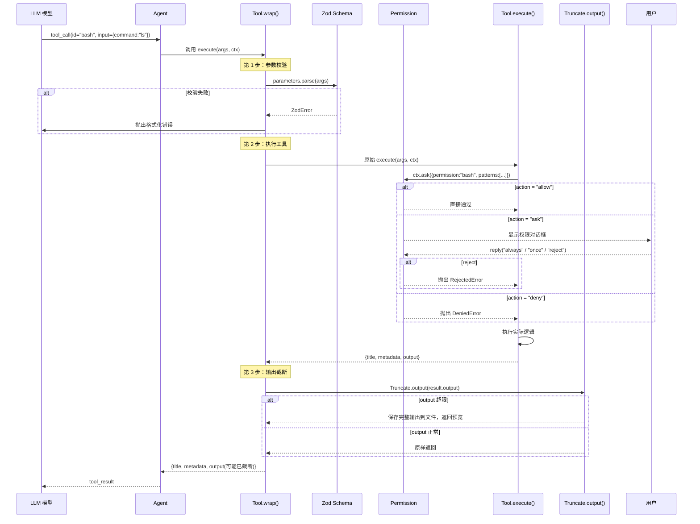
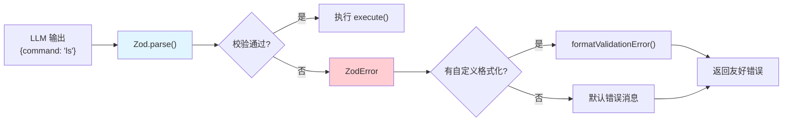
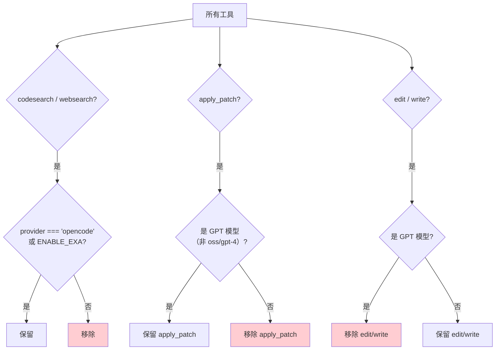

# Tool 系统详解

> OpenCode v1.3.17 源码学习 | 执行阶段

## 📌 模块位置



> 💡 **Java 类比**：OpenCode 的 Tool 系统类似 Java 的 **Strategy 模式 + Spring Bean 注册表**。`Tool.Def` 是策略接口，`ToolRegistry` 是 ApplicationContext，每个工具是一个 `@Component` Bean。`Tool.define()` 就像 `@Bean` 注解，而 `ToolRegistry.tools()` 就像 `ApplicationContext.getBeansOfType()`。

---

## 1. Tool 接口设计

### 核心类型层次



### 伪代码：核心接口

```typescript
// ===== tool.ts — Tool 命名空间 =====

namespace Tool {
  // 工具元数据（任意类型）
  interface Metadata {
    [key: string]: any
  }

  // 初始化上下文（可选传入 Agent 信息）
  interface InitContext {
    agent?: Agent.Info
  }

  // 工具执行上下文（每次调用时创建）
  type Context<M extends Metadata = Metadata> = {
    sessionID: SessionID      // 会话 ID
    messageID: MessageID       // 消息 ID
    agent: string              // 当前 Agent 名称
    abort: AbortSignal         // 中止信号
    callID?: string            // 调用 ID
    extra?: Record<string, any> // 额外数据
    messages: MessageV2[]      // 历史消息
    metadata(input): void     // 更新元数据（流式显示用）
    ask(input): Promise<void>  // 请求权限
  }

  // 工具定义（核心接口）
  interface Def<Parameters extends ZodType, M extends Metadata> {
    description: string        // 工具描述（给 LLM 看）
    parameters: Parameters     // Zod schema（参数校验）
    execute(args, ctx): Promise<{
      title: string            // 简短标题
      metadata: M              // 元数据
      output: string           // 输出文本
      attachments?: FilePart[] // 附件（图片等）
    }>
    formatValidationError?(error: ZodError): string  // 自定义错误格式
  }

  // 工具信息（可延迟初始化）
  interface Info<Parameters, M> {
    id: string                  // 工具唯一标识
    init(ctx?): Promise<Def>    // 初始化 → 返回 Def
  }
}
```

> 💡 **Java 类比**：`Tool.Info` 类似 `FactoryBean<T>`，有一个 `init()` 工厂方法延迟创建实例。`Tool.Def` 类似 `CommandLineRunner`，`execute()` 是核心执行逻辑。`Context` 类似 `ApplicationContext`，提供运行时环境信息。

---

## 2. Tool 注册与发现机制



### 伪代码：注册流程

```typescript
// ===== registry.ts — ToolRegistry =====

namespace ToolRegistry {
  // 全局状态：自定义工具列表
  type State = {
    custom: Tool.Info[]
  }

  // 构建工具列表
  async function tools(model, agent?) {
    // 1️⃣ 获取自定义工具
    const { custom } = await getState()

    // 2️⃣ 合并所有工具
    const allTools = [
      invalid,              // 占位工具（错误处理）
      ...(question ? [ask] : []),  // 仅 app/cli/desktop
      bash, read, glob, grep,     // 核心工具
      edit, write, task, fetch,   // 文件操作
      todo, search, code, skill,  // 辅助工具
      patch,                      // Patch 工具
      ...(experimentalLsp ? [lsp] : []),     // 实验性
      ...(batchEnabled ? [batch] : []),       // 实验性
      ...(planMode ? [plan] : []),            // 实验性
      ...custom,                               // 自定义 + 插件
    ]

    // 3️⃣ 按模型过滤
    const filtered = allTools.filter(tool => {
      // codesearch/websearch 仅 OpenCode provider
      if (['codesearch', 'websearch'].includes(tool.id)) {
        return model.providerID === 'opencode' || ENABLE_EXA
      }
      // apply_patch vs edit/write 互斥
      const usePatch = isGPTModel(model.modelID)
      if (tool.id === 'apply_patch') return usePatch
      if (tool.id === 'edit' || tool.id === 'write') return !usePatch
      return true
    })

    // 4️⃣ 并行初始化 + 插件钩子
    return await Promise.all(filtered.map(async tool => {
      const def = await tool.init({ agent })
      // 触发插件修改工具定义
      await plugin.trigger('tool.definition', { toolID: tool.id }, {
        description: def.description,
        parameters: def.parameters,
      })
      return { id: tool.id, ...def }
    }))
  }
}
```

---

## 3. 内置工具清单

| # | 工具 ID | 描述 | 输入概要 | 输出概要 |
|---|---------|------|---------|---------|
| 1 | `invalid` | 错误占位 | tool, error | 错误信息 |
| 2 | `question` | 向用户提问 | questions[] | 用户回答 |
| 3 | `bash` | 执行 Shell 命令 | command, timeout?, workdir?, description | 命令输出 |
| 4 | `read` | 读取文件/目录 | filePath, offset?, limit? | 文件内容/目录列表 |
| 5 | `glob` | 文件名模式匹配 | pattern, path? | 匹配文件列表 |
| 6 | `grep` | 内容正则搜索 | pattern, path?, include? | 匹配行列表 |
| 7 | `edit` | 精确替换文件片段 | filePath, oldString, newString, replaceAll? | 编辑结果 + diff |
| 8 | `write` | 写入文件 | filePath, content | 写入结果 + LSP 诊断 |
| 9 | `task` | 调用子 Agent | description, prompt, subagent_type | 子 Agent 输出 |
| 10 | `webfetch` | 抓取 URL 内容 | url, format?, timeout? | 网页内容 |
| 11 | `todowrite` | 更新 Todo 列表 | todos[] | Todo JSON |
| 12 | `websearch` | 网络搜索 | query, numResults?, type? | 搜索结果 |
| 13 | `codesearch` | 代码上下文搜索 | query, tokensNum? | 代码片段 |
| 14 | `skill` | 加载技能 | name | 技能内容 |
| 15 | `apply_patch` | 应用 Patch | patchText | 变更摘要 |
| 16 | `lsp` | LSP 操作（实验性） | operation, filePath, line, character | LSP 结果 |
| 17 | `batch` | 批量执行工具（实验性） | tool_calls[] | 批量结果 |
| 18 | `plan_exit` | 退出计划模式（实验性） | {} | 确认信息 |

---

## 4. Tool 调用流程



### 伪代码：wrap 包装器

```typescript
// ===== tool.ts — wrap 函数 =====

function wrap(id, init) {
  return async (initCtx?) => {
    const toolInfo = init instanceof Function 
      ? await init(initCtx)    // 延迟初始化
      : { ...init }             // 直接使用

    const originalExecute = toolInfo.execute

    // 包装 execute，添加校验 + 截断
    toolInfo.execute = async (args, ctx) => {
      // 1️⃣ Zod 参数校验
      try {
        toolInfo.parameters.parse(args)
      } catch (error) {
        if (error instanceof ZodError) {
          if (toolInfo.formatValidationError) {
            throw new Error(toolInfo.formatValidationError(error))
          }
        }
        throw new Error(`Tool ${id} called with invalid arguments: ${error}`)
      }

      // 2️⃣ 执行原始逻辑
      const result = await originalExecute(args, ctx)

      // 3️⃣ 如果已手动截断，跳过
      if (result.metadata.truncated !== undefined) {
        return result
      }

      // 4️⃣ 自动截断
      const truncated = await Truncate.output(result.output, {}, initCtx?.agent)
      return {
        ...result,
        output: truncated.content,
        metadata: {
          ...result.metadata,
          truncated: truncated.truncated,
          ...(truncated.truncated && { outputPath: truncated.outputPath }),
        },
      }
    }

    return toolInfo
  }
}
```

---

## 5. 自定义 Tool 示例

```typescript
// ===== 如何用 Tool.define 注册自定义工具 =====

import { Tool } from "./tool"
import { z } from "zod"

// 方式 1：直接定义（静态）
export const MyTool = Tool.define("my_tool", {
  description: "我的自定义工具",
  parameters: z.object({
    query: z.string().describe("搜索关键词"),
    limit: z.number().optional().describe("结果数量限制"),
  }),
  async execute(params, ctx) {
    // ctx.ask() → 权限检查
    await ctx.ask({
      permission: "my_tool",
      patterns: [params.query],
      always: ["*"],
      metadata: {},
    })

    // 实际执行逻辑
    const results = await doSearch(params.query, params.limit)

    // 返回标准格式
    return {
      title: `搜索: ${params.query}`,
      output: JSON.stringify(results, null, 2),
      metadata: { count: results.length },
    }
  },
})

// 方式 2：延迟初始化（动态）
export const DynamicTool = Tool.define("dynamic_tool", async (initCtx) => {
  // 可以根据 Agent 信息决定行为
  const agentName = initCtx?.agent?.name ?? "default"

  return {
    description: `动态工具 (for ${agentName})`,
    parameters: z.object({ input: z.string() }),
    async execute(params, ctx) {
      return {
        title: "动态结果",
        output: `Agent: ${agentName}, Input: ${params.input}`,
        metadata: {},
      }
    },
  }
})

// 方式 3：Effect 依赖注入
export const EffectTool = Tool.defineEffect(
  "effect_tool",
  Effect.gen(function* () {
    const db = yield* Database.Service   // 注入数据库服务
    const config = yield* Config.Service // 注入配置服务

    return {
      description: "带依赖注入的工具",
      parameters: z.object({ id: z.string() }),
      async execute(params, ctx) {
        const result = yield* db.query(params.id)
        return {
          title: "查询结果",
          output: JSON.stringify(result),
          metadata: {},
        }
      },
    }
  }),
)
```

---

## 6. Zod Schema 校验机制



Zod 在 Tool 系统中的三个作用：

| 作用 | 说明 | 示例 |
|------|------|------|
| **参数校验** | `wrap()` 中 `parameters.parse(args)` | 缺少必填字段、类型错误 |
| **描述生成** | `parameters` 的 Zod schema 自动转为 JSON Schema | LLM 识别需要哪些参数 |
| **类型推导** | `z.infer<Parameters>` 自动推导 `execute` 参数类型 | 无需手写类型 |

> 💡 **Java 类比**：Zod 类似 Java 的 **Bean Validation (JSR 380)**。`z.object({command: z.string()})` 类似 `@NotNull @NotBlank String command`。但 Zod 更强大，它同时负责 JSON Schema 生成和 TypeScript 类型推导。

---

## 7. 工具过滤逻辑

### 按模型过滤



### 按实验标志过滤

| 标志 | 影响的工具 |
|------|-----------|
| `OPENCODE_EXPERIMENTAL_LSP_TOOL` | 启用 `lsp` 工具 |
| `cfg.experimental.batch_tool` | 启用 `batch` 工具 |
| `OPENCODE_EXPERIMENTAL_PLAN_MODE` + CLI | 启用 `plan_exit` 工具 |
| `app` / `cli` / `desktop` 客户端 | 启用 `question` 工具 |

### 按权限过滤

Agent 权限规则通过 `Permission.evaluate()` 过滤：
- `edit: { "*": "deny" }` → plan Agent 无法使用 edit/write
- `grep: "allow"` → explore Agent 可以使用 grep

---

## 🔑 关键设计决策

### 1. 延迟初始化（Lazy Init）

工具定义与工具实例分离。`Tool.Info` 只包含 `id` 和 `init()`，真正的 `Def` 在首次使用时才创建。

**原因**：某些工具（如 `ReadTool`）需要注入 Effect 服务（`AppFileSystem`, `LSP` 等），不能在模块加载时就创建。

### 2. 包装器模式（Wrapper Pattern）

`wrap()` 函数在原始 `execute()` 外层包装了：
- Zod 参数校验
- 输出自动截断
- 错误格式化

**原因**：让工具开发者专注于业务逻辑，不必重复编写校验和截断代码。

### 3. 内置 + 自定义 + 插件三级发现

```
内置工具（编译时确定）
  ↓ 合并
文件扫描（{tool,tools}/*.{js,ts}）
  ↓ 合并
插件工具（plugin.tool）
```

**原因**：兼顾开箱即用与用户扩展。

### 4. 模型特定工具选择

GPT 系列模型使用 `apply_patch`（一次性多文件修改），其他模型使用 `edit/write`。

**原因**：`apply_patch` 适合大上下文窗口模型，`edit/write` 对小窗口模型更可靠。

---

## 📦 源码锚点表

| 文件 | 路径 | 关键内容 |
|------|------|---------|
| Tool 接口定义 | `packages/opencode/src/tool/tool.ts` | `Tool.Def`, `Tool.Info`, `Tool.Context`, `Tool.define()`, `wrap()` |
| 工具注册表 | `packages/opencode/src/tool/registry.ts` | `ToolRegistry.tools()`, 过滤逻辑, 自定义工具发现 |
| Tool ID Schema | `packages/opencode/src/tool/schema.ts` | `ToolID` 品牌类型, ID 生成 |
| Bash 工具 | `packages/opencode/src/tool/bash.ts` | Shell 命令执行, Tree-sitter 解析, 权限扫描 |
| Read 工具 | `packages/opencode/src/tool/read.ts` | 文件/目录读取, 流式行读取, 二进制检测 |
| Write 工具 | `packages/opencode/src/tool/write.ts` | 文件写入, LSP 诊断 |
| Edit 工具 | `packages/opencode/src/tool/edit.ts` | 多策略替换, Levenshtein 模糊匹配 |
| Glob 工具 | `packages/opencode/src/tool/glob.ts` | 文件名模式匹配 |
| Grep 工具 | `packages/opencode/src/tool/grep.ts` | ripgrep 内容搜索 |
| Task 工具 | `packages/opencode/src/tool/task.ts` | 子 Agent 调度 |
| Question 工具 | `packages/opencode/src/tool/question.ts` | 用户交互 |
| WebFetch 工具 | `packages/opencode/src/tool/webfetch.ts` | URL 抓取, HTML→Markdown |
| WebSearch 工具 | `packages/opencode/src/tool/websearch.ts` | Exa API 搜索 |
| CodeSearch 工具 | `packages/opencode/src/tool/codesearch.ts` | Exa 代码搜索 |
| Skill 工具 | `packages/opencode/src/tool/skill.ts` | 技能加载 |
| ApplyPatch 工具 | `packages/opencode/src/tool/apply_patch.ts` | Patch 解析与应用 |
| LSP 工具 | `packages/opencode/src/tool/lsp.ts` | LSP 操作（实验性） |
| Batch 工具 | `packages/opencode/src/tool/batch.ts` | 批量工具执行 |
| 输出截断 | `packages/opencode/src/tool/truncate.ts` | `Truncate.output()`, 行数/字节限制 |
| 外部目录检查 | `packages/opencode/src/tool/external-directory.ts` | `assertExternalDirectory()` |
