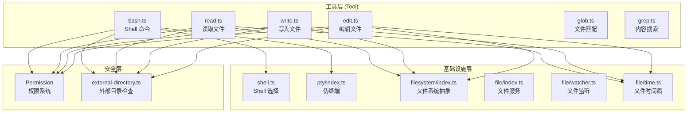
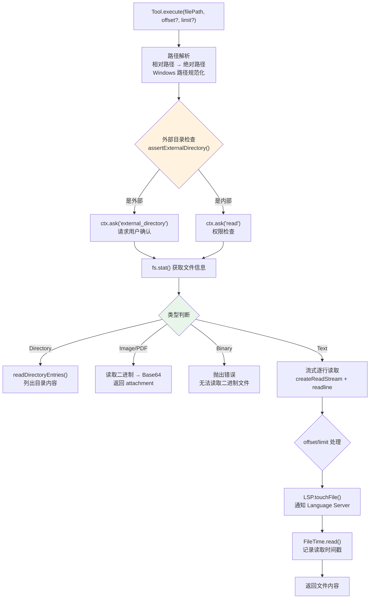
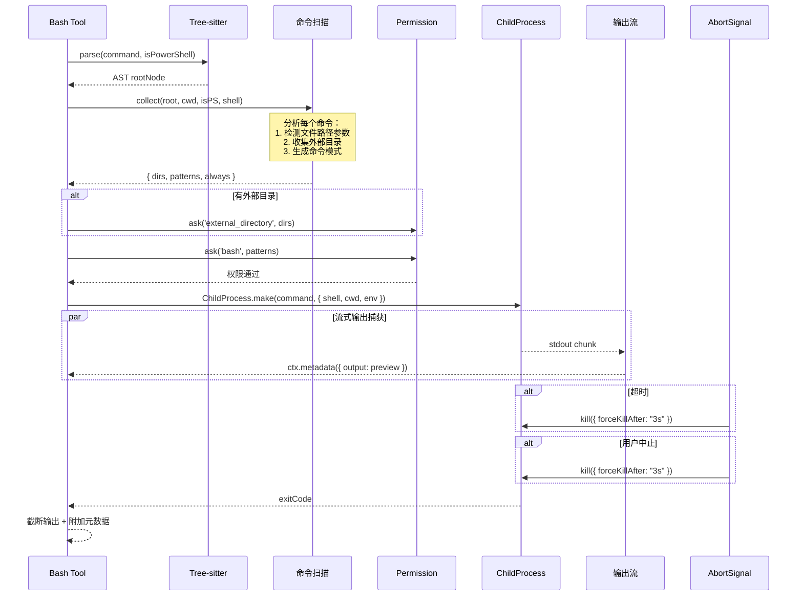
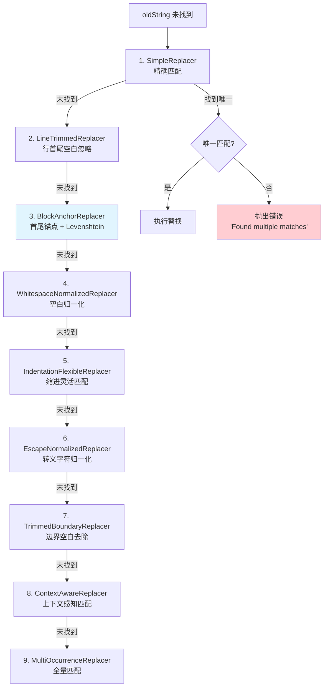
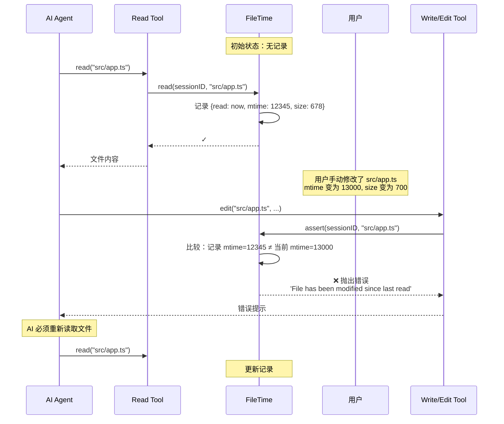
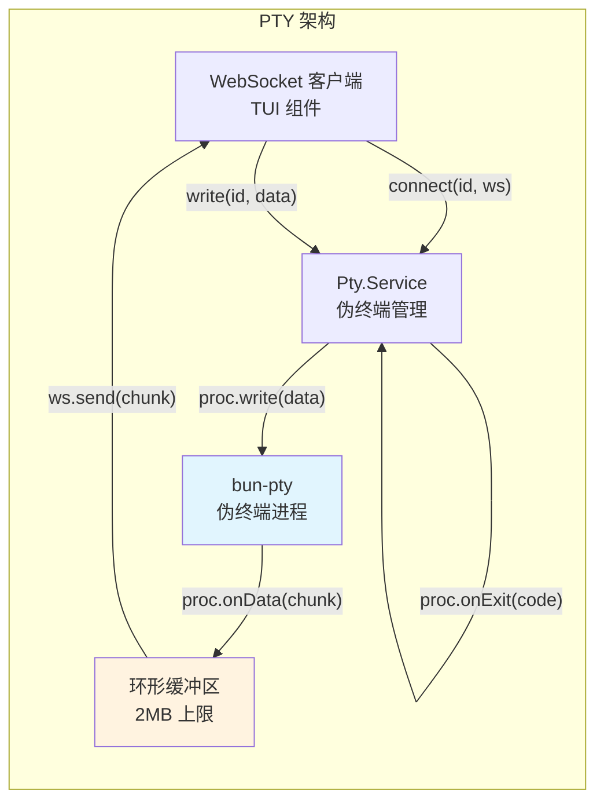

# 06 · 文件操作与 Shell 执行

> OpenCode v1.3.17 源码学习 | 执行阶段

## 📌 模块位置



> 💡 **Java 类比**：`AppFileSystem` 类似 Java NIO 的 `Path` + `Files` 工具类。`FileTime` 类似一个**文件版本控制器**（类似乐观锁），确保 AI 读过文件后才允许写入，防止覆盖用户的手动修改。

---

## 1. 文件读写操作流程

### Read 工具



### Read 核心伪代码

```typescript
// ===== read.ts — 核心读取逻辑 =====

async function lines(filepath: string, opts: { limit: number; offset: number }) {
  const stream = createReadStream(filepath, { encoding: "utf8" })
  const rl = createInterface({ input: stream, crlfDelay: Infinity })

  const start = opts.offset - 1   // 转为 0-based
  const raw: string[] = []
  let bytes = 0
  let count = 0
  let cut = false    // 字节超限
  let more = false   // 行数超限

  for await (const text of rl) {
    count += 1
    if (count <= start) continue           // 跳过 offset 之前的行

    if (raw.length >= opts.limit) {
      more = true                          // 行数超限
      continue
    }

    // 单行截断
    const line = text.length > 2000
      ? text.substring(0, 2000) + "... (truncated)"
      : text

    // 字节限制 (50KB)
    const size = Buffer.byteLength(line, "utf-8") + (raw.length > 0 ? 1 : 0)
    if (bytes + size > 50 * 1024) {
      cut = true
      more = true
      break
    }

    raw.push(line)
    bytes += size
  }

  return { raw, count, cut, more, offset: opts.offset }
}
```

### 二进制文件检测

```typescript
// ===== read.ts — isBinaryFile =====

async function isBinaryFile(filepath: string, fileSize: number): Promise<boolean> {
  // 1️⃣ 先检查扩展名（快速路径）
  const ext = path.extname(filepath).toLowerCase()
  if ([".zip", ".jar", ".class", ".wasm", ".exe", ...].includes(ext)) {
    return true
  }

  // 2️⃣ 采样检测（读取前 4096 字节）
  const fh = await open(filepath, "r")
  const bytes = Buffer.alloc(Math.min(4096, fileSize))
  const result = await fh.read(bytes, 0, sampleSize, 0)

  // 检查 NULL 字节 + 不可打印字符比例
  let nonPrintableCount = 0
  for (let i = 0; i < result.bytesRead; i++) {
    if (bytes[i] === 0) return true       // NULL 字节 = 确定是二进制
    if (bytes[i] < 9 || (bytes[i] > 13 && bytes[i] < 32)) {
      nonPrintableCount++
    }
  }
  return nonPrintableCount / result.bytesRead > 0.3  // 30% 阈值
}
```

---

## 2. Shell 命令执行流程



### Tree-sitter 命令解析

Bash 工具使用 **Tree-sitter** 解析命令，而非简单的字符串匹配。这确保了对命令结构的精确理解：

```typescript
// ===== bash.ts — Tree-sitter 解析 =====

const parser = lazy(async () => {
  const { Parser } = await import("web-tree-sitter")
  await Parser.init({ locateFile: () => treeWasmPath })

  // 加载 Bash 和 PowerShell 语法
  const [bashLang, psLang] = await Promise.all([
    Language.load(bashWasm),
    Language.load(psWasm),
  ])
  const bash = new Parser(); bash.setLanguage(bashLang)
  const ps = new Parser();   ps.setLanguage(psLang)
  return { bash, ps }
})

// 解析命令 → AST
async function parse(command: string, isPowerShell: boolean) {
  const tree = await parser().then(p => 
    (isPowerShell ? p.ps : p.bash).parse(command)
  )
  return tree.rootNode
}
```

### 命令扫描（安全分析）

```typescript
// ===== bash.ts — collect 函数 =====

async function collect(root: Node, cwd: string, isPS: boolean, shell: string) {
  const scan = { dirs: new Set(), patterns: new Set(), always: new Set() }

  for (const node of commands(root)) {
    const tokens = parts(node).map(item => item.text)
    const cmd = isPS ? tokens[0]?.toLowerCase() : tokens[0]

    // 检测涉及文件操作的命令
    if (cmd && FILES.has(cmd)) {
      // FILES = {rm, cp, mv, mkdir, touch, chmod, chown, cat, ...}
      for (const arg of pathArgs(command, isPS)) {
        const resolved = await argPath(arg, cwd, isPS, shell)
        if (!resolved || Instance.containsPath(resolved)) continue
        
        // 收集外部目录
        const dir = (await Filesystem.isDir(resolved)) 
          ? resolved : path.dirname(resolved)
        scan.dirs.add(dir)
      }
    }

    // 收集命令模式（用于权限匹配）
    scan.patterns.add(source(node))
    scan.always.add(BashArity.prefix(tokens).join(" ") + " *")
  }

  return scan
}
```

---

## 3. Read / Write / Edit 三种操作对比

| 维度 | Read | Write | Edit |
|------|------|-------|------|
| **目的** | 读取文件内容 | 创建/覆盖文件 | 精确替换片段 |
| **参数** | filePath, offset?, limit? | filePath, content | filePath, oldString, newString |
| **路径要求** | 绝对或相对 | 必须绝对 | 必须绝对 |
| **权限类型** | `read` | `edit` | `edit` |
| **FileTime 检查** | 记录读取时间戳 | 断言已读取 | 断言已读取 + 加锁 |
| **外部目录** | 检查 | 检查 | 检查 |
| **Diff 生成** | 无 | `createTwoFilesPatch()` | `createTwoFilesPatch()` |
| **LSP 通知** | `touchFile(false)` | `touchFile(true)` + 诊断 | `touchFile(true)` + 诊断 |
| **格式化** | 无 | `Format.file()` | `Format.file()` |
| **文件监听** | 无 | `FileWatcher.Updated` | `FileWatcher.Updated` |
| **二进制检测** | 拒绝读取 | 无 | 无 |
| **输出截断** | 50KB / 2000 行 | 无 | 无 |

---

## 4. Edit 工具的多策略替换

Edit 工具的核心是 `replace()` 函数，它实现了 **9 种替换策略** 的级联回退：



### BlockAnchorReplacer 核心算法

```typescript
// ===== edit.ts — BlockAnchorReplacer =====

function* BlockAnchorReplacer(content: string, find: string): Generator<string> {
  const searchLines = find.split("\n")
  if (searchLines.length < 3) return  // 至少 3 行才有锚点意义

  const firstLine = searchLines[0].trim()
  const lastLine = searchLines[searchLines.length - 1].trim()

  // 收集候选位置：首尾行都匹配
  const candidates = []
  for (let i = 0; i < originalLines.length; i++) {
    if (originalLines[i].trim() !== firstLine) continue
    for (let j = i + 2; j < originalLines.length; j++) {
      if (originalLines[j].trim() === lastLine) {
        candidates.push({ startLine: i, endLine: j })
        break
      }
    }
  }

  if (candidates.length === 0) return

  // 计算中间行的 Levenshtein 相似度
  if (candidates.length === 1) {
    // 单候选：宽松阈值 (0.0)
    const similarity = computeSimilarity(candidates[0], searchLines)
    if (similarity >= 0.0) yield extractContent(candidates[0])
  } else {
    // 多候选：严格阈值 (0.3)
    const best = candidates.maxBy(c => computeSimilarity(c, searchLines))
    if (best.similarity >= 0.3) yield extractContent(best)
  }
}
```

> 💡 **Java 类比**：这种多策略替换类似 Java 的 **java.text.Normalizer** + **Apache Commons StringUtils** 的组合。但 OpenCode 更激进——它会尝试 9 种策略，而 Java 通常只做精确匹配。

---

## 5. FileTime 时间戳保护



### FileTime 核心伪代码

```typescript
// ===== file/time.ts =====

namespace FileTime {
  // 每个会话维护一个 读取记录表
  // Key: "sessionID" → "filepath"
  // Value: { read: Date, mtime: number, size: number }

  async function assert(sessionID: string, filepath: string) {
    const time = reads.get(sessionID)?.get(filepath)
    if (!time) {
      throw new Error(`You must read ${filepath} before overwriting it`)
    }

    const current = await stamp(filepath)
    const changed = current.mtime !== time.mtime 
                 || current.size !== time.size

    if (changed) {
      throw new Error(
        `File ${filepath} has been modified since last read.\n` +
        `Last modification: ${current.mtime}\n` +
        `Last read: ${time.read}\n\n` +
        `Please read the file again before modifying it.`
      )
    }
  }

  // Edit 工具使用文件锁防止并发冲突
  async function withLock<T>(filepath: string, fn: () => Promise<T>) {
    const semaphore = getLock(filepath)  // 每个文件一个信号量
    return await semaphore.withPermits(1, () => fn())
  }
}
```

---

## 6. PTY（伪终端）集成

PTY 模块提供完整的终端模拟功能，用于 TUI 界面中的嵌入式终端：



### PTY 创建流程

```typescript
// ===== pty/index.ts — 核心创建逻辑 =====

async function create(input: CreateInput) {
  const id = PtyID.ascending()
  const command = input.command || Shell.preferred()
  const args = input.args || []

  // 如果是 login shell，添加 -l 参数
  if (Shell.login(command)) args.push("-l")

  const env = {
    ...process.env,
    ...input.env,
    TERM: "xterm-256color",
    OPENCODE_TERMINAL: "1",
  }

  // 使用 bun-pty 创建伪终端
  const spawn = await import("bun-pty").then(m => m.spawn)
  const proc = spawn(command, args, {
    name: "xterm-256color",
    cwd: input.cwd,
    env,
  })

  // 设置输出缓冲
  const session = {
    info: { id, title, command, args, cwd, status: "running", pid: proc.pid },
    process: proc,
    buffer: "",           // 环形缓冲区
    bufferCursor: 0,     // 缓冲区游标
    subscribers: new Map(),  // WebSocket 订阅者
  }

  // 流式输出处理
  proc.onData((chunk) => {
    // 转发给所有 WebSocket 订阅者
    for (const [key, ws] of session.subscribers) {
      if (ws.readyState === 1) ws.send(chunk)
    }

    // 写入缓冲区
    session.buffer += chunk
    if (session.buffer.length > 2 * 1024 * 1024) {
      const excess = session.buffer.length - 2 * 1024 * 1024
      session.buffer = session.buffer.slice(excess)
      session.bufferCursor += excess
    }
  })

  proc.onExit(({ exitCode }) => {
    session.info.status = "exited"
    Bus.publish(Event.Exited, { id, exitCode })
    remove(id)  // 自动清理
  })
}
```

> 💡 **Java 类比**：PTY 类似 Java 的 **Apache MINA SSHD** 或 **pty4j**。`bun-pty` 是底层伪终端库（类似 JNI 调用 `openpty()`），OpenCode 在此基础上添加了 WebSocket 多路复用和缓冲管理。

---

## 7. 安全机制

### 权限检查流程

工具调用涉及的安全机制（目录权限校验、allow/deny/ask 策略、Deferred 级联）由独立的权限控制模块管理。

> 完整的权限检查流程、策略匹配算法和安全模型请参见 [09-权限控制与安全模型](../part-4-输出阶段/09-权限控制与安全模型.md)。

### 外部目录检查

```typescript
// ===== external-directory.ts =====

async function assertExternalDirectory(ctx, target?, options?) {
  if (!target) return
  if (options?.bypass) return  // 可跳过

  // 如果在项目目录内，直接放行
  if (Instance.containsPath(target)) return

  // 否则请求权限
  const kind = options?.kind ?? "file"
  const dir = kind === "directory" ? target : path.dirname(target)
  const glob = path.join(dir, "*")

  await ctx.ask({
    permission: "external_directory",
    patterns: [glob],
    always: [glob],
    metadata: { filepath: target, parentDir: dir },
  })
}
```

### 文件监听（FileWatcher）

```typescript
// ===== file/watcher.ts =====

// 使用 @parcel/watcher 监控文件变化
// 支持 macOS (FSEvents), Linux (inotify), Windows (ReadDirectoryChangesW)

const cb: ParcelWatcher.SubscribeCallback = (err, evts) => {
  if (err) return
  for (const evt of evts) {
    if (evt.type === "create") Bus.publish(Event.Updated, { file: evt.path, event: "add" })
    if (evt.type === "update") Bus.publish(Event.Updated, { file: evt.path, event: "change" })
    if (evt.type === "delete") Bus.publish(Event.Updated, { file: evt.path, event: "unlink" })
  }
}

// 监听项目目录（排除 node_modules 等）
await watcher.subscribe(Instance.directory, {
  ignore: [...FileIgnore.PATTERNS, ...cfgIgnores, ...protecteds],
  backend: getBackend(),  // fs-events / inotify / windows
})
```

---

## 🔑 关键设计决策

### 1. Tree-sitter 命令解析而非正则

Bash 工具使用 Tree-sitter 解析命令 AST，而非正则表达式。这确保了：
- 正确处理嵌套引号、变量替换、管道
- 精确识别命令名和参数
- 支持 PowerShell 和 Bash 双语法

### 2. FileTime 防止覆盖用户修改

AI 写入文件前必须先读取。如果文件在读取后被外部修改（mtime/size 变化），写入会被拒绝。这解决了 **AI 覆盖用户手动编辑** 的痛点。

### 3. Edit 的 9 策略级联

AI 生成的 `oldString` 经常与实际文件内容有微小差异（缩进、空白、转义字符等）。9 种替换策略确保即使不完全匹配也能成功编辑。

### 4. 流式输出 + 元数据预览

Bash 工具通过 `ctx.metadata()` 实时推送输出预览，TUI 可以在命令执行过程中显示中间结果。

---

## 📦 源码锚点表

| 文件 | 路径 | 关键内容 |
|------|------|---------|
| Bash 工具 | `packages/opencode/src/tool/bash.ts` | Tree-sitter 解析, 命令扫描, 进程执行 |
| Read 工具 | `packages/opencode/src/tool/read.ts` | 流式读取, 二进制检测, 图片/PDF 附件 |
| Write 工具 | `packages/opencode/src/tool/write.ts` | 文件写入, Diff 生成, LSP 诊断 |
| Edit 工具 | `packages/opencode/src/tool/edit.ts` | 9 种替换策略, Levenshtein 模糊匹配 |
| 外部目录检查 | `packages/opencode/src/tool/external-directory.ts` | `assertExternalDirectory()` |
| Shell 选择 | `packages/opencode/src/shell/shell.ts` | Shell 检测, 黑名单, Windows 处理 |
| PTY 伪终端 | `packages/opencode/src/pty/index.ts` | bun-pty 集成, WebSocket 多路复用 |
| 文件系统抽象 | `packages/opencode/src/filesystem/index.ts` | Effect FileSystem 封装, glob, findUp |
| 文件服务 | `packages/opencode/src/file/index.ts` | 文件列表, 搜索, Git diff, 模糊搜索 |
| 文件时间戳 | `packages/opencode/src/file/time.ts` | FileTime.assert(), 文件锁 |
| 文件监听 | `packages/opencode/src/file/watcher.ts` | @parcel/watcher, Bus 事件 |
| 输出截断 | `packages/opencode/src/tool/truncate.ts` | 行数/字节限制, 文件保存 |
