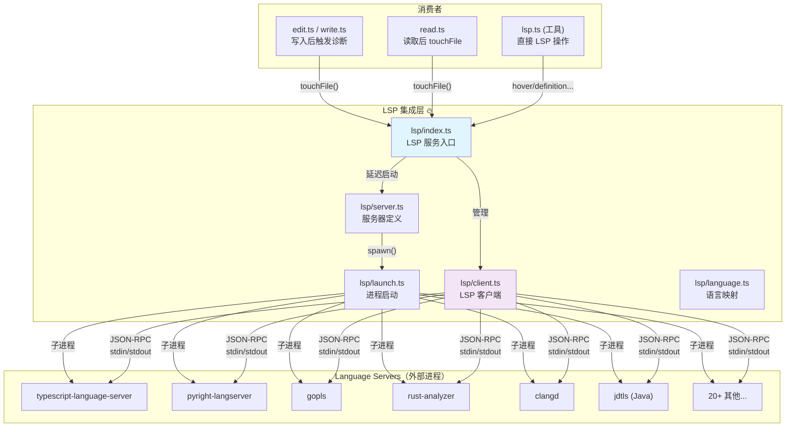
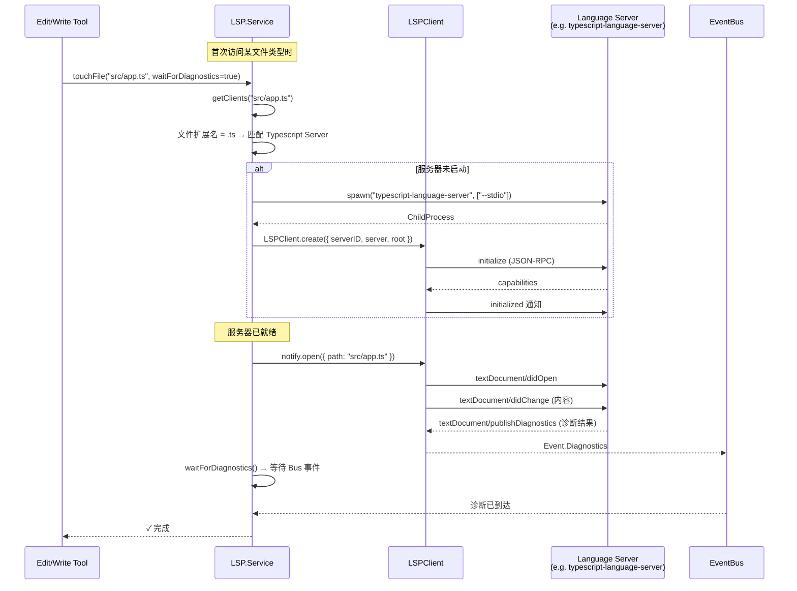
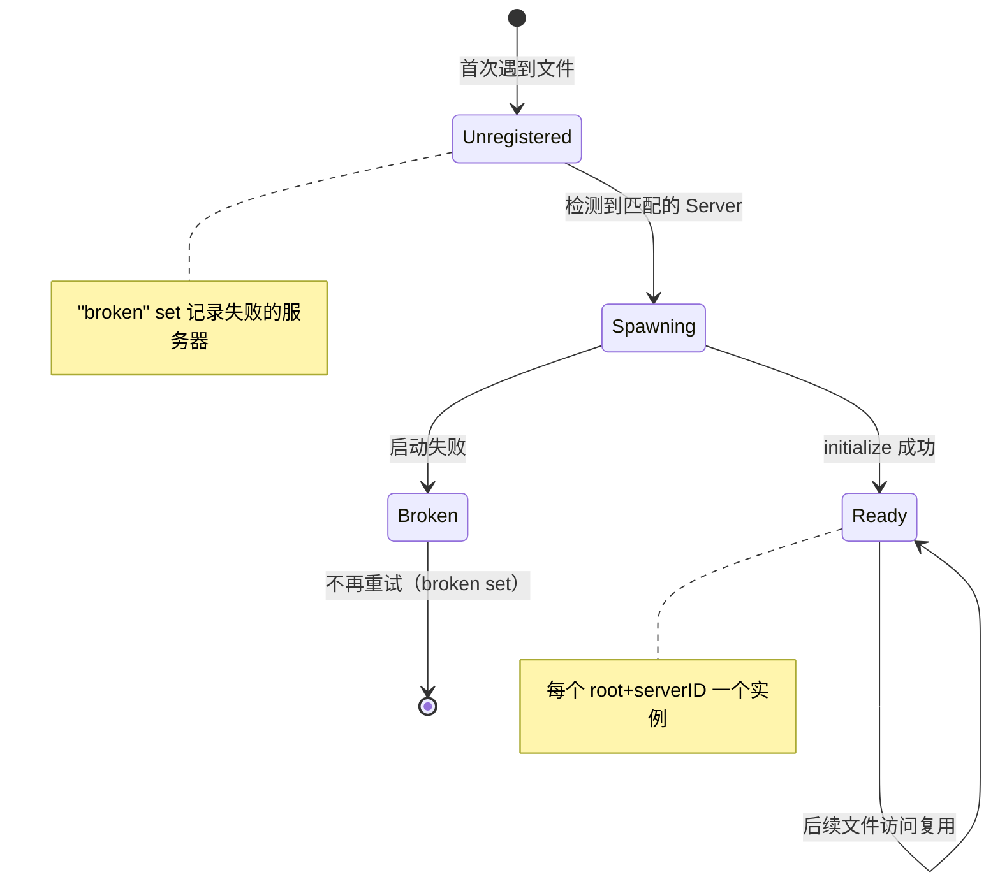
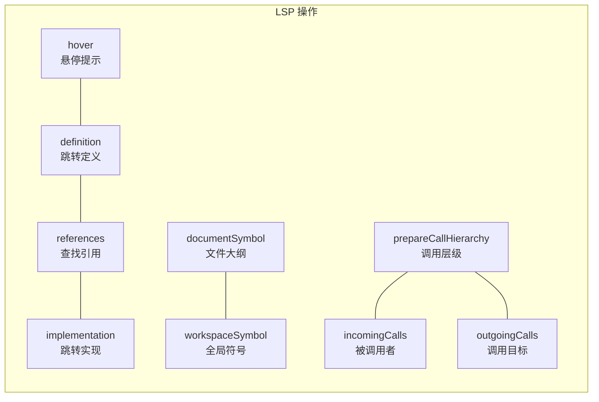
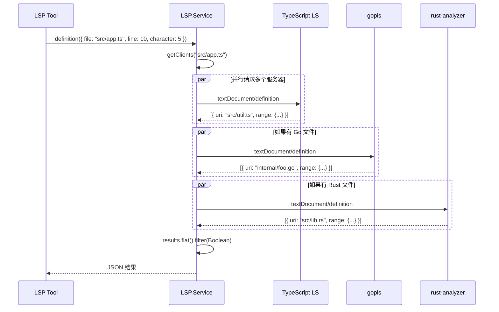
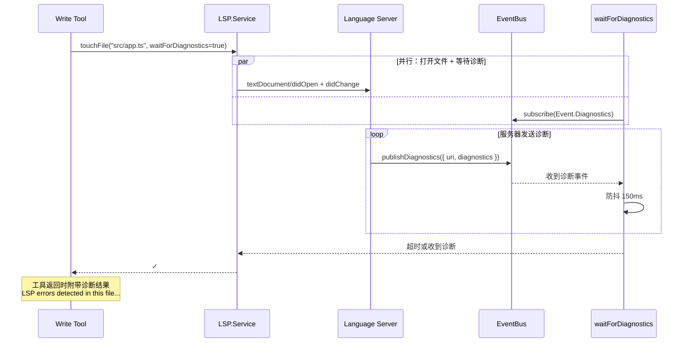
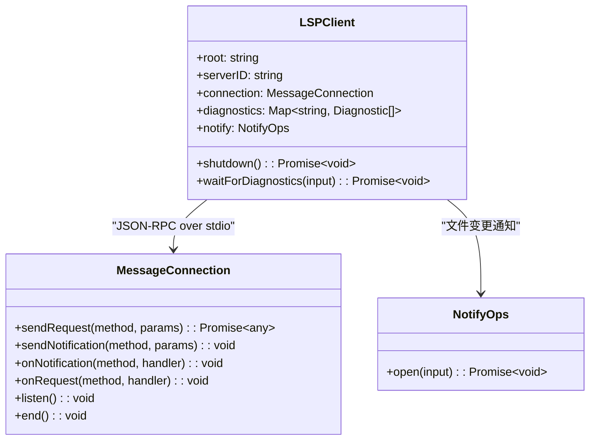
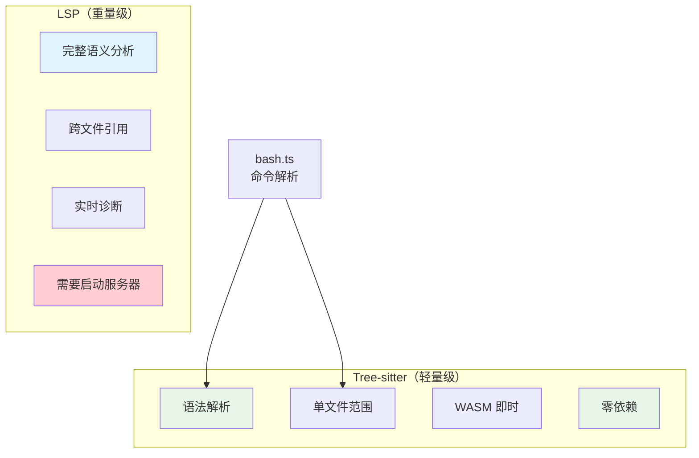

# LSP 集成

> OpenCode v1.3.17 源码学习 | 执行阶段

## 📌 模块位置



> 💡 **Java 类比**：OpenCode 的 LSP 集成类似 Eclipse 的 **JDT (Java Development Tools)**。`LSP.Server` 定义了各语言服务器的配置（类似 Eclipse 的 `plugin.xml`），`LSP.Client` 管理与服务器的 JSON-RPC 通信（类似 `LanguageServer` 接口），`LSP.Service` 协调按需启动（类似 Eclipse 的延迟加载机制）。

---

## 1. LSP 协议概述

### 什么是 Language Server Protocol？

**Language Server Protocol (LSP)** 是微软提出的开放协议，将**语言智能功能**（补全、诊断、跳转定义等）与**编辑器**解耦。

```
传统架构：每个编辑器 × 每种语言 = N × M 种实现
LSP 架构：每个编辑器 + 每个 Language Server = N + M 种实现
```

### 对 Java 开发者友好的类比

| LSP 概念 | Java 类比 | 说明 |
|----------|----------|------|
| Language Server | Eclipse JDT / IntelliJ IDEA 后端 | 提供代码分析能力 |
| LSP Client | IDE 前端 | 发送请求，展示结果 |
| JSON-RPC | Java RMI / gRPC | 通信协议 |
| textDocument/didOpen | FileChangeListener | 文件打开通知 |
| textDocument/publishDiagnostics | ProblemMarker | 错误/警告标记 |
| textDocument/hover | Ctrl+Hover | 悬停提示 |
| textDocument/definition | F3 / Ctrl+Click | 跳转定义 |
| textDocument/references | Ctrl+Shift+G | 查找引用 |
| textDocument/implementation | Ctrl+Alt+B | 跳转实现 |
| workspace/symbol | Ctrl+Shift+T / Ctrl+O | 全局符号搜索 |
| textDocument/documentSymbol | Outline 视图 | 文件结构大纲 |
| textDocument/prepareCallHierarchy | Call Hierarchy | 调用层级 |

---

## 2. LSP 集成架构



### 按需启动机制



### 伪代码：按需启动

```typescript
// ===== lsp/index.ts — getClients =====

async function getClients(file: string) {
  const extension = path.parse(file).ext
  const result: LSPClient.Info[] = []

  for (const server of Object.values(servers)) {
    // 1️⃣ 检查扩展名是否匹配
    if (server.extensions.length && !server.extensions.includes(extension)) {
      continue
    }

    // 2️⃣ 查找项目根目录
    const root = await server.root(file)
    if (!root) continue

    // 3️⃣ 检查是否在失败列表
    if (broken.has(root + server.id)) continue

    // 4️⃣ 检查是否已有实例
    const existing = clients.find(c => c.root === root && c.serverID === server.id)
    if (existing) { result.push(existing); continue }

    // 5️⃣ 检查是否正在启动（去重）
    const inflight = spawning.get(root + server.id)
    if (inflight) { result.push(await inflight); continue }

    // 6️⃣ 启动新实例
    const task = schedule(server, root)
    spawning.set(root + server.id, task)
    const client = await task
    if (client) result.push(client)
  }

  return result
}
```

---

## 3. 代码智能功能

### 完整的 LSP 功能矩阵



### 跳转定义时序图



### 诊断（Diagnostics）工作流



---

## 4. 支持的 Language Server

| 服务器 | 语言 | 扩展名 | 根目录标记 | 自动安装 |
|--------|------|--------|-----------|---------|
| typescript-language-server | TypeScript/JavaScript | .ts/.tsx/.js/.jsx | lock 文件 | ✅ 通过 npm |
| pyright-langserver | Python | .py/.pyi | pyproject.toml | ✅ 通过 npm |
| ty (实验性) | Python | .py/.pyi | pyproject.toml | ❌ |
| gopls | Go | .go | go.mod / go.work | ✅ go install |
| rust-analyzer | Rust | .rs | Cargo.toml | ❌ |
| clangd | C/C++ | .c/.cpp/.h | compile_commands.json | ✅ 下载二进制 |
| jdtls | Java | .java | pom.xml / build.gradle | ✅ 下载 tar.gz |
| kotlin-ls | Kotlin | .kt/.kts | build.gradle.kts | ✅ 下载 zip |
| deno lsp | Deno | .ts/.js | deno.json | ❌ |
| vue-language-server | Vue | .vue | lock 文件 | ✅ 通过 npm |
| svelte-language-server | Svelte | .svelte | lock 文件 | ✅ 通过 npm |
| biome | 多语言 | .ts/.json/.css... | biome.json | ✅ 通过 npm |
| eslint | JS/TS | .ts/.js | lock 文件 | ✅ 下载+编译 |
| lua-language-server | Lua | .lua | .luarc.json | ✅ 下载 tar.gz |
| zls | Zig | .zig | build.zig | ✅ 下载 tar.gz |
| bash-language-server | Bash | .sh/.bash | Instance.dir | ✅ 通过 npm |
| ruby-lsp | Ruby | .rb | Gemfile | ✅ gem install |
| terraform-ls | Terraform | .tf | .terraform.lock.hcl | ✅ 下载 zip |
| dart | Dart | .dart | pubspec.yaml | ❌ |
| sourcekit-lsp | Swift | .swift | Package.swift | ❌ (系统自带) |
| prisma | Prisma | .prisma | schema.prisma | ❌ |
| ocaml-lsp | OCaml | .ml | dune-project | ❌ |
| php intelephense | PHP | .php | composer.json | ✅ 通过 npm |
| yaml-language-server | YAML | .yaml/.yml | lock 文件 | ✅ 通过 npm |
| texlab | LaTeX | .tex/.bib | .latexmkrc | ❌ |

> 💡 **Java 类比**：OpenCode 的 LSP 自动安装机制类似 **VS Code 的 Language Server 扩展**。当检测到项目中有 `Cargo.toml` 但没有 `rust-analyzer`，会提示安装。但 OpenCode 更进一步——它可以自动下载并安装。

---

## 5. LSPClient 实现



### 初始化握手

```typescript
// ===== lsp/client.ts — 初始化流程 =====

async function create(input) {
  // 1️⃣ 创建 JSON-RPC 连接（通过 stdin/stdout）
  const connection = createMessageConnection(
    new StreamMessageReader(process.stdout),
    new StreamMessageWriter(process.stdin),
  )

  // 2️⃣ 注册诊断处理器
  connection.onNotification("textDocument/publishDiagnostics", (params) => {
    const filePath = normalizePath(fileURLToPath(params.uri))
    diagnostics.set(filePath, params.diagnostics)
    Bus.publish(Event.Diagnostics, { path: filePath, serverID })
  })

  // 3️⃣ 注册服务器请求处理器
  connection.onRequest("window/workDoneProgress/create", () => null)
  connection.onRequest("workspace/configuration", () => [initialization])
  connection.onRequest("client/registerCapability", async () => {})
  connection.onRequest("client/unregisterCapability", async () => {})

  connection.listen()

  // 4️⃣ 发送 initialize 请求（45 秒超时）
  await withTimeout(
    connection.sendRequest("initialize", {
      rootUri: pathToFileURL(root).href,
      processId: process.pid,
      capabilities: {
        textDocument: {
          synchronization: { didOpen: true, didChange: true },
          publishDiagnostics: { versionSupport: true },
        },
        workspace: {
          didChangeWatchedFiles: { dynamicRegistration: true },
        },
      },
    }),
    45_000,
  )

  // 5️⃣ 发送 initialized 通知
  await connection.sendNotification("initialized", {})
}
```

---

## 6. LSP 工具（实验性）

LSP 工具允许 AI Agent 直接调用 LSP 操作：

```typescript
// ===== tool/lsp.ts =====

export const LspTool = Tool.define("lsp", {
  description: "...",
  parameters: z.object({
    operation: z.enum([
      "goToDefinition", "findReferences", "hover",
      "documentSymbol", "workspaceSymbol",
      "goToImplementation", "prepareCallHierarchy",
      "incomingCalls", "outgoingCalls",
    ]),
    filePath: z.string(),
    line: z.number().int().min(1),
    character: z.number().int().min(1),
  }),
  execute: async (args, ctx) => {
    // 通知 LSP 文件已更改
    await LSP.touchFile(file, true)

    const result = await (() => {
      switch (args.operation) {
        case "goToDefinition": return LSP.definition(position)
        case "findReferences": return LSP.references(position)
        case "hover": return LSP.hover(position)
        case "documentSymbol": return LSP.documentSymbol(uri)
        // ... 其他操作
      }
    })()

    return {
      title: `${args.operation} ${relPath}:${args.line}:${args.character}`,
      output: JSON.stringify(result, null, 2),
      metadata: { result },
    }
  },
})
```

> ⚠️ **注意**：此工具需要 `OPENCODE_EXPERIMENTAL_LSP_TOOL` 标志启用。

---

## 7. Tree-sitter 作为轻量级替代

OpenCode 还集成了 **Tree-sitter** 作为 LSP 的轻量级补充：



在 `bash.ts` 中，Tree-sitter 用于：
- 解析 Bash/PowerShell 命令 AST
- 识别命令名、参数、管道结构
- 提取文件路径用于安全检查

---

## 🔑 关键设计决策

### 1. 按需启动而非全量启动

LSP 服务器在**首次访问某文件类型时**才启动，而非应用启动时全部启动。

**原因**：一个项目通常只使用 1-2 种语言，启动所有 20+ 服务器会浪费资源。

### 2. Broken Set 防止重复失败

一旦某语言服务器启动失败，记录到 `broken` 集合，后续不再重试。

**原因**：避免反复启动失败的服务器拖慢用户体验。

### 3. 诊断防抖 150ms

`waitForDiagnostics()` 在收到诊断事件后等待 150ms，确保收到所有诊断（语法诊断先于语义诊断）。

**原因**：Language Server 通常分两轮发送诊断——先快速语法检查，再慢速语义分析。

### 4. 自动安装机制

对于常用语言服务器（gopls, clangd, jdtls 等），OpenCode 可以自动下载安装。

**原因**：降低用户使用门槛，开箱即用。

### 5. 与编辑工具深度集成

`edit.ts` 和 `write.ts` 在写入文件后：
1. 调用 `LSP.touchFile(file, true)` 通知服务器
2. 等待诊断结果
3. 将错误注入到返回的 output 中

**原因**：AI 可以立即看到自己引入的错误并修复，形成闭环。

---

## 📦 源码锚点表

| 文件 | 路径 | 关键内容 |
|------|------|---------|
| LSP 服务入口 | `packages/opencode/src/lsp/index.ts` | `LSP.Service`, `getClients()`, `touchFile()`, `diagnostics()` |
| LSP 客户端 | `packages/opencode/src/lsp/client.ts` | `LSPClient.create()`, JSON-RPC, 诊断处理 |
| 服务器定义 | `packages/opencode/src/lsp/server.ts` | 20+ 语言服务器配置, `NearestRoot()`, 自动安装 |
| 进程启动 | `packages/opencode/src/lsp/launch.ts` | `spawn()` 封装 |
| 语言映射 | `packages/opencode/src/lsp/language.ts` | 120 种扩展名 → languageId 映射 |
| LSP 工具 | `packages/opencode/src/tool/lsp.ts` | 9 种 LSP 操作的 Agent 工具 |
| Edit 集成 | `packages/opencode/src/tool/edit.ts` | 写入后触发 LSP 诊断 |
| Write 集成 | `packages/opencode/src/tool/write.ts` | 写入后触发 LSP 诊断 |
| Read 集成 | `packages/opencode/src/tool/read.ts` | 读取后 touchFile |
