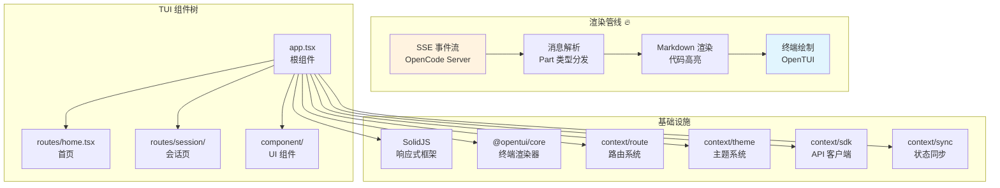
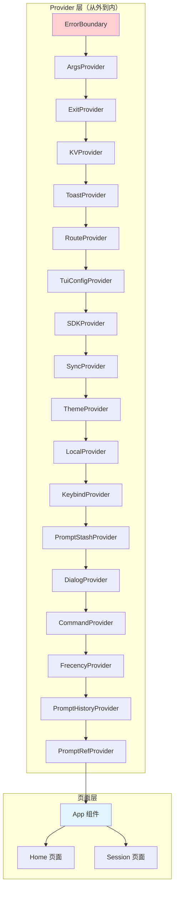
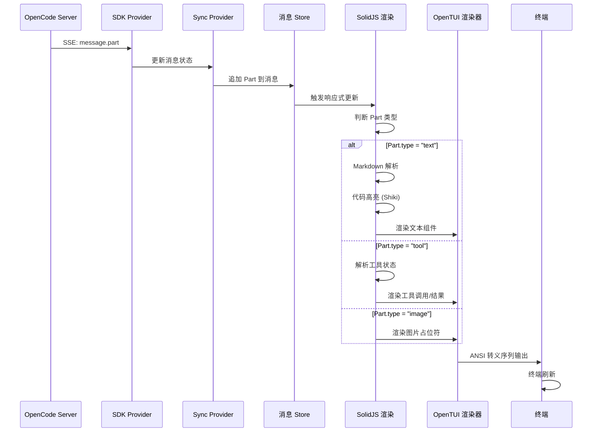
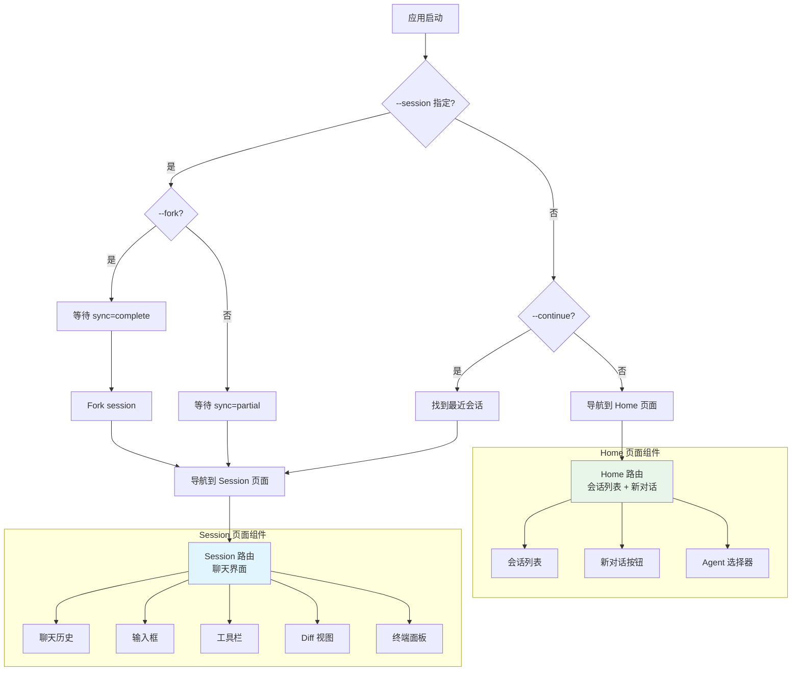
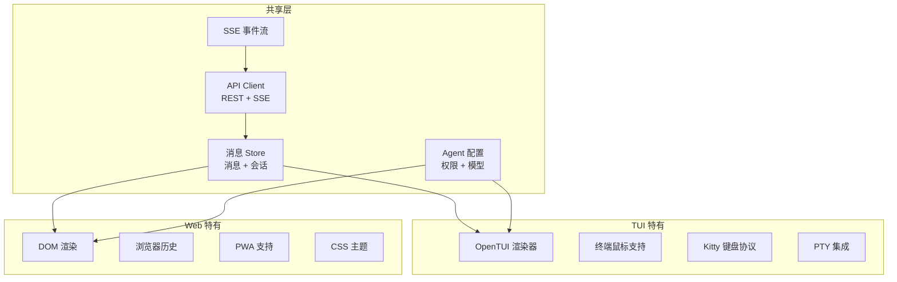
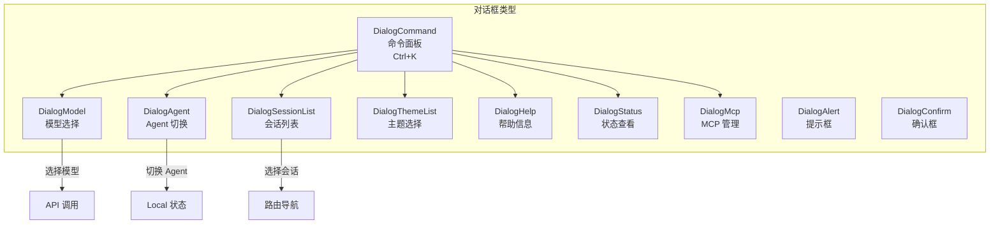

# 响应渲染与 TUI 界面

> OpenCode v1.3.17 源码学习 | 输出阶段

## 📌 模块位置



> 💡 **Java 类比**：OpenCode 的 TUI 类似 **JavaFX 终端应用**。`SolidJS` 类似 JavaFX 的 FXML 控件树，`@opentui/core` 类似 JavaFX 的渲染引擎，而 TUI 中的 `<box>`, `<text>` 类似 JavaFX 的 `Pane`, `Label` 控件。

---

## 1. TUI 架构

### 组件层次结构



### 伪代码：TUI 入口

```typescript
// ===== app.tsx — tui() 入口函数 =====

export function tui(input: {
  url: string, args: Args, config: TuiConfig.Info,
  events?: EventSource,
}) {
  return new Promise<void>(async (resolve) => {
    // 1️⃣ 检测终端背景色（暗色/亮色）
    const mode = await getTerminalBackgroundColor()

    // 2️⃣ 创建终端渲染器
    const renderer = await createCliRenderer({
      targetFps: 60,
      exitOnCtrlC: false,
      useMouse: true,
      useKittyKeyboard: {},
    })

    // 3️⃣ 渲染组件树
    await render(() => (
      <ErrorBoundary fallback={ErrorComponent}>
        <ArgsProvider {...input.args}>
          <ExitProvider onExit={resolve}>
            <KVProvider>
              <ToastProvider>
                <RouteProvider>
                  <TuiConfigProvider config={input.config}>
                    <SDKProvider url={input.url} events={input.events}>
                      <SyncProvider>
                        <ThemeProvider mode={mode}>
                          <LocalProvider>
                            <KeybindProvider>
                              {/* ... 更多 Provider ... */}
                              <App />
                            </KeybindProvider>
                          </LocalProvider>
                        </ThemeProvider>
                      </SyncProvider>
                    </SDKProvider>
                  </TuiConfigProvider>
                </RouteProvider>
              </ToastProvider>
            </KVProvider>
          </ExitProvider>
        </ArgsProvider>
      </ErrorBoundary>
    ), renderer)
  })
}
```

---

## 2. 消息渲染流程



### 流式输出伪代码

```typescript
// ===== 流式 Token 级别实时渲染 =====

// SDK 接收 SSE 事件流
sdk.event.on("message.part", (evt) => {
  const { sessionID, messageID } = evt.properties

  // 更新 Store 中的消息
  sync.updateMessage({
    id: messageID,
    sessionID,
    // 追加新的 Part
    parts: [...existingParts, evt.properties.part],
  })
})

// SolidJS 组件中消费消息
function MessagePart(props: { part: Part }) {
  const content = createMemo(() => {
    switch (props.part.type) {
      case "text":
        return props.part.text  // 流式文本已完整
      case "tool":
        return formatToolPart(props.part)
      default:
        return ""
    }
  })

  return (
    <box>
      {content().split("\n").map(line => (
        <text>{line}</text>
      ))}
    </box>
  )
}

// 工具调用状态渲染
function formatToolPart(part: ToolPart) {
  switch (part.state.status) {
    case "running":
      return `⏳ ${part.tool}(${part.state.input?.command || ""})`
    case "completed":
      return `✅ ${part.tool} → ${part.state.title}`
    case "error":
      return `❌ ${part.tool} → ${part.state.error}`
  }
}
```

---

## 3. 路由结构



### 路由状态管理

```typescript
// ===== context/route.tsx — 简化版 =====

type RouteData =
  | { type: "home" }
  | { type: "session"; sessionID: SessionID }
  | { type: "plugin"; id: string; data?: any }

// 路由导航
function useRoute() {
  const [route, setRoute] = createSignal<RouteData>({ type: "home" })

  return {
    data: route,
    navigate: (data: RouteData) => setRoute(data),
  }
}

// 在 App 组件中使用
function App() {
  return (
    <Switch>
      <Match when={route.data.type === "home"}>
        <Home />
      </Match>
      <Match when={route.data.type === "session"}>
        <Session sessionID={route.data.sessionID} />
      </Match>
    </Switch>
  )
}
```

---

## 4. Web UI 与 TUI 对比

| 维度 | TUI (终端 UI) | Web UI |
|------|-------------|--------|
| **框架** | SolidJS + @opentui | SolidJS + @opencode/app |
| **渲染目标** | 终端 (ANSI 转义) | 浏览器 (DOM) |
| **代码高亮** | Shiki (终端色彩) | Shiki (HTML) |
| **Markdown** | 自定义终端渲染 | 标准 HTML 渲染 |
| **交互方式** | 键盘 + 鼠标事件 | 鼠标 + 触摸 + 键盘 |
| **路由** | 内存状态 (createSignal) | URL hash/history |
| **状态管理** | SolidJS Signal + Store | SolidJS Signal + Store |
| **数据源** | SSE + REST API | SSE + REST API |
| **实时更新** | SSE 推送 | SSE 推送 |
| **主题** | 自动检测终端背景色 | CSS 变量 |
| **性能** | 轻量，60 FPS | 中等，依赖浏览器 |
| **可访问性** | 终端原生 | 浏览器原生 |

### 共享架构



---

## 5. 主题系统

```mermaid
flowchart LR
    Start["应用启动"] --> Detect["检测终端背景色<br/>x1b]11;? 查询"]
    Detect -->|"响应"| Parse["解析 RGB 值"]
    Parse --> Luminance["计算亮度<br/>0.299R + 0.587G + 0.114B"]
    Luminance --> Check{"亮度 > 0.5?"}
    Check -->|"是"| Light["亮色模式"]
    Check -->|"否"| Dark["暗色模式"]
    Detect -->|"超时"| Dark["默认暗色"]

    Light --> ThemeP["ThemeProvider<br/>mode = 'light'"]
    Dark --> ThemeP
    ThemeP --> CSS["CSS 变量<br/>background / foreground"]

    style Light fill:#fff9c4
    style Dark fill:#263238
```



### 终端背景色检测

```typescript
// ===== app.tsx — getTerminalBackgroundColor() =====

async function getTerminalBackgroundColor() {
  return new Promise((resolve) => {
    const handler = (data: Buffer) => {
      const str = data.toString()
      const match = str.match(/\x1b]11;([^\x07\x1b]+)/)
      if (match) {
        cleanup()
        const color = match[1]

        // 解析 RGB 值
        let r = 0, g = 0, b = 0
        if (color.startsWith("rgb:")) {
          [r, g, b] = color.substring(4).split("/").map(v => parseInt(v, 16) >> 8)
        }

        // 计算亮度
        const luminance = (0.299 * r + 0.587 * g + 0.114 * b) / 255
        resolve(luminance > 0.5 ? "light" : "dark")
      }
    }

    process.stdin.setRawMode(true)
    process.stdin.on("data", handler)
    process.stdout.write("\x1b]11;?\x07")  // 查询终端背景色

    // 1 秒超时
    setTimeout(() => { cleanup(); resolve("dark") }, 1000)
  })
}
```

---

## 6. 对话框系统



### 命令面板（Ctrl+K）

```typescript
// ===== app.tsx — 命令注册 =====

command.register(() => [
  { title: "Switch session",  value: "session.list",  keybind: "session_list" },
  { title: "New session",    value: "session.new",   keybind: "session_new" },
  { title: "Switch model",   value: "model.list",   keybind: "model_list" },
  { title: "Switch agent",   value: "agent.list",   keybind: "agent_list" },
  { title: "Toggle theme",   value: "theme.switch",  slash: { name: "themes" } },
  { title: "View status",   value: "opencode.status", slash: { name: "status" } },
  { title: "Help",          value: "help.show",     slash: { name: "help" } },
  { title: "Exit",          value: "app.exit",       slash: { name: "exit" } },
  // ... 更多命令
])
```

---

## 7. TUI 渲染配置

```typescript
// ===== app.tsx — rendererConfig =====

function rendererConfig(config: TuiConfig.Info) {
  return {
    targetFps: 60,                    // 目标帧率
    exitOnCtrlC: false,              // Ctrl+C 交给 App 处理
    useKittyKeyboard: {},             // 启用 Kitty 键盘协议
    autoFocus: false,                 // 不自动聚焦
    useMouse: config.mouse ?? true,   // 启用鼠标支持
    externalOutputMode: "passthrough", // 外部输出透传
    consoleOptions: {
      keyBindings: [
        { name: "y", ctrl: true, action: "copy-selection" },
      ],
      onCopySelection: (text) => {
        Clipboard.copy(text)  // 选中即复制
      },
    },
  }
}
```

---

## 🔑 关键设计决策

### 1. 为什么用终端 UI 而非纯 Web？

| 原因 | 说明 |
|------|------|
| **开发效率** | 开发者已在终端中工作，无需切换窗口 |
| **低延迟** | 终端渲染比浏览器更轻量，响应更快 |
| **SSH 友好** | 可通过 SSH 远程使用 |
| **资源占用** | 无需启动浏览器，内存占用更低 |
| **文本友好** | AI 输出主要是文本，终端天然适合 |
| **自动化** | 终端操作更容易脚本化 |

### 2. SolidJS 而非 React

- **更小的包体积**：SolidJS 编译后约 7KB，React 约 45KB
- **更快的更新**：细粒度响应式，无 Virtual DOM diff 开销
- **更简单的 API**：信号（Signal）比 useState/useEffect 更直观

### 3. 60 FPS 目标帧率

TUI 以 60 FPS 渲染，确保流式输出时文字显示流畅，不会出现卡顿感。

### 4. 自动主题检测

通过查询终端背景色自动选择暗色/亮色主题，无需用户手动配置。

### 5. Provider 嵌套架构

20+ 个 Provider 层级嵌套，每个提供不同的上下文能力。这是 SolidJS 的 Context 模式，类似 React 的 Context Provider。

---

## 📦 源码锚点表

| 文件 | 路径 | 关键内容 |
|------|------|---------|
| TUI 入口 | `packages/opencode/src/cli/cmd/tui/app.tsx` | `tui()` 函数, Provider 树, 命令注册 |
| 路由上下文 | `packages/opencode/src/cli/cmd/tui/context/route.tsx` | 路由状态管理 |
| 主题上下文 | `packages/opencode/src/cli/cmd/tui/context/theme.tsx` | 主题切换, CSS 变量 |
| SDK 上下文 | `packages/opencode/src/cli/cmd/tui/context/sdk.tsx` | API 客户端, SSE 连接 |
| 同步上下文 | `packages/opencode/src/cli/cmd/tui/context/sync.tsx` | 消息/会话同步 |
| Home 页面 | `packages/opencode/src/cli/cmd/tui/routes/home.tsx` | 首页, 会话列表 |
| Session 页面 | `packages/opencode/src/cli/cmd/tui/routes/session/` | 聊天界面, 输入框 |
| 命令面板 | `packages/opencode/src/cli/cmd/tui/component/dialog-command.tsx` | Ctrl+K 命令面板 |
| 对话框系统 | `packages/opencode/src/cli/cmd/tui/component/` | 各种对话框组件 |
| TUI 配置 | `packages/opencode/src/config/tui.ts` | TUI 配置接口 |
| Web 前端 | `packages/app/package.json` | Web UI 依赖 |
