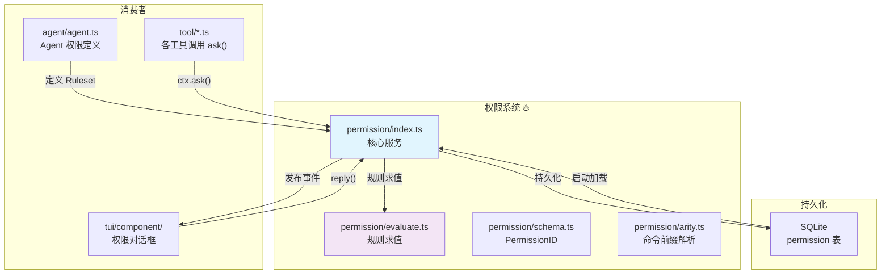
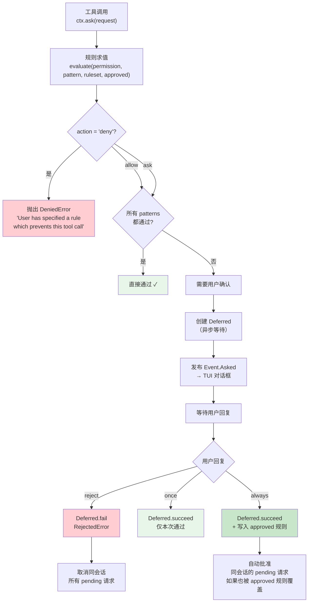
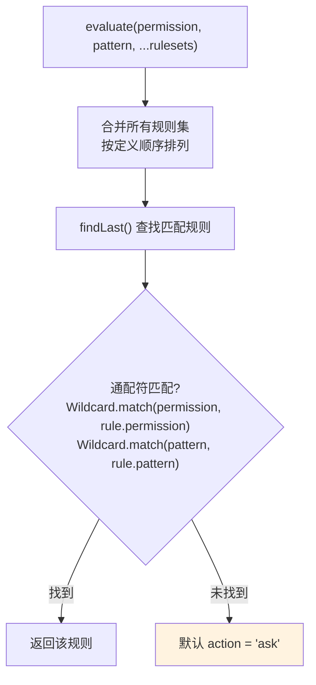
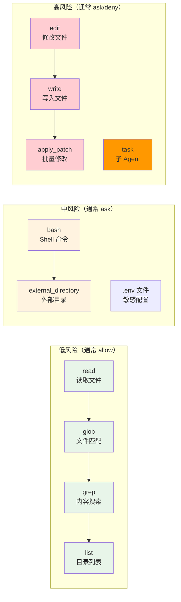
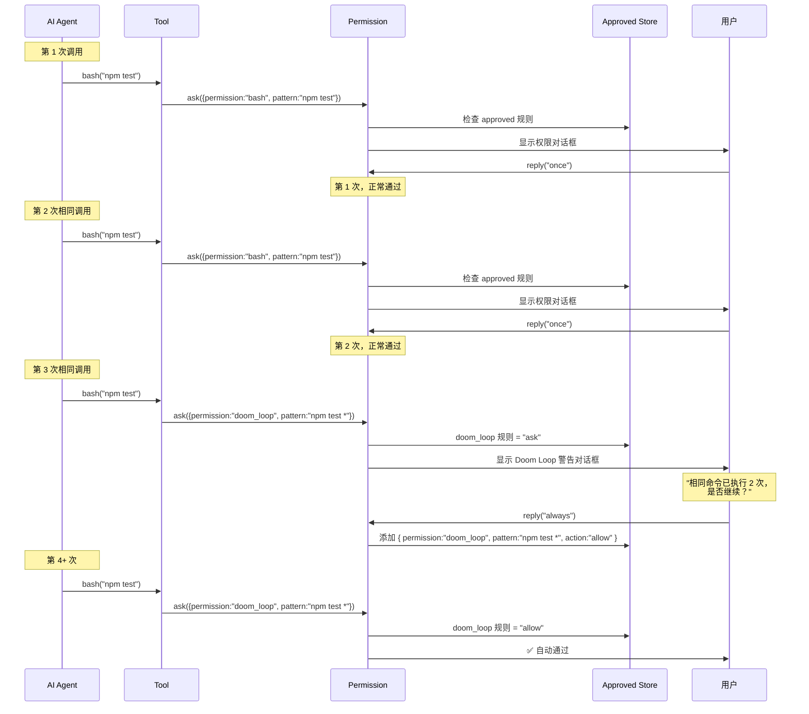
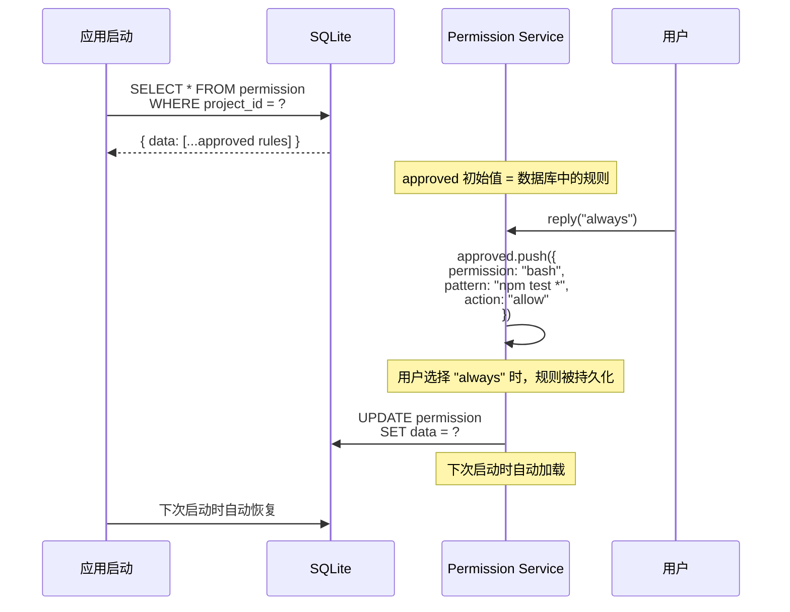
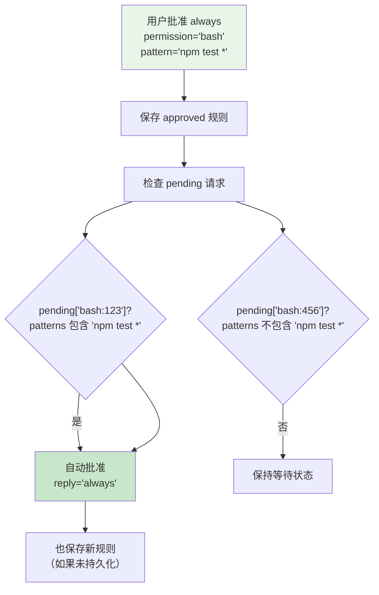

# 权限控制与安全模型

> OpenCode v1.3.17 源码学习 | 输出阶段

## 📌 模块位置



> 💡 **Java 类比**：OpenCode 的权限系统类似 **Spring Security 的 @PreAuthorize**。每个工具调用前检查权限规则（类似 `@PreAuthorize("hasPermission('bash')")`），支持 allow/deny/ask 三种策略（类似 `AccessDecision.VOTED_ALLOW/DENY/ABSTAIN`）。

---

## 1. 权限检查流程



---

## 2. 权限规则数据结构

### 核心类型

```mermaid
classDiagram
    class Rule {
        +permission: string
        +pattern: string
        +action: "allow" | "deny" | "ask"
    }

    class Ruleset {
        +Rule[]: rules
    }

    class Request {
        +id: PermissionID
        +sessionID: SessionID
        +permission: string
        +patterns: string[]
        +metadata: Record~string, any~
        +always: string[]
        +tool?: { messageID, callID }
    }

    class Reply {
        +requestID: PermissionID
        +reply: "once" | "always" | "reject"
        +message?: string
    }

    Ruleset "1..*" --> Rule
    Request --> Ruleset : "携带"
    Reply --> Request : "回复"

    class Approved {
        +Ruleset: approved
    }
    Approved --> Rule : "持久化存储"
```

### 伪代码：权限规则

```typescript
// ===== permission/index.ts =====

namespace Permission {
  // 单条规则
  const Rule = z.object({
    permission: z.string(),     // 权限标识（如 "bash", "edit", "read"）
    pattern: z.string(),        // 匹配模式（支持 glob 通配符）
    action: z.enum(["allow", "deny", "ask"]),
  })

  // 规则集（有序，后定义的优先）
  const Ruleset = Rule.array()

  // 权限请求
  const Request = z.object({
    id: PermissionID,           // 唯一请求 ID
    sessionID: SessionID,       // 会话 ID
    permission: z.string(),     // 权限标识
    patterns: z.string[].array(), // 匹配的模式
    metadata: z.record(z.any()), // 元数据（diff, filepath 等）
    always: z.string().array(), // "always" 时自动批准的模式
    tool: z.object({           // 关联的工具调用
      messageID: MessageID,
      callID: z.string(),
    }).optional(),
  })

  // 用户回复
  const Reply = z.enum(["once", "always", "reject"])
}
```

### 默认权限规则

```typescript
// ===== agent/agent.ts — 默认权限 =====

const defaults = Permission.fromConfig({
  "*": "allow",                        // 默认允许所有
  doom_loop: "ask",                     // 循环检测需要询问
  external_directory: {
    "*": "ask",                         // 外部目录需要询问
    // 白名单目录自动允许
    ...Object.fromEntries(whitelistedDirs.map(dir => [dir, "allow"])),
  },
  question: "deny",                    // 禁止直接提问（需 Agent 明确允许）
  plan_enter: "deny",                  // 禁止进入计划模式
  plan_exit: "deny",                   // 禁止退出计划模式
  read: {
    "*": "allow",                       // 允许读取所有文件
    "*.env": "ask",                     // .env 文件需要询问
    "*.env.*": "ask",                   // .env.local 等需要询问
    "*.env.example": "allow",            // .env.example 直接允许
  },
})
```

---

## 3. Agent 权限对比

| 权限 | build（默认） | plan | general | explore | compaction | title |
|------|:-----------:|:----:|:-------:|:-------:|:----------:|:-----:|
| **\*** (所有)** | ✅ allow | ✅ allow | ✅ allow | ❌ deny | ❌ deny | ❌ deny |
| **bash** | ✅ allow | ✅ allow | ✅ allow | ✅ allow | ❌ deny | ❌ deny |
| **read** | ✅ allow | ✅ allow | ✅ allow | ✅ allow | ❌ deny | ❌ deny |
| **glob** | ✅ allow | ✅ allow | ✅ allow | ✅ allow | ❌ deny | ❌ deny |
| **grep** | ✅ allow | ✅ allow | ✅ allow | ✅ allow | ❌ deny | ❌ deny |
| **edit** | ✅ allow | ❌ deny* | ✅ allow | ❌ deny | ❌ deny | ❌ deny |
| **write** | ✅ allow | ❌ deny* | ✅ allow | ❌ deny | ❌ deny | ❌ deny |
| **apply_patch** | ✅ allow | ❌ deny* | ✅ allow | ❌ deny | ❌ deny | ❌ deny |
| **todowrite** | ✅ allow | ✅ allow | ❌ deny | ❌ deny | ❌ deny | ❌ deny |
| **task** | ✅ allow | ✅ allow | ✅ allow | ❌ deny | ❌ deny | ❌ deny |
| **question** | ✅ allow | ✅ allow | ✅ allow | ❌ deny | ❌ deny | ❌ deny |
| **plan_exit** | ✅ allow | ✅ allow | ❌ deny | ❌ deny | ❌ deny | ❌ deny |
| **webfetch** | ✅ allow | ✅ allow | ✅ allow | ✅ allow | ❌ deny | ❌ deny |
| **websearch** | ✅ allow | ✅ allow | ✅ allow | ✅ allow | ❌ deny | ❌ deny |

> \* plan Agent 可以编辑 `.opencode/plans/*.md` 计划文件

---

## 4. 规则求值算法



### 伪代码：规则求值

```typescript
// ===== permission/evaluate.ts =====

function evaluate(
  permission: string,    // 如 "bash"
  pattern: string,        // 如 "rm *"
  ...rulesets: Rule[][]  // 多个规则集
): Rule {
  // 1️⃣ 合并所有规则集（保持顺序）
  const rules = rulesets.flat()

  // 2️⃣ 查找最后匹配的规则（后定义的优先）
  const match = rules.findLast(rule =>
    Wildcard.match(permission, rule.permission) &&
    Wildcard.match(pattern, rule.pattern)
  )

  // 3️⃣ 未匹配则默认询问
  return match ?? { action: "ask", permission, pattern: "*" }
}
```

### 通配符匹配（Wildcard）

```typescript
// ===== util/wildcard.ts — 简化版 =====

function match(text: string, pattern: string): boolean {
  // 将 glob 模式转为正则表达式
  const regex = globToRegex(pattern)
  return regex.test(text)
}

// 示例
Wildcard.match("bash", "bash")          // true  // 精确匹配
Wildcard.match("bash", "*")             // true  // 通配所有
Wildcard.match("bash", "b?sh")          // true  // 单字符通配
Wildcard.match("edit", "edit")          // true
Wildcard.match("edit", "write")         // false
Wildcard.match("external_directory", "external_directory")  // true
Wildcard.match("external_directory", "external_dir*")  // true
```

---

## 5. 敏感操作分级



### 权限类型汇总

| 权限 ID | 描述 | 默认动作 | 风险等级 |
|---------|------|-----------|---------|
| `read` | 读取文件 | allow | 低 |
| `glob` | 文件名匹配 | allow | 低 |
| `grep` | 内容搜索 | allow | 低 |
| `list` | 列出目录 | allow | 低 |
| `bash` | Shell 命令 | allow | 中 |
| `external_directory` | 外部目录访问 | ask | 中 |
| `edit` | 修改文件 | allow | 高 |
| `write` | 写入文件 | allow | 高 |
| `apply_patch` | 批量修改 | allow | 高 |
| `multiedit` | 多处修改 | allow | 高 |
| `task` | 子 Agent 调用 | allow | 中 |
| `todowrite` | 更新 Todo | allow | 低 |
| `webfetch` | URL 抓取 | allow | 中 |
| `websearch` | 网络搜索 | allow | 中 |
| `codesearch` | 代码搜索 | allow | 中 |
| `skill` | 加载技能 | allow | 低 |
| `lsp` | LSP 操作 | allow | 低 |
| `question` | 向用户提问 | deny | N/A |
| `doom_loop` | 循环检测 | ask | N/A |
| `batch` | 批量工具 | ask (实验) | 高 |

---

## 6. Doom Loop 检测机制



### Doom Loop 原理

```typescript
// ===== bash.ts — collect() 中的 doom loop 检测 =====

// 每个命令生成一个"前缀模式"
scan.always.add(BashArity.prefix(tokens).join(" ") + " *")
// 例如: "npm test *"  ← 命令前缀 + 通配符

// BashArity.prefix() 的作用：
// "npm test" → arity=2 → tokens.slice(0, 2) → "npm test"
// "npm test" → "npm test *"
// "git add ." → arity=2 → "git add *"  ← 注意！不是 "git add ."

// 这些模式被记录到权限请求的 patterns 中
// 如果用户连续 3 次批准相同模式，
// 系统自动降级为 "ask"（除非已有 allow 规则）
```

### BashArity 命令前缀解析

```typescript
// ===== permission/arity.ts — 简化版 =====

const ARITY: Record<string, number> = {
  cat: 1,       // cat file.txt → prefix = "cat"
  ls: 1,        // ls -la → prefix = "ls"
  rm: 1,        // rm file.txt → prefix = "rm"
  npm: 2,       // npm install → prefix = "npm install"
  "npm run": 3,  // npm run dev → prefix = "npm run dev"
  git: 2,       // git add . → prefix = "git add"
  docker: 2,    // docker run nginx → prefix = "docker run"
  "docker compose": 3,  // docker compose up → prefix = "docker compose up"
  // ... 160+ 条规则
}

function prefix(tokens: string[]): string[] {
  // 从长到短尝试匹配
  for (let len = tokens.length; len > 0; len--) {
    const prefix = tokens.slice(0, len).join(" ")
    const arity = ARITY[prefix]
    if (arity !== undefined) return tokens.slice(0, arity)
  }
  return tokens.slice(0, 1)  // 默认取第一个 token
}
```

---

## 7. 权限持久化



### 持久化格式

```typescript
// permission 表结构
{
  project_id: "xxx",
  data: [
    { permission: "bash", pattern: "npm test *", action: "allow" },
    { permission: "edit", pattern: "*", action: "allow" },
    { permission: "external_directory", pattern: "/tmp/*", action: "allow" },
  ]
}
```

---

## 8. "always" 回复的级联效果



### 伪代码：级联批准

```typescript
// ===== permission/index.ts — reply 处理 =====

async function reply(input: ReplyInput) {
  const existing = pending.get(input.requestID)

  // 处理 "always" 回复
  if (input.reply === "once") return
  if (input.reply === "always") {
    // 保存 approved 规则
    for (const pattern of existing.info.always) {
      approved.push({
        permission: existing.info.permission,
        pattern,
        action: "allow",
      })
    }

    // 级联批准同会话的 pending 请求
    for (const [id, item] of pending.entries()) {
      if (item.info.sessionID !== existing.info.sessionID) continue
      // 检查新规则是否覆盖
      const ok = item.info.patterns.every(
        pattern => evaluate(item.info.permission, pattern, approved).action === "allow"
      )
      if (!ok) continue
      // 自动批准
      pending.delete(id)
      Deferred.succeed(item.deferred)
    }
  }
}
```

---

## 🔑 关键设计决策

### 1. 三级权限模型（allow/ask/deny）

- **allow**：自动通过，不弹窗
- **ask**：弹出确认对话框，用户决定
- **deny**：直接拒绝，不弹窗

**原因**：不同操作的风险等级不同，一刀切的 allow 或 ask 都不合适。

### 2. 后定义规则优先

`findLast()` 确保最后定义的规则覆盖先前的。这符合"用户配置 > 默认配置"的直觉。

### 3. Doom Loop 检测

通过 `BashArity.prefix()` 生成命令前缀模式，检测连续重复调用。

**原因**：AI 有时会在错误修复循环中反复执行相同命令，浪费资源和 token。

### 4. "always" 的级联效果

用户选择 "always" 后，同会话中已被新规则覆盖的 pending 请求自动批准。

**原因**：减少用户重复确认的疲劳感。

### 5. 权限粒度 = permission × pattern

权限由两个维度定义：
- **permission**：工具类型（bash, edit, read...）
- **pattern**：匹配模式（支持 glob 通配符）

这种设计允许精细控制，如：
- 允许读取所有文件但 `.env` 需确认
- 允许 bash 但外部目录需要确认

---

## 📦 源码锚点表

| 文件 | 路径 | 关键内容 |
|------|------|---------|
| 权限核心 | `packages/opencode/src/permission/index.ts` | `ask()`, `reply()`, `evaluate()`, `DeniedError`, `RejectedError` |
| 规则求值 | `packages/opencode/src/permission/evaluate.ts` | `findLast()` 匹配, 默认 "ask" |
| 权限 ID | `packages/opencode/src/permission/schema.ts` | `PermissionID` 品牌类型 |
| 命令前缀 | `packages/opencode/src/permission/arity.ts` | `BashArity.prefix()`, 160+ 命令 arity 规则 |
| Agent 权限 | `packages/opencode/src/agent/agent.ts` | build/plan/general/explore 权限定义, 默认规则 |
| 工具调用 | `packages/opencode/src/tool/*.ts` | 各工具中的 `ctx.ask()` 调用 |
| 外部目录 | `packages/opencode/src/tool/external-directory.ts` | `assertExternalDirectory()` |
