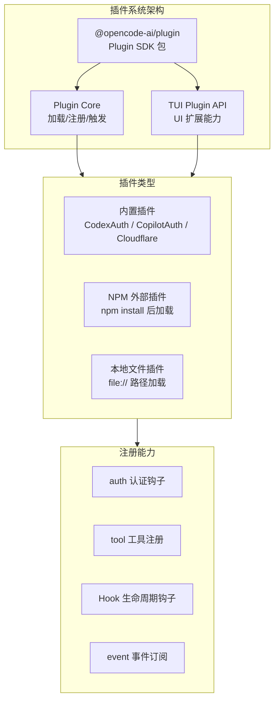
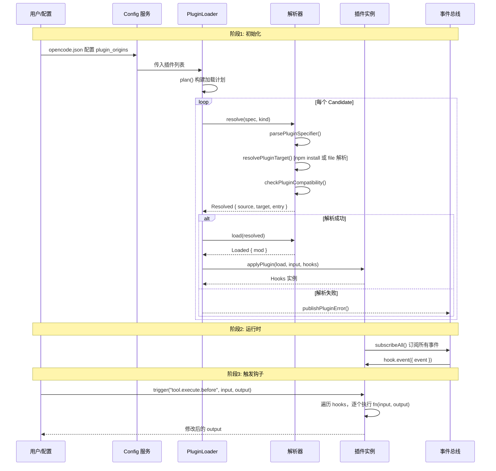
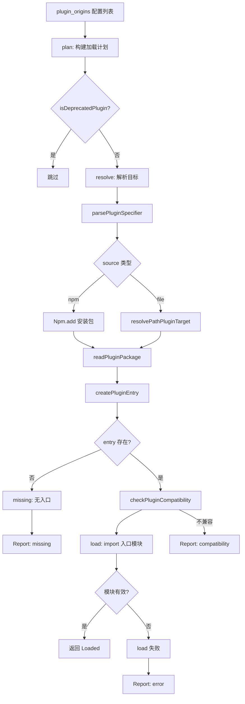
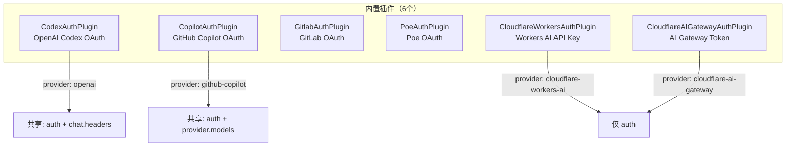
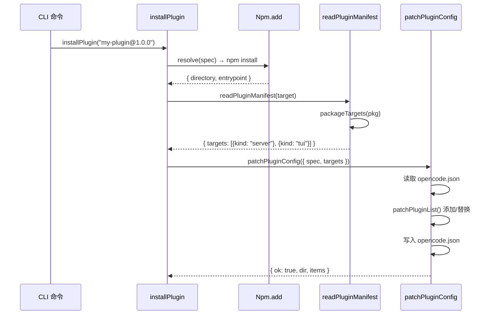

# 10 - 插件系统与二次开发

> OpenCode v1.3.17 · 源码级深度解析
> Java 开发者友好 · 手机可读

---

## 一、插件系统总览

OpenCode 的插件系统采用 **Server + TUI 双入口** 架构。每个插件可以注册到服务端（Server 端），也可以注册到终端 UI（TUI 端），或者两者兼有。

> 💡 **Java 类比**：类似于 Spring Boot 的 `@Bean` + `@Controller` 分层。Server 插件 = `@Service`（业务逻辑），TUI 插件 = `@Controller`（UI 渲染）。



---

## 二、插件包结构（`@opencode-ai/plugin`）

这是插件开发者使用的 SDK 包，位于 `packages/plugin/`。

### 2.1 包导出结构

| 导出路径 | 内容 | 用途 |
|---------|------|------|
| `@opencode-ai/plugin` | `Plugin`, `Hooks`, `PluginInput` | Server 插件开发核心类型 |
| `@opencode-ai/plugin/tool` | `tool()`, `ToolDefinition` | 工具注册 API |
| `@opencode-ai/plugin/tui` | `TuiPlugin`, `TuiPluginApi` | TUI 插件开发 API |

### 2.2 核心类型定义

```typescript
// === Server 插件入口签名 ===
// Java 类比: 类似 Function<T, R> 的函数式接口
type Plugin = (input: PluginInput, options?: PluginOptions) => Promise<Hooks>

// === 插件接收的输入 ===
type PluginInput = {
  client: OpencodeClient    // HTTP 客户端，调用 OpenCode API
  project: Project           // 当前项目信息
  directory: string          // 工作目录
  worktree: string           // Git worktree 根目录
  serverUrl: URL             // 服务器地址
  $: BunShell               // Bun Shell 执行器（类似 ProcessBuilder）
}

// === Hooks — 插件可以注册的所有钩子 ===
// Java 类比: 类似 Spring 的 ApplicationListener<T>
interface Hooks {
  event?: (input: { event: Event }) => Promise<void>         // 事件监听
  config?: (input: Config) => Promise<void>                  // 配置变更通知
  tool?: { [key: string]: ToolDefinition }                   // 工具注册表
  auth?: AuthHook                                            // 认证方式注册
  provider?: ProviderHook                                    // Provider 扩展
  "chat.message"?: (...) => Promise<void>                    // 消息拦截
  "chat.params"?: (...) => Promise<void>                     // 参数修改
  "chat.headers"?: (...) => Promise<void>                    // 请求头修改
  "permission.ask"?: (...) => Promise<void>                  // 权限拦截
  "tool.execute.before"?: (...) => Promise<void>             // 工具前置拦截
  "tool.execute.after"?: (...) => Promise<void>              // 工具后置处理
  "shell.env"?: (...) => Promise<void>                       // Shell 环境变量注入
  "tool.definition"?: (...) => Promise<void>                 // 工具定义修改
}
```

---

## 三、插件生命周期

### 3.1 完整生命周期时序图



### 3.2 阶段说明

| 阶段 | 动作 | 源码位置 |
|------|------|---------|
| **初始化** | 加载内置插件 → 解析外部插件 → 注册 Hook | `plugin/index.ts` L102-240 |
| **配置通知** | 调用每个 Hook 的 `config()` 方法 | `plugin/index.ts` L218-225 |
| **事件订阅** | 订阅 Bus 所有事件，转发给 Hook 的 `event()` | `plugin/index.ts` L228-237 |
| **运行时触发** | 按名称触发对应 Hook（如 `tool.execute.before`） | `plugin/index.ts` L243-256 |

---

## 四、插件加载器（PluginLoader）

`PluginLoader` 是插件系统的核心引擎，负责从 npm 或本地文件系统加载插件。

### 4.1 加载流程



### 4.2 关键类型

```typescript
// 加载计划
type Plan = {
  spec: string                    // 插件描述符（如 "my-plugin@1.0.0"）
  options: PluginOptions | undefined
  deprecated: boolean              // 是否已废弃
}

// 解析结果
type Resolved = Plan & {
  source: "file" | "npm"          // 来源类型
  target: string                   // 解析后的目标路径
  entry: string                    // 入口文件路径
  pkg?: PluginPackage              // npm 包信息
}

// 加载结果
type Loaded = Resolved & {
  mod: Record<string, unknown>     // 导入的模块对象
}
```

---

## 五、插件类型说明

### 5.1 四种注册类型

```mermaid
graph LR
    subgraph "插件注册类型"
        direction TB
        AUTH["🔐 auth<br/>认证方式注册"]
        TOOL["🔧 tool<br/>工具注册"]
        PROV["📡 provider<br/>模型提供商扩展"]
        HOOK["🪝 hook<br/>生命周期钩子"]
    end

    AUTH --> |OAuth/API Key| A1["扩展认证流程"]
    TOOL --> |tool()| T1["添加新工具给 LLM"]
    PROV --> |provider.models| P1["添加/修改模型"]
    HOOK --> |chat.message 等| H1["拦截/修改请求"]
```

| 类型 | 说明 | 伪代码 |
|------|------|--------|
| **auth** | 注册新的认证方式（OAuth/API Key） | `{ auth: { provider: "xxx", methods: [...] } }` |
| **tool** | 注册新工具供 LLM 调用 | `{ tool: { myTool: tool({ description, args, execute }) } }` |
| **provider** | 扩展/修改 Provider 的模型列表 | `{ provider: { id: "xxx", models: async () => ({...}) } }` |
| **hook** | 拦截各种生命周期事件 | `{ "tool.execute.before": async (input, output) => {...} }` |

### 5.2 内置插件清单



> 💡 **Java 类比**：内置插件就像 Spring Boot 的自动配置（AutoConfiguration），通过 `INTERNAL_PLUGINS` 数组直接注册，无需安装。

---

## 六、插件开发伪代码示例

### 6.1 Server 插件（添加自定义工具）

```typescript
// my-plugin/src/index.ts
import { tool } from "@opencode-ai/plugin/tool"
import type { PluginInput, Hooks } from "@opencode-ai/plugin"

// 导出默认对象，包含 server() 函数
export default {
  id: "my-awesome-plugin",     // 插件唯一 ID

  // Server 端入口函数
  async server(input: PluginInput, options?: Record<string, any>): Promise<Hooks> {
    return {
      // ====== 注册工具 ======
      tool: {
        // 工具名: my_calculator
        my_calculator: tool({
          description: "执行数学计算",
          args: {
            expression: z.string().describe("数学表达式，如 2+3*4"),
          },
          // 执行函数 — LLM 调用时会传入 args 和 context
          async execute(args, context) {
            // context 包含 sessionID, directory, abort 信号等
            const result = eval(args.expression) // 实际请用安全解析
            return `计算结果: ${result}`
          },
        }),
      },

      // ====== 拦截工具执行 ======
      "tool.execute.before": async (input, output) => {
        // input: { tool, sessionID, callID }
        // 可以修改 output.args
        console.log(`工具 ${input.tool} 即将执行`)
      },

      // ====== 注入 Shell 环境变量 ======
      "shell.env": async (input, output) => {
        output.env.MY_PLUGIN_TOKEN = "secret123"
      },

      // ====== 事件监听 ======
      "event": async ({ event }) => {
        if (event.type === "session.created") {
          console.log("新会话已创建:", event.sessionID)
        }
      },
    }
  },
}

// Java 类比:
// @Component
// public class MyPlugin implements Plugin {
//   @Override
//   public Hooks server(PluginInput input) {
//     return Hooks.builder()
//       .tool("my_calculator", this::calculate)
//       .onToolExecuteBefore(this::beforeTool)
//       .build();
//   }
// }
```

### 6.2 Auth 插件（自定义认证方式）

```typescript
// 以 Cloudflare 插件为例（简化版）
export async function CloudflareWorkersAuthPlugin(_input: PluginInput): Promise<Hooks> {
  return {
    auth: {
      provider: "cloudflare-workers-ai",   // 对应 provider ID
      methods: [
        {
          type: "api",                      // API Key 认证方式
          label: "API key",
          prompts: [
            {
              type: "text",
              key: "accountId",
              message: "Enter your Cloudflare Account ID",
              placeholder: "e.g. 1234567890abcdef",
            },
          ],
          // authorize 函数在用户输入后调用
          async authorize(inputs) {
            return {
              type: "success",
              key: inputs.accountId,        // 返回的 API Key
            }
          },
        },
      ],
    },
  }
}
```

### 6.3 Provider 扩展插件

```typescript
export default {
  id: "my-provider-extender",
  async server(input, options): Promise<Hooks> {
    return {
      provider: {
        id: "anthropic",  // 扩展现有 provider
        // 动态修改模型列表
        async models(provider, ctx) {
          const models = { ...provider.models }
          // 添加自定义模型
          models["claude-custom-3.5"] = {
            id: "claude-custom-3.5",
            name: "Claude Custom 3.5",
            cost: { input: 3, output: 15, cache: { read: 0.3, write: 3.75 } },
            // ... 其他模型属性
          }
          return models
        },
      },
    }
  },
}
```

---

## 七、插件安装与配置

### 7.1 安装流程



### 7.2 配置格式

```jsonc
// opencode.json
{
  "plugin": [
    "my-plugin",                              // npm 包（最新版）
    "my-plugin@^2.0.0",                       // 指定版本
    ["my-plugin", { "apiKey": "xxx" }],       // 带选项
    "file://./local-plugin"                   // 本地文件
  ]
}
```

---

## 八、插件元数据（PluginMeta）

`PluginMeta` 跟踪每个插件的加载状态，存储在 `plugin-meta.json` 中。

```typescript
type Entry = {
  id: string               // 插件唯一 ID
  source: "file" | "npm"   // 来源
  spec: string             // 原始描述符
  target: string           // 解析后的路径
  version?: string         // npm 版本号
  modified?: number        // 文件修改时间（file 类型）
  first_time: number       // 首次加载时间
  last_time: number        // 最后加载时间
  load_count: number       // 加载次数
  fingerprint: string      // 用于判断是否更新
  state: "first" | "updated" | "same"  // 加载状态
}
```

> 💡 **Java 类比**：类似 `java.nio.file.WatchService` 的文件变更检测，通过 fingerprint 判断插件是否需要重新加载。

---

## 📦 源码锚点表

| 文件路径 | 核心内容 |
|---------|---------|
| `packages/plugin/src/index.ts` | Plugin SDK 核心类型（`Hooks`, `PluginInput`, `AuthHook`） |
| `packages/plugin/src/tool.ts` | `tool()` 工具注册函数 |
| `packages/plugin/src/shell.ts` | `BunShell` 类型定义 |
| `packages/plugin/src/tui.ts` | TUI 插件 API（`TuiPluginApi`） |
| `packages/opencode/src/plugin/index.ts` | Plugin 服务主入口（加载、注册、触发） |
| `packages/opencode/src/plugin/loader.ts` | PluginLoader（解析、加载外部插件） |
| `packages/opencode/src/plugin/shared.ts` | 共享工具函数（解析 spec、兼容性检查） |
| `packages/opencode/src/plugin/meta.ts` | PluginMeta（插件元数据管理） |
| `packages/opencode/src/plugin/install.ts` | installPlugin / patchPluginConfig |
| `packages/opencode/src/plugin/codex.ts` | CodexAuthPlugin（内置 OAuth 插件） |
| `packages/opencode/src/plugin/cloudflare.ts` | Cloudflare 插件 |
| `packages/opencode/src/plugin/github-copilot/` | GitHub Copilot 插件 |
