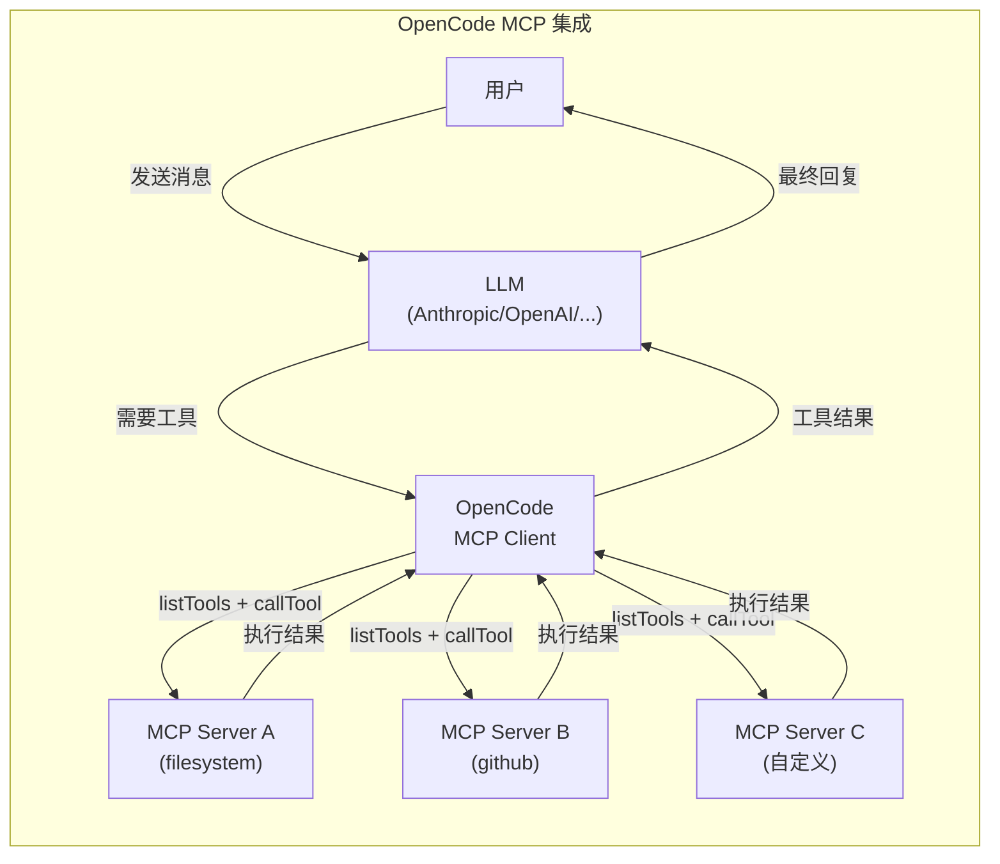
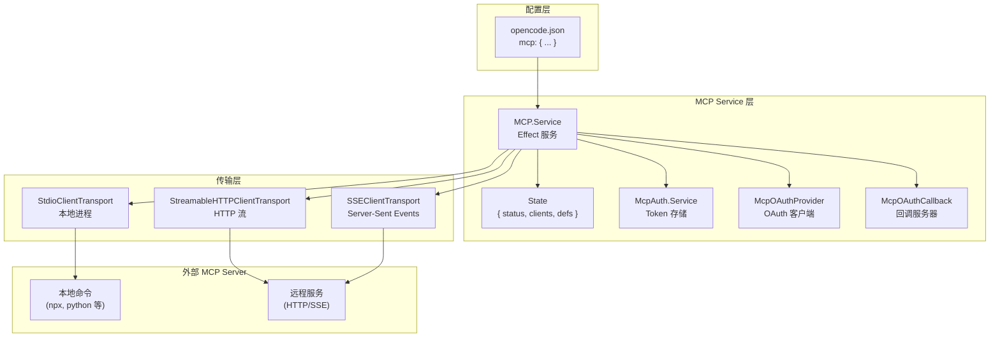
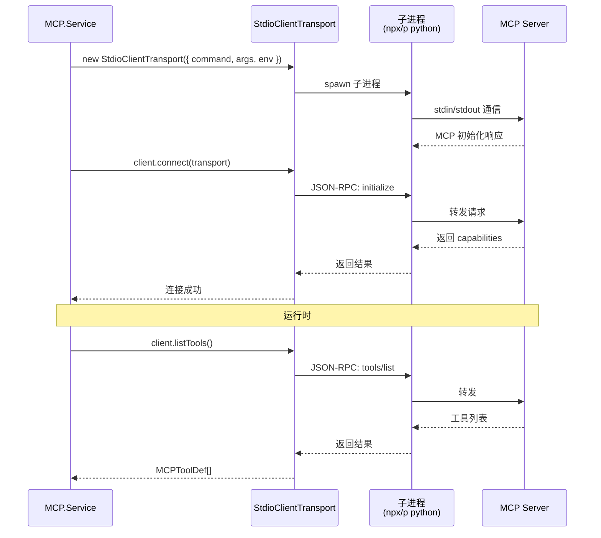
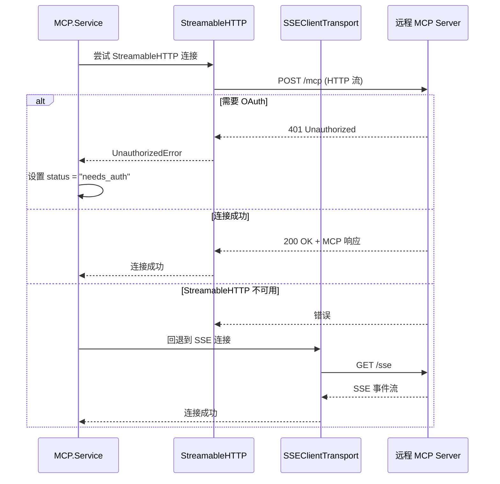
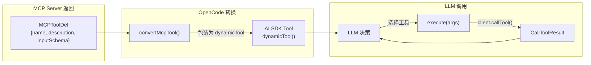
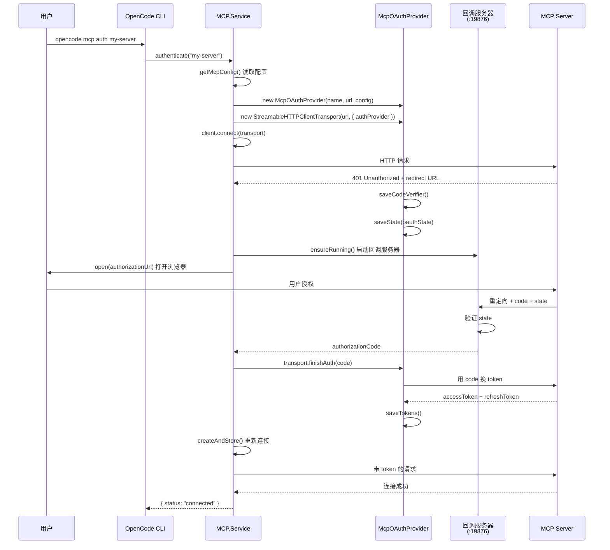
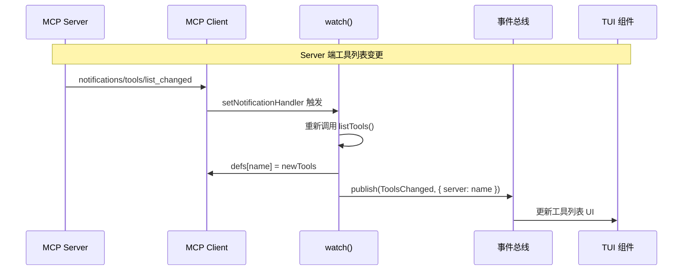
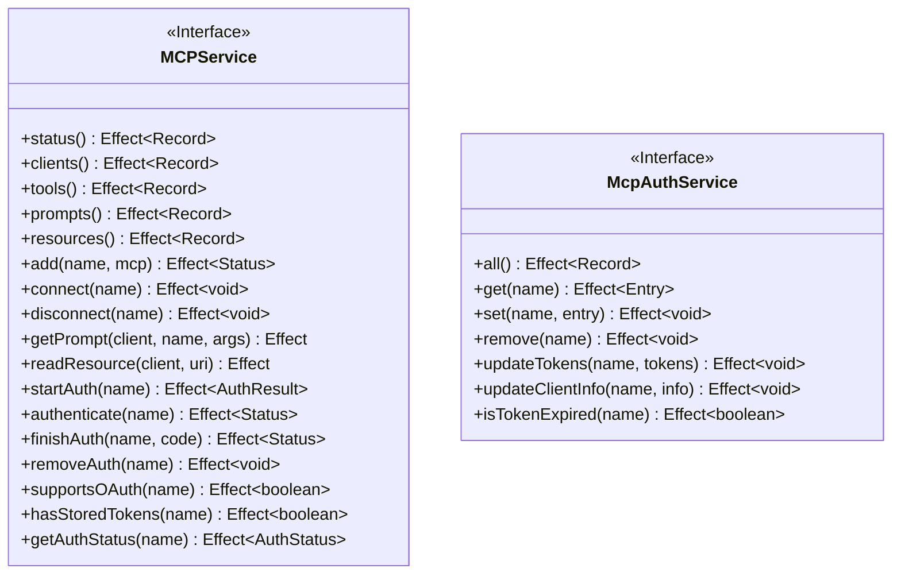

# 11 - MCP 协议集成

> OpenCode v1.3.17 · 源码级深度解析
> Java 开发者友好 · 手机可读

---

## 一、MCP 协议概述

### 1.1 什么是 MCP

**MCP（Model Context Protocol）** 是 Anthropic 提出的开放协议，用于让 AI 应用与外部工具/服务进行标准化通信。它定义了统一的 Tool 发现、调用和资源访问接口。

> 💡 **Java 类比**：MCP 就像 Java 的 **JDBC（Java Database Connectivity）**——JDBC 定义了统一的数据库访问接口，各种数据库只需提供 JDBC Driver 即可接入。MCP 则定义了统一的 AI 工具接口，各种服务只需提供 MCP Server 即可被 AI 调用。

### 1.2 MCP 在 OpenCode 中的定位



### 1.3 MCP 支持的能力

| 能力 | 说明 | 状态 |
|------|------|------|
| **Tool** | 发现和调用远程工具 | ✅ 已实现 |
| **Resource** | 读取远程资源 | ✅ 已实现 |
| **Prompt** | 获取预定义提示模板 | ✅ 已实现 |
| **OAuth 认证** | 远程 MCP Server 的 OAuth 流程 | ✅ 已实现 |
| **动态注册** | OAuth Client 动态注册 | ✅ 已实现 |
| **工具变更通知** | Server 端工具列表变更实时通知 | ✅ 已实现 |

---

## 二、MCP 集成架构

### 2.1 三层架构图



### 2.2 MCP Service 状态模型

```typescript
// MCP Service 内部状态
interface State {
  status: Record<string, Status>        // 每个 Server 的连接状态
  clients: Record<string, MCPClient>    // 每个 Server 的客户端实例
  defs: Record<string, MCPToolDef[]>    // 每个 Server 的工具定义缓存
}

// Server 连接状态 — 联合类型（类似 Java sealed interface）
type Status =
  | { status: "connected" }                                    // 已连接
  | { status: "disabled" }                                     // 已禁用
  | { status: "failed"; error: string }                        // 连接失败
  | { status: "needs_auth" }                                   // 需要认证
  | { status: "needs_client_registration"; error: string }     // 需要客户端注册
```

---

## 三、连接类型详解

### 3.1 Local（本地进程）连接



### 3.2 Remote（远程 HTTP）连接



> 💡 **Java 类比**：远程连接的回退策略类似于 Spring 的 `@LoadBalanced` + `@Retry`——先尝试首选协议，失败后自动回退。

---

## 四、Tool 发现与调用

### 4.1 Tool 转换流程



### 4.2 Tool 转换伪代码

```typescript
// 将 MCP Tool 定义转换为 AI SDK Tool
function convertMcpTool(mcpTool: MCPToolDef, client: MCPClient, timeout?: number): Tool {
  const inputSchema = {
    ...mcpTool.inputSchema,
    type: "object",                    // 强制为 object
    properties: mcpTool.inputSchema?.properties ?? {},
    additionalProperties: false,       // 禁止额外属性
  }

  return dynamicTool({
    description: mcpTool.description ?? "",
    inputSchema: jsonSchema(inputSchema),
    execute: async (args) => {
      // 调用 MCP Server 的工具
      return client.callTool(
        {
          name: mcpTool.name,
          arguments: args ?? {},
        },
        CallToolResultSchema,
        { resetTimeoutOnProgress: true, timeout }
      )
    },
  })
}

// Java 类比: 类似将 JDBC ResultSet 映射为 Java 对象
// MCPToolDef (外部格式) → Tool (AI SDK 格式)
```

### 4.3 Tool 命名规则

MCP 工具在 OpenCode 中的命名格式为：`{sanitizedClientName}_{sanitizedToolName}`

```typescript
// 伪代码
function sanitize(s: string) {
  return s.replace(/[^a-zA-Z0-9_-]/g, "_")
}

// 示例:
// MCP Server "my-server" 的工具 "read-file"
// → OpenCode 工具名: "my-server_read-file"
```

---

## 五、MCP Server 配置

### 5.1 配置格式

```jsonc
// opencode.json
{
  "mcp": {
    // 本地 MCP Server（通过子进程启动）
    "filesystem": {
      "type": "local",
      "command": ["npx", "-y", "@modelcontextprotocol/server-filesystem", "/path/to/dir"],
      "environment": {
        "NODE_ENV": "production"
      },
      "timeout": 30000,
      "enabled": true
    },

    // 远程 MCP Server（HTTP/SSE）
    "remote-tools": {
      "type": "remote",
      "url": "https://mcp.example.com/mcp",
      "headers": {
        "X-Custom-Header": "value"
      },
      "timeout": 60000,
      // OAuth 配置
      "oauth": {
        "clientId": "my-client-id",
        "clientSecret": "my-secret",
        "scope": "tools:read tools:write"
      }
      // 禁用 OAuth
      // "oauth": false
    },

    // 禁用某个 Server
    "disabled-server": {
      "type": "local",
      "command": ["echo", "disabled"],
      "enabled": false
    }
  }
}
```

### 5.2 配置字段说明表

| 字段 | 类型 | 必填 | 说明 |
|------|------|------|------|
| `type` | `"local" \| "remote"` | ✅ | 连接类型 |
| `command` | `string[]` | local 必填 | 启动命令及参数 |
| `url` | `string` | remote 必填 | 远程 Server URL |
| `environment` | `Record<string, string>` | ❌ | 环境变量 |
| `headers` | `Record<string, string>` | ❌ | 自定义 HTTP 头 |
| `timeout` | `number` | ❌ | 超时时间（ms），默认 30000 |
| `enabled` | `boolean` | ❌ | 是否启用，默认 true |
| `oauth` | `object \| false` | ❌ | OAuth 配置或禁用 |

---

## 六、OAuth 认证流程

### 6.1 完整认证时序图



### 6.2 Token 存储结构

```typescript
// mcp-auth.json
{
  "my-server": {
    "tokens": {
      "accessToken": "eyJhbG...",
      "refreshToken": "dGhpcy...",
      "expiresAt": 1735689600,
      "scope": "tools:read tools:write"
    },
    "clientInfo": {
      "clientId": "opencode-abc123",
      "clientSecret": "secret-xyz",
      "clientIdIssuedAt": 1735689600,
      "clientSecretExpiresAt": 1767225600
    },
    "serverUrl": "https://mcp.example.com/mcp"
  }
}
```

---

## 七、运行时管理

### 7.1 工具变更通知



### 7.2 生命周期管理

```typescript
// InstanceState 初始化时
// 1. 读取所有 mcp 配置
// 2. 并发连接所有 Server（unbounded concurrency）
// 3. 为每个连接设置工具变更监听
// 4. 注册 Finalizer：关闭时杀掉子进程并断开连接

// 清理逻辑（Effect Finalizer）
Effect.addFinalizer(() =>
  Effect.forEach(Object.values(s.clients), async (client) => {
    // 1. 找到子进程 PID
    const pid = client.transport?.pid
    // 2. 递归杀掉所有子进程
    const pids = await descendants(pid)
    pids.forEach(p => process.kill(p, "SIGTERM"))
    // 3. 关闭客户端连接
    await client.close()
  })
)
```

---

## 八、MCP API 接口一览



---

## 📦 源码锚点表

| 文件路径 | 核心内容 |
|---------|---------|
| `packages/opencode/src/mcp/index.ts` | MCP Service 主入口（连接、工具、认证） |
| `packages/opencode/src/mcp/auth.ts` | McpAuth Service（Token 存储管理） |
| `packages/opencode/src/mcp/oauth-provider.ts` | McpOAuthProvider（OAuth 客户端实现） |
| `packages/opencode/src/mcp/oauth-callback.ts` | McpOAuthCallback（回调服务器 :19876） |
| `packages/opencode/src/server/routes/mcp.ts` | MCP HTTP API 路由 |
| `packages/opencode/src/config/config.ts` | MCP 配置类型定义（`Config.Mcp`） |
