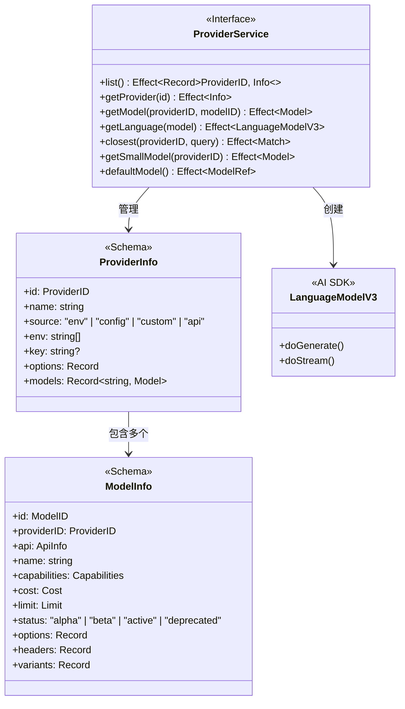
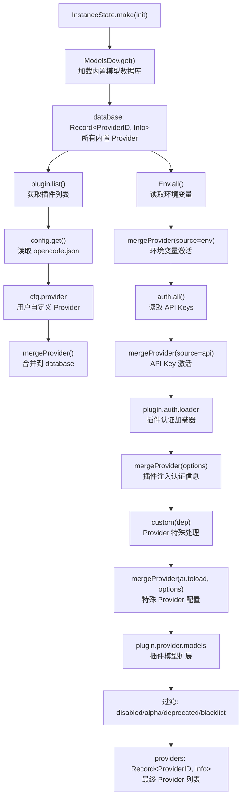
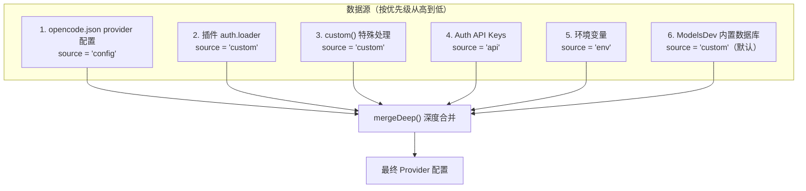
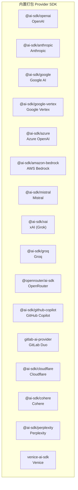
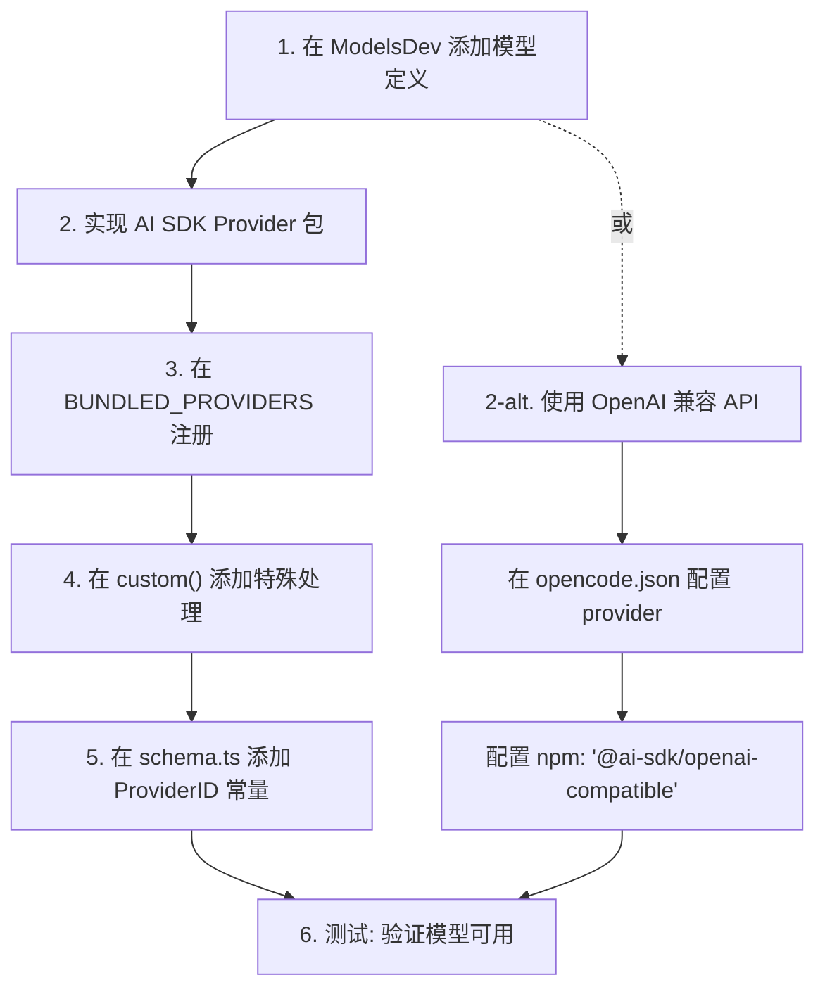
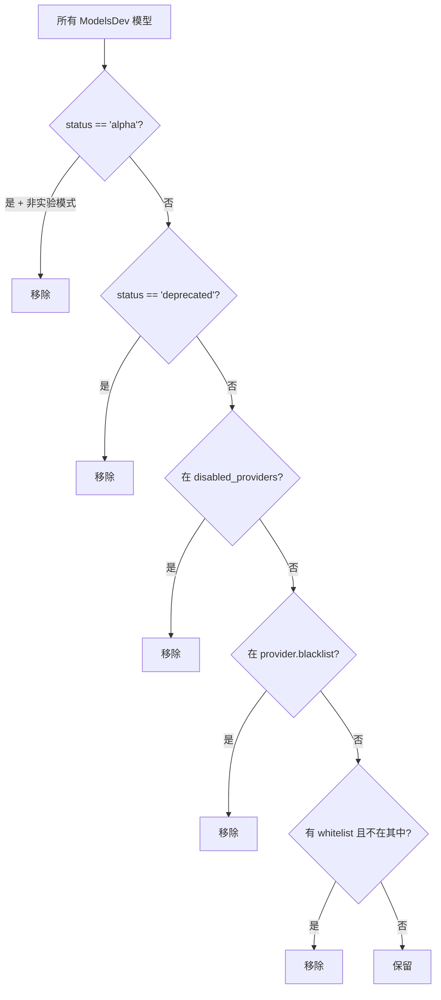
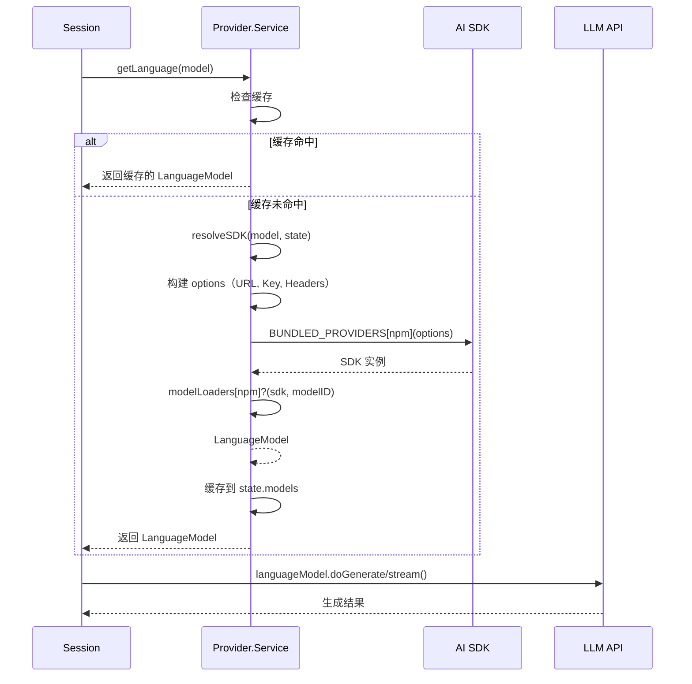

# 12 · 自定义 Provider 开发

> OpenCode v1.3.17 · 源码级深度解析
> Java 开发者友好 · 手机可读

---

## 一、Provider 系统概述

Provider 是 OpenCode 中管理 LLM 模型提供商的核心系统。它负责模型注册、SDK 实例化、认证注入和 API 调用。

> 💡 **Java 类比**：Provider 系统类似于 **Spring Data 的 Repository 抽象**——`Provider` 是数据源接口，`Model` 是实体类，`getLanguage()` 返回可执行的 `LanguageModel`（类似 `JdbcTemplate`）。

---

## 二、Provider 接口类图



---

## 三、Provider 注册流程

### 3.1 状态初始化流程



### 3.2 数据源优先级



---

## 四、内置 Provider 清单

### 4.1 已打包（Bundled）的 Provider



### 4.2 Provider 特殊处理

每个 Provider 可能有独特的初始化逻辑，通过 `custom(dep)` 函数注册：

| Provider | 特殊处理 |
|---------|---------|
| `openai` | 使用 `sdk.responses()` 而非 `sdk.languageModel()` |
| `github-copilot` | GPT-5+ 使用 Responses API，低版本使用 Chat API |
| `amazon-bedrock` | 自动添加区域前缀（us./eu./apac.），AWS 凭证链 |
| `azure` | 从配置/环境变量读取 resource name |
| `google-vertex` | Google Auth 自动获取 access token |
| `gitlab` | 支持 Workflow 模型动态发现 |
| `cloudflare-ai-gateway` | 使用 `ai-gateway-provider` 统一 API |

---

## 五、添加新 Provider 的步骤

### 5.1 完整流程图



### 5.2 方法一：使用 OpenAI 兼容 API（无需改源码）

```jsonc
// opencode.json — 添加自定义 Provider
{
  "provider": {
    "my-custom-provider": {
      "name": "My Custom Provider",
      "api": "https://api.my-provider.com/v1",
      "npm": "@ai-sdk/openai-compatible",
      "env": ["MY_API_KEY"],
      "models": {
        "my-model-v1": {
          "name": "My Model V1",
          "id": "my-model-v1",
          "limit": { "context": 128000, "output": 4096 },
          "cost": { "input": 2.0, "output": 8.0, "cache": { "read": 0.5, "write": 2.0 } },
          "capabilities": {
            "temperature": true,
            "reasoning": false,
            "attachment": true,
            "toolcall": true,
            "input": { "text": true, "image": true, "audio": false, "video": false, "pdf": false },
            "output": { "text": true, "audio": false, "image": false, "video": false, "pdf": false }
          }
        }
      }
    }
  }
}
```

### 5.3 方法二：开发原生 Provider（需改源码）

```typescript
// ====== 步骤 1: 创建 AI SDK Provider 包 ======
// packages/opencode/src/provider/sdk/my-provider.ts
import { createOpenAICompatible } from "@ai-sdk/openai-compatible"

export function createMyProvider(options: any) {
  return createOpenAICompatible({
    name: "my-provider",
    baseURL: "https://api.my-provider.com/v1",
    ...options,
  })
}

// ====== 步骤 2: 在 provider.ts 中注册 ======
// 在 BUNDLED_PROVIDERS 中添加:
const BUNDLED_PROVIDERS = {
  // ... 其他 Provider
  "my-provider": createMyProvider,
}

// ====== 步骤 3: 在 custom() 中添加特殊处理（可选） ======
function custom(dep) {
  return {
    // ... 其他 Provider
    "my-provider": () =>
      Effect.succeed({
        autoload: false,
        options: {
          headers: { "X-Custom-Header": "value" },
        },
        async getModel(sdk, modelID, options) {
          return sdk.languageModel(modelID)
        },
      }),
  }
}

// ====== 步骤 4: 在 schema.ts 中添加常量（可选） ======
export const ProviderID = providerIdSchema.pipe(withStatics((schema) => ({
  make: (id) => schema.makeUnsafe(id),
  // ... 其他常量
  myProvider: schema.makeUnsafe("my-provider"),
})))
```

---

## 六、模型注册说明

### 6.1 模型 Schema

```typescript
const Model = z.object({
  id: ModelID.zod,                           // 模型 ID（ branded string）
  providerID: ProviderID.zod,                // 所属 Provider
  api: z.object({
    id: z.string(),                           // API 调用时的模型名
    url: z.string(),                          // API 端点
    npm: z.string(),                          // Provider SDK npm 包名
  }),
  name: z.string(),                           // 显示名称
  capabilities: z.object({
    temperature: z.boolean(),                 // 支持温度调节
    reasoning: z.boolean(),                   // 支持推理模式
    attachment: z.boolean(),                  // 支持附件
    toolcall: z.boolean(),                    // 支持工具调用
    input: z.object({                         // 输入能力
      text: z.boolean(),
      audio: z.boolean(),
      image: z.boolean(),
      video: z.boolean(),
      pdf: z.boolean(),
    }),
    output: z.object({                        // 输出能力
      text: z.boolean(),
      audio: z.boolean(),
      image: z.boolean(),
      video: z.boolean(),
      pdf: z.boolean(),
    }),
    interleaved: z.boolean(),                 // 支持交错思考
  }),
  cost: z.object({                            // 费用（每百万 token）
    input: z.number(),
    output: z.number(),
    cache: z.object({ read: z.number(), write: z.number() }),
  }),
  limit: z.object({                           // 限制
    context: z.number(),                      // 上下文窗口大小
    output: z.number(),                       // 最大输出 token
  }),
  status: z.enum(["alpha", "beta", "deprecated", "active"]),
  variants: z.record(z.any()),               // 模型变体（如快慢模式）
})
```

### 6.2 模型过滤规则



---

## 七、LanguageModel 创建流程

### 7.1 SDK 解析伪代码

```typescript
// 当需要调用模型时，getLanguage() 被调用
async function resolveSDK(model: Model, state: State): Promise<BundledSDK> {
  const provider = state.providers[model.providerID]
  const options = { ...provider.options }

  // 1. 解析 baseURL（支持 ${VAR} 模板变量）
  const baseURL = resolveTemplateURL(model.api.url, options)

  // 2. 注入 API Key
  if (!options.apiKey && provider.key) {
    options.apiKey = provider.key
  }

  // 3. 合并模型级别 headers
  if (model.headers) {
    options.headers = { ...options.headers, ...model.headers }
  }

  // 4. 缓存检查（相同配置复用 SDK 实例）
  const cacheKey = hash({ providerID, npm: model.api.npm, options })
  if (state.sdk.has(cacheKey)) return state.sdk.get(cacheKey)

  // 5. 创建 SDK 实例
  let sdk: BundledSDK
  const bundledFn = BUNDLED_PROVIDERS[model.api.npm]
  if (bundledFn) {
    // 使用内置 SDK
    sdk = bundledFn({ name: model.providerID, ...options })
  } else {
    // 动态加载外部 SDK
    const installed = await Npm.add(model.api.npm)
    const mod = await import(installed.entrypoint)
    const createFn = mod[findCreateFunction(mod)]
    sdk = createFn({ name: model.providerID, ...options })
  }

  // 6. 缓存并返回
  state.sdk.set(cacheKey, sdk)
  return sdk
}
```

### 7.2 Model → LanguageModel 调用链



---

## 📦 源码锚点表

| 文件路径 | 核心内容 |
|---------|---------|
| `packages/opencode/src/provider/provider.ts` | Provider Service（核心逻辑，1709 行） |
| `packages/opencode/src/provider/schema.ts` | `ProviderID` / `ModelID` 品牌 Schema |
| `packages/opencode/src/provider/models.ts` | ModelsDev（内置模型数据库） |
| `packages/opencode/src/provider/auth.ts` | Provider 认证相关 |
| `packages/opencode/src/provider/transform.ts` | ProviderTransform（模型变体处理） |
| `packages/opencode/src/provider/error.ts` | Provider 错误类型 |
| `packages/opencode/src/provider/sdk/` | Provider SDK 实现（如 Copilot） |
