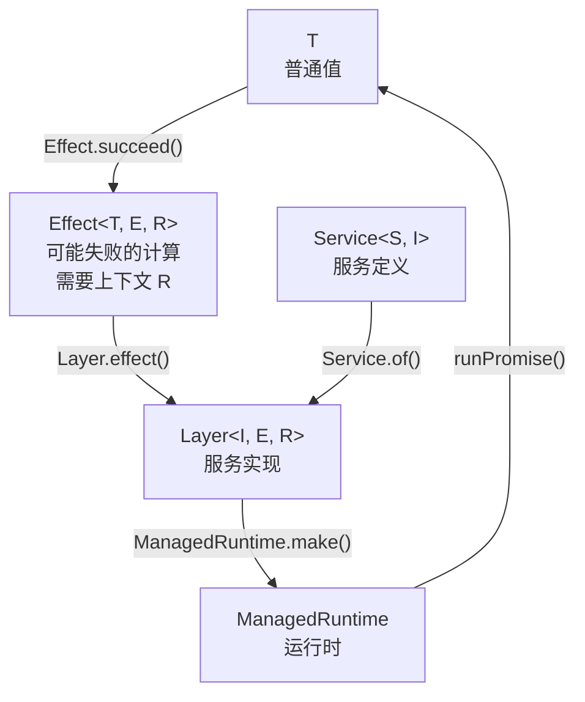
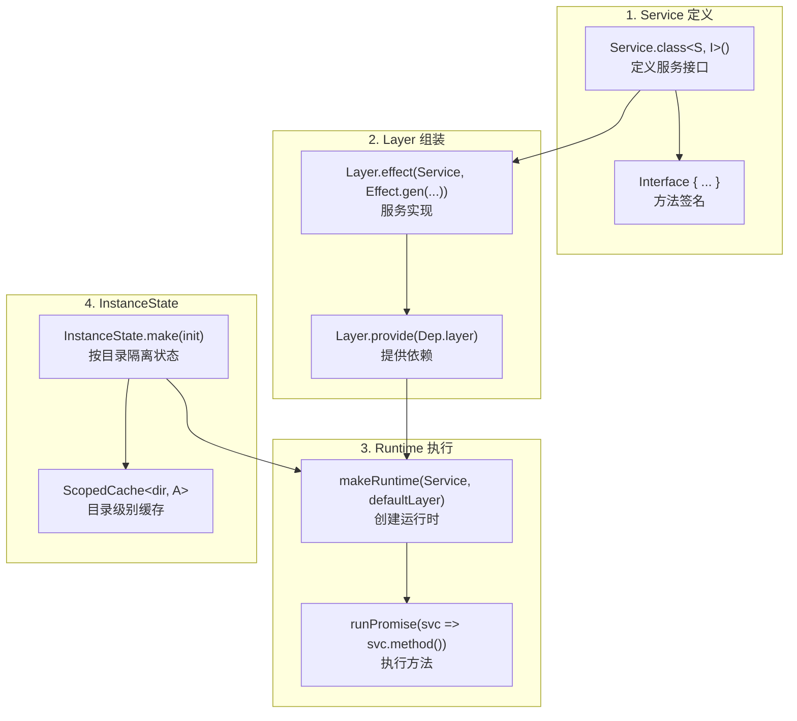
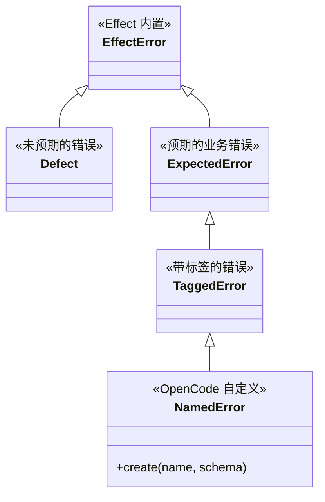
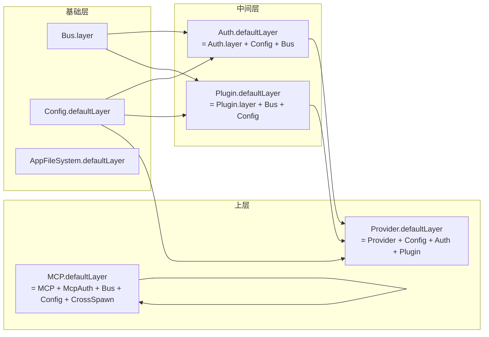
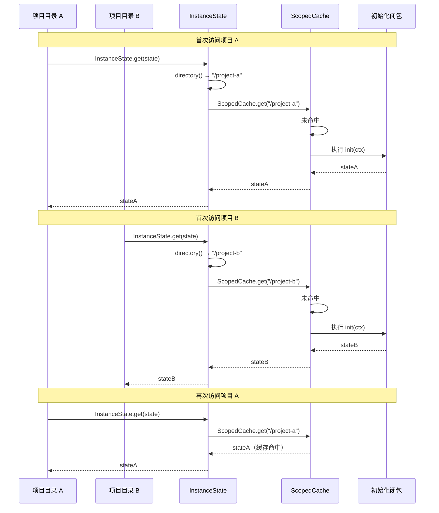
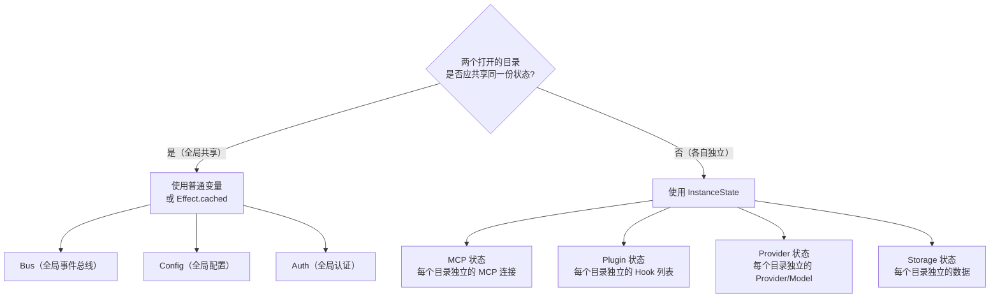

# 13 - Effect 框架实战指南

> OpenCode v1.3.17 · 源码级深度解析
> Java 开发者友好 · 手机可读

---

## 一、Effect 概述

**Effect** 是 TypeScript 生态中最强大的函数式编程框架，类似于 Haskell 的 IO Monad 在 TS 中的实现。OpenCode 全面采用 Effect 作为其副作用管理、依赖注入和并发控制的核心框架。

> 💡 **Java 类比**：Effect 在 TypeScript 中的地位，类似于 **RxJava + Dagger + CompletableFuture** 三合一。
> - `Effect` ≈ `CompletableFuture<T>`（异步计算）
> - `Layer` ≈ `@Module` + `@Provides`（依赖注入）
> - `Stream` ≈ `Flow<T>`（响应式流）

---

## 二、核心概念速查表

### 2.1 概念对照表

| Effect 概念 | 说明 | Java 对应 | RxJava 对应 |
|------------|------|----------|------------|
| `Effect<T>` | 描述一个可能失败的计算 | `CompletableFuture<T>` | `Single<T>` |
| `Effect.gen` | 同步风格编排异步代码 | 代码块 `{}` | `Single.create()` |
| `Layer` | 依赖注入容器 | `@Module` | N/A |
| `Service` | 服务定义 | `@Service` 接口 | N/A |
| `Program` | 完整的可执行程序 | `main()` | N/A |
| `Stream` | 惰性异步流 | `Flow<T>` | `Flowable<T>` |
| `Schema` | 数据验证与编解码 | `@Valid` + Bean Validation | N/A |
| `Scope` | 资源生命周期管理 | `try-with-resources` | N/A |
| `Fiber` | 轻量级线程 | `VirtualThread` | N/A |

### 2.2 基础类型层级



---

## 三、Effect vs RxJava 详细对比

| 特性 | Effect | RxJava | 说明 |
|------|--------|--------|------|
| **创建** | `Effect.succeed(42)` | `Single.just(42)` | 纯值 |
| **失败** | `Effect.fail(new Error())` | `Single.error(e)` | 错误值 |
| **异步** | `Effect.promise(() => fetch(url))` | `Single.fromCallable()` | 包装异步 |
| **编排** | `Effect.gen(function* () { ... })` | 链式 `.flatMap()` | 组合多个操作 |
| **错误处理** | `Effect.catch` / `Effect.catchAll` | `.onErrorResume()` | 恢复错误 |
| **依赖注入** | `Layer` + `Service` | N/A | Effect 独有 |
| **资源管理** | `Effect.acquireRelease` | `using()` | 安全释放 |
| **并发** | `Effect.forEach({ concurrency })` | `Flowable.parallel()` | 并行执行 |
| **缓存** | `Effect.cached` | `.cache()` | 去重 |
| **调度** | `Effect.fork` / `Effect.forkScoped` | `.subscribeOn()` | 纤程调度 |
| **超时** | `Effect.timeout` | `.timeout()` | 超时控制 |
| **重试** | `Effect.retry` | `.retry()` | 重试策略 |

---

## 四、OpenCode 中的使用模式

### 4.1 Service 定义 → Layer 组装 → Program 执行



### 4.2 标准服务模板

```typescript
// ============================================
// 伪代码: OpenCode Effect 服务标准模板
// Java 类比: @Service + @Module + @Inject
// ============================================

// 1. 定义 Service 类型
export class MyService extends ServiceMap.Service<MyService, Interface>()("@opencode/MyService") {}

// 2. 定义接口
export interface Interface {
  readonly getData: (id: string) => Effect.Effect<Data>
  readonly setData: (id: string, data: Data) => Effect.Effect<void>
}

// 3. 创建 Layer
export const layer = Layer.effect(
  MyService,
  Effect.gen(function* () {
    // yield* 获取依赖（类似 @Inject）
    const bus = yield* Bus.Service
    const config = yield* Config.Service

    // 使用 InstanceState 管理状态（按目录隔离）
    const state = yield* InstanceState.make<State>(
      Effect.fn("MyService.state")(function* () {
        const cfg = yield* config.get()
        // 初始化逻辑...
        return { /* state */ }
      }),
    )

    // Effect.fn 创建可追踪的命名 Effect
    const getData = Effect.fn("MyService.getData")(function* (id: string) {
      const s = yield* InstanceState.get(state)
      return s.data[id]
    })

    const setData = Effect.fn("MyService.setData")(function* (id: string, data: Data) {
      const s = yield* InstanceState.get(state)
      s.data[id] = data
      yield* bus.publish(DataChanged, { id })
    })

    // 注册 Finalizer（类似 @PreDestroy）
    yield* Effect.addFinalizer(() =>
      Effect.sync(() => console.log("MyService cleaned up"))
    )

    // 返回 Service 实例
    return MyService.of({ getData, setData })
  }),
)

// 4. 组装依赖
export const defaultLayer = layer.pipe(
  Layer.provide(Bus.layer),
  Layer.provide(Config.defaultLayer),
)

// 5. 创建运行时
const { runPromise } = makeRuntime(MyService, defaultLayer)

// 6. 暴露异步门面函数
export async function getData(id: string) {
  return runPromise(svc => svc.getData(id))
}
```

---

## 五、错误处理

### 5.1 错误类型层次



### 5.2 错误处理模式

```typescript
// ============================================
// 模式 1: Schema.TaggedErrorClass（推荐）
// Java 类比: 自定义 Exception 子类
// ============================================
export const MyError = Schema.TaggedErrorClass("MyError", {
  message: Schema.String,
  code: Schema.Number,
})

// 使用: yield* new MyError({ message: "出错了", code: 404 })

// ============================================
// 模式 2: NamedError.create（OpenCode 便捷方法）
// ============================================
export const NotFoundError = NamedError.create(
  "NotFoundError",
  z.object({ message: z.string() }),
)
// 使用: yield* new NotFoundError({ message: "找不到资源" })

// ============================================
// 模式 3: Effect.catch + Effect.orElseSucceed
// ============================================
const result = yield* Effect.tryPromise({
  try: () => fetchData(),
  catch: (err) => new NetworkError({ cause: err }),
}).pipe(
  Effect.catch(() => Effect.succeed(fallbackData)),
)

// ============================================
// 模式 4: Effect.catchTag（按标签捕获）
// ============================================
const data = yield* operation.pipe(
  Effect.catchTag("NotFoundError", () => Effect.succeed(null)),
  Effect.catchTag("PermissionError", () => Effect.succeed(undefined)),
)
```

---

## 六、依赖注入

### 6.1 Layer 组装链



### 6.2 Layer.provide 语义

```typescript
// Layer.provide 的含义: "为 Layer 提供所需的依赖"
// Java 类比: 类似 Spring 的 @Configuration 声明

// Auth 需要 Config 和 Bus
export const AuthLayer = Layer.effect(Auth, Effect.gen(...))

// defaultLayer = AuthLayer + ConfigLayer + BusLayer
export const AuthDefaultLayer = AuthLayer.pipe(
  Layer.provide(Config.defaultLayer),   // 注入 Config
  Layer.provide(Bus.layer),             // 注入 Bus
)

// Provider 需要 Config, Auth, Plugin
export const ProviderDefaultLayer = ProviderLayer.pipe(
  Layer.provide(Config.defaultLayer),
  Layer.provide(Auth.defaultLayer),     // 递归包含 Auth 的依赖
  Layer.provide(Plugin.defaultLayer),   // 递归包含 Plugin 的依赖
)
```

---

## 七、并发控制

```typescript
// ============================================
// 并发遍历（类似 Java parallelStream）
// ============================================
yield* Effect.forEach(items, (item) => process(item), {
  concurrency: "unbounded",    // 无限制并发
})
yield* Effect.forEach(items, (item) => process(item), {
  concurrency: 5,              // 最多 5 个并发
})

// ============================================
// 后台任务（类似 CompletableFuture.runAsync）
// ============================================
yield* Effect.forkScoped(
  Effect.repeat(
    Effect.gen(() => healthCheck()),
    { schedule: Schedule.spaced(Duration.seconds(30)) }
  )
)

// ============================================
// 去重缓存（多个调用者共享同一计算）
// ============================================
const cachedFetch = Effect.cached(
  Effect.tryPromise(() => fetch(url)),
  { timeToLive: Duration.minutes(5) }
)

// 多次调用 cachedFetch 只会执行一次 fetch
```

---

## 八、InstanceState 机制

### 8.1 什么是 InstanceState

`InstanceState` 是 OpenCode 对 Effect 的关键扩展。它解决了 **多项目实例** 场景下的状态隔离问题——每个打开的项目目录拥有独立的服务状态。

> 💡 **Java 类比**：类似于每个用户请求有独立的 `ThreadLocal` 上下文。但这里不是线程级别，而是 **目录级别** 的隔离。

### 8.2 InstanceState 工作原理



### 8.3 InstanceState 核心实现

```typescript
// InstanceState 本质是一个 ScopedCache
// key = 当前目录路径
// value = 初始化闭包的返回值

export const make = <A>(
  init: (ctx: InstanceContext) => Effect.Effect<A>,
): Effect.Effect<InstanceState<A>> =>
  Effect.gen(function* () {
    const cache = yield* ScopedCache.make<string, A>({
      capacity: Infinity,          // 无容量限制
      lookup: () =>
        Effect.gen(function* () {
          return yield* init(yield* context)  // 获取当前目录上下文
        }),
    })

    // 注册清理回调
    const off = registerDisposer((directory) =>
      Effect.runPromise(ScopedCache.invalidate(cache, directory))
    )
    yield* Effect.addFinalizer(() => Effect.sync(off))

    return { [TypeId]: TypeId, cache }
  })
```

### 8.4 InstanceState.bind — ALS 桥接

```typescript
// InstanceState.bind 解决的问题：
// Effect 纤程内部的 AsyncLocalStorage（ALS）上下文
// 无法自动传递给原生回调（如 node-pty、@parcel/watcher）
//
// Java 类比: 类似 InheritableThreadLocal 但需要手动绑定

export const bind = <F extends (...args: any[]) => any>(fn: F): F => {
  try {
    return Instance.bind(fn)    // 尝试使用 Instance 的 ALS
  } catch (err) {
    if (!(err instanceof Context.NotFound)) throw err
  }
  // 回退: 从当前 Fiber 的 services 获取 InstanceRef
  const fiber = Fiber.getCurrent()
  const ctx = fiber ? ServiceMap.getReferenceUnsafe(fiber.services, InstanceRef) : undefined
  if (!ctx) return fn
  // 包装函数: 执行前恢复 ALS 上下文
  return ((...args) => Instance.restore(ctx, () => fn(...args))) as F
}
```

### 8.5 何时使用 InstanceState



---

## 九、makeRuntime — 运行时工厂

```typescript
// makeRuntime 是 OpenCode 对 Effect 运行时的统一封装
// 它使用 Layer.makeMemoMapUnsafe 实现跨调用的 Layer 缓存

const memoMap = Layer.makeMemoMapUnsafe()  // 全局 Layer 缓存

export function makeRuntime<I, S, E>(service, layer) {
  let rt: ManagedRuntime | undefined
  const getRuntime = () => (rt ??= ManagedRuntime.make(layer, { memoMap }))

  return {
    runSync: (fn) => getRuntime().runSync(service.use(fn)),
    runPromise: (fn) => getRuntime().runPromise(service.use(fn)),
    runFork: (fn) => getRuntime().runFork(service.use(fn)),
    runCallback: (fn) => getRuntime().runCallback(service.use(fn)),
  }
}

// Java 类比: 类似 Spring 的 ApplicationContext
// - ManagedRuntime ≈ ApplicationContext
// - memoMap ≈ singleton scope（默认所有 Layer 只初始化一次）
// - runPromise ≈ context.getBean(Service.class).method()
```

---

## 📦 源码锚点表

| 文件路径 | 核心内容 |
|---------|---------|
| `packages/opencode/src/effect/instance-state.ts` | InstanceState（按目录隔离的状态管理） |
| `packages/opencode/src/effect/run-service.ts` | makeRuntime（运行时工厂 + memoMap） |
| `packages/opencode/src/effect/instance-registry.ts` | registerDisposer（实例清理注册） |
| `packages/opencode/src/effect/instance-ref.ts` | InstanceRef（Effect Service 引用到 Instance 的桥接） |
| `packages/opencode/src/effect/cross-spawn-spawner.ts` | CrossSpawnSpawner（Effect 进程生成器） |
| `packages/opencode/src/effect/runner.ts` | Runner（Effect 执行器） |
