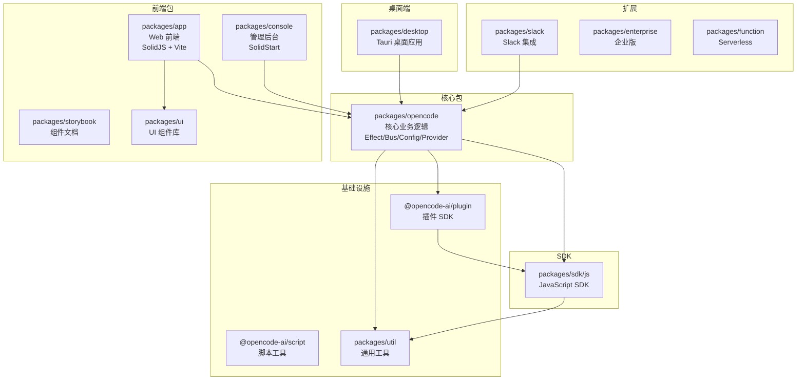
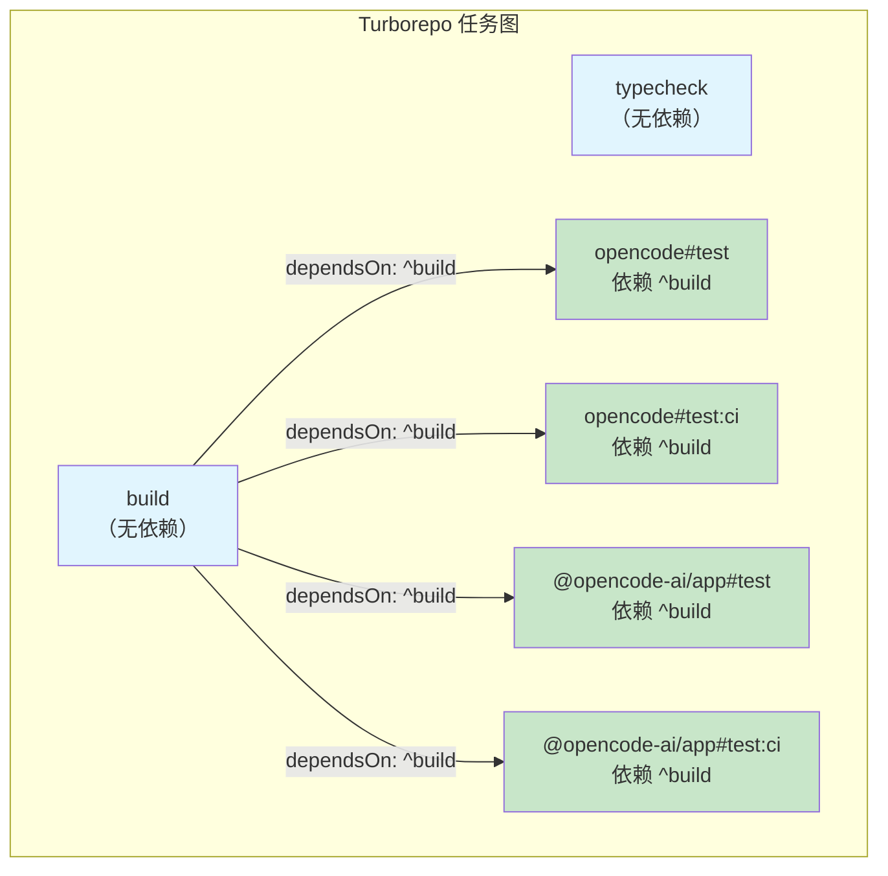
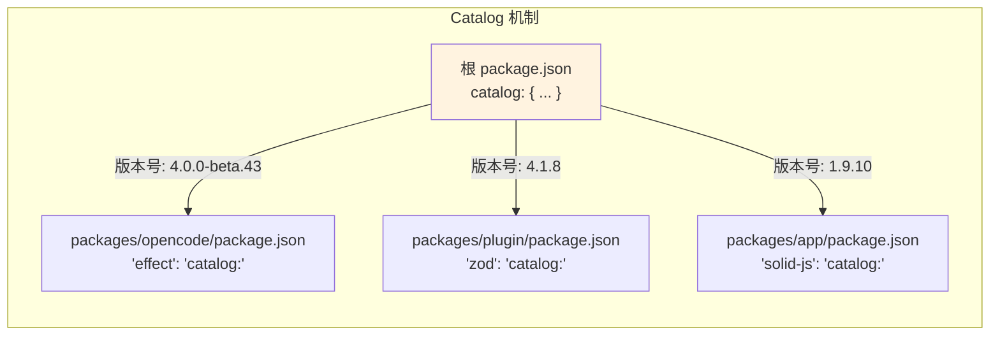
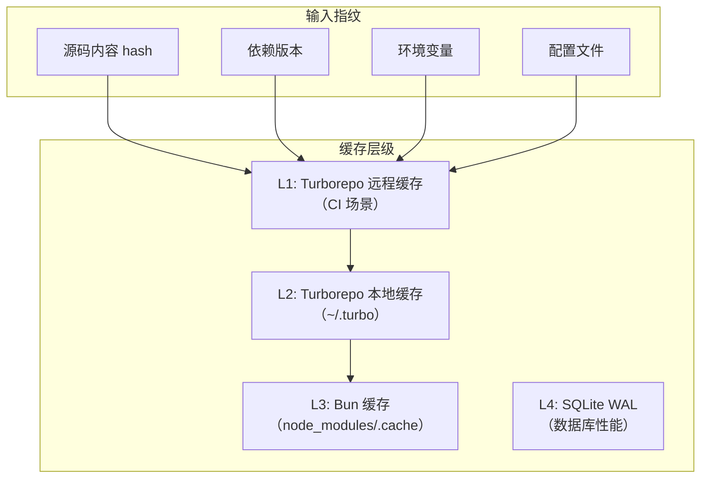
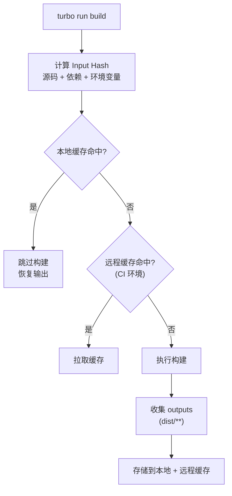

# 14 · 构建系统与 Monorepo

> OpenCode v1.3.17 · 源码级深度解析
> Java 开发者友好 · 手机可读

---

## 一、Monorepo 结构

### 1.1 依赖关系图



### 1.2 包清单表

| 包名 | 路径 | 说明 | 构建工具 |
|------|------|------|---------|
| `opencode` | `packages/opencode` | 核心包（CLI + Server） | Bun |
| `@opencode-ai/plugin` | `packages/plugin` | 插件开发 SDK | TypeScript |
| `@opencode-ai/sdk` | `packages/sdk/js` | JavaScript SDK | bun build |
| `@opencode-ai/script` | `packages/script` | 脚本工具 | Bun |
| `@opencode-ai/app` | `packages/app` | Web 前端 | Vite |
| `packages/console` | `packages/console` | 管理后台 | SolidStart |
| `packages/desktop` | `packages/desktop` | 桌面应用 | Tauri |
| `packages/ui` | `packages/ui` | UI 组件库 | Vite |
| `packages/storybook` | `packages/storybook` | 组件文档 | Storybook |
| `packages/util` | `packages/util` | 通用工具库 | Bun |
| `packages/slack` | `packages/slack` | Slack 集成 | Bun |
| `packages/enterprise` | `packages/enterprise` | 企业版功能 | Bun |
| `packages/function` | `packages/function` | Serverless | SST |

---

## 二、Turborepo 任务编排

### 2.1 任务依赖图



### 2.2 turbo.json 解读

```jsonc
{
  "$schema": "https://v2-8-13.turborepo.dev/schema.json",
  // 全局环境变量（变化时所有任务重新执行）
  "globalEnv": ["CI", "OPENCODE_DISABLE_SHARE"],
  
  "tasks": {
    // typecheck: 无依赖，无输出
    "typecheck": {},
    
    // build: 无依赖，输出 dist/**
    "build": {
      "dependsOn": [],           // 不依赖其他包的 build
      "outputs": ["dist/**"]     // 缓存输出
    },
    
    // opencode 包的测试
    "opencode#test": {
      "dependsOn": ["^build"],   // 依赖所有依赖包的 build
      "outputs": [],
      "passThroughEnv": ["*"]    // 传递所有环境变量
    }
  }
}
```

> 💡 **Java 类比**：Turborepo 类似 Maven/Gradle 的增量构建系统。`^build` 依赖表示"先构建所有上游依赖包"，类似于 Maven 的 reactor build。

---

## 三、Bun Workspace 配置

### 3.1 Workspace 结构

```jsonc
// 根 package.json
{
  "private": true,
  "type": "module",
  "packageManager": "bun@1.3.11",
  
  "workspaces": {
    "packages": [
      "packages/*",          // packages/ 下的所有包
      "packages/console/*",  // console 子包
      "packages/sdk/js",     // SDK
      "packages/slack"       // Slack
    ],
    "catalog": { /* 统一版本管理 */ }
  }
}
```

### 3.2 Catalog 统一版本管理



> 💡 **Java 类比**：Catalog 类似 Maven 的 `<dependencyManagement>` 或 Gradle 的 `platform()` BOM。在根 pom.xml 统一声明版本，子模块引用时不指定版本。

### 3.3 核心 Catalog 条目

| 依赖 | 版本 | 说明 |
|------|------|------|
| `effect` | 4.0.0-beta.43 | 函数式框架 |
| `ai` | 6.0.138 | Vercel AI SDK |
| `zod` | 4.1.8 | Schema 验证 |
| `drizzle-orm` | 1.0.0-beta.19 | ORM |
| `hono` | 4.10.7 | HTTP 框架 |
| `solid-js` | 1.9.10 | UI 框架 |
| `typescript` | 5.8.2 | TypeScript |
| `vite` | 7.1.4 | 构建工具 |
| `tailwindcss` | 4.1.11 | CSS 框架 |
| `turbo` | 2.8.13 | Monorepo 编排 |

---

## 四、构建缓存与增量策略

### 4.1 缓存层级



### 4.2 Turborepo 缓存策略



---

## 五、开发命令

### 5.1 常用脚本

| 命令 | 说明 | 对应 Java |
|------|------|----------|
| `bun run dev` | 启动核心包开发模式 | `mvn spring-boot:run` |
| `bun run dev:web` | 启动 Web 前端 | `npm run dev` |
| `bun run dev:desktop` | 启动桌面应用 | `./gradlew desktop:run` |
| `bun run dev:console` | 启动管理后台 | N/A |
| `bun run typecheck` | 全量类型检查 | `mvn compile` |
| `bun turbo build` | 构建所有包 | `mvn package` |

### 5.2 测试命令

```bash
# ❌ 不能在根目录运行测试
bun run test  # 输出: "do not run tests from root"

# ✅ 在包目录内运行
cd packages/opencode && bun test
cd packages/app && bun test
```

> 💡 **Java 类比**：这类似于 Maven 的多模块项目，每个模块有自己的测试。`turbo test` 相当于 `mvn test`，会自动处理模块间依赖。

---

## 六、Monorepo 工作流

### 6.1 依赖更新流程


### 6.2 patches（补丁）

```jsonc
// 根 package.json 中的 patchedDependencies
{
  "patchedDependencies": {
    // 修补 @standard-community/standard-openapi
    "@standard-community/standard-openapi@0.2.9": "patches/...",
    // 修补 solid-js
    "solid-js@1.9.10": "patches/...",
    // 修补 @ai-sdk/provider-utils
    "@ai-sdk/provider-utils@4.0.21": "patches/...",
    // 修补 @ai-sdk/anthropic
    "@ai-sdk/anthropic@3.0.64": "patches/..."
  }
}
```

> 💡 **Java 类比**：patches 类似于 `maven-shade-plugin` 或字节码增强，在不修改原始源码的情况下修改依赖包的行为。

---

## 📦 源码锚点表

| 文件路径 | 核心内容 |
|---------|---------|
| `package.json`（根） | Monorepo 配置、workspace、catalog |
| `turbo.json` | Turborepo 任务编排配置 |
| `packages/*/package.json` | 各包独立配置 |
| `packages/opencode/package.json` | 核心包依赖配置 |
| `packages/plugin/package.json` | 插件 SDK 导出配置 |
| `patches/` | 依赖补丁目录 |
