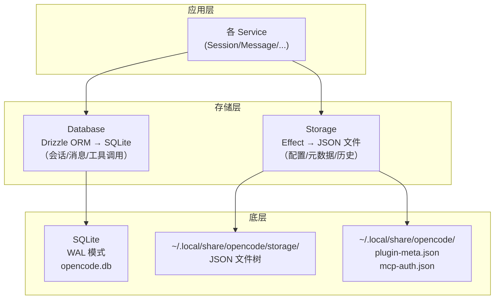
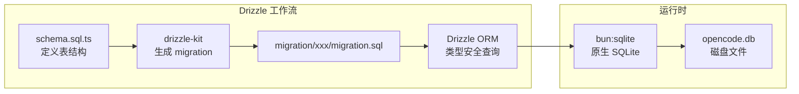
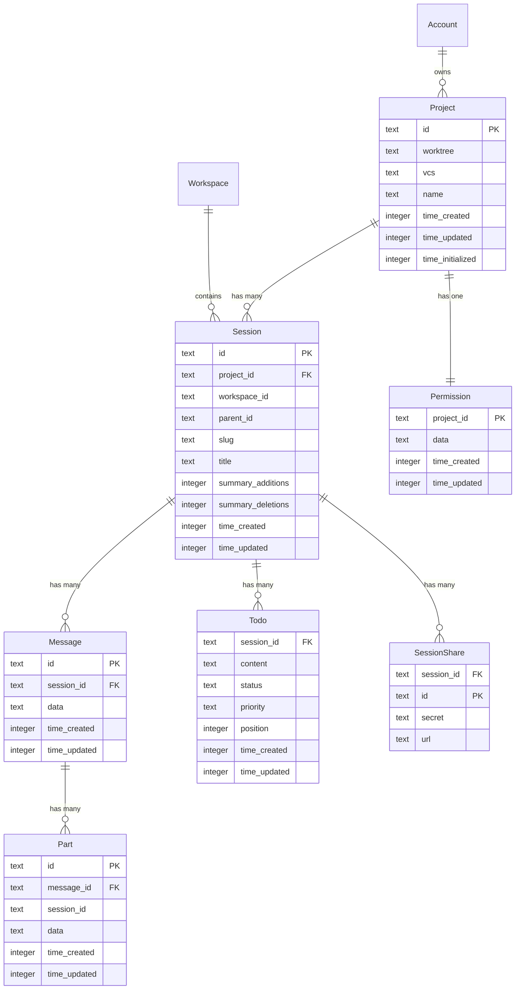
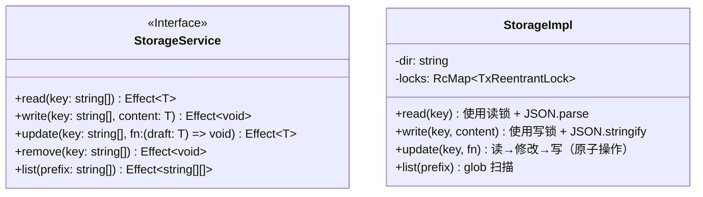
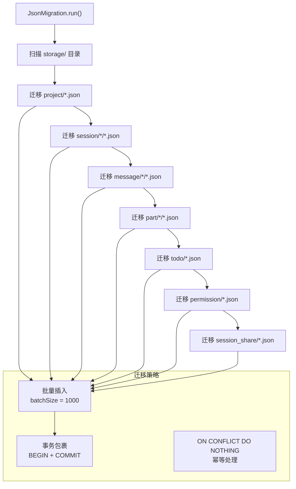
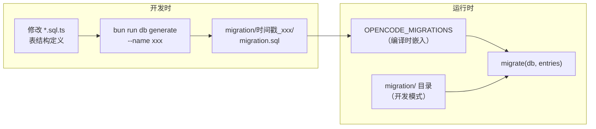

# 15 · 存储与数据模型

> OpenCode v1.3.17 · 源码级深度解析
> Java 开发者友好 · 手机可读

---

## 一、存储层架构

### 1.1 双存储架构

OpenCode 使用 **双存储策略**：SQLite（关系型数据）+ JSON 文件（历史遗留 + 部分配置）。



> 💡 **Java 类比**：双存储类似于 **JPA（关系型）+ Redis（键值型）** 的组合。SQLite 承载核心业务数据（JPA），JSON 文件承载辅助数据（Redis）。

---

## 二、SQLite 数据库

### 2.1 数据库配置

```typescript
// 数据库位置
function getChannelPath() {
  // 默认: ~/.local/share/opencode/opencode.db（XDG 标准路径）
  // 非稳定版: ~/.local/share/opencode/opencode-{channel}.db
  return path.join(Global.Path.data, "opencode.db")
}

// 初始化 PRAGMA（性能优化）
db.run("PRAGMA journal_mode = WAL")        // Write-Ahead Logging
db.run("PRAGMA synchronous = NORMAL")      // 平衡安全与性能
db.run("PRAGMA busy_timeout = 5000")       // 忙等待 5 秒
db.run("PRAGMA cache_size = -64000")       // 64MB 页缓存
db.run("PRAGMA foreign_keys = ON")         // 启用外键约束
db.run("PRAGMA wal_checkpoint(PASSIVE)")   // 启动时检查点
```

### 2.2 Drizzle ORM 使用模式



### 2.3 数据库初始化

```typescript
// db.bun.ts — 数据库初始化（8 行核心代码）
import { Database } from "bun:sqlite"
import { drizzle } from "drizzle-orm/bun-sqlite"

export function init(path: string) {
  const sqlite = new Database(path, { create: true })
  const db = drizzle({ client: sqlite })
  return db
}
```

> 💡 **Java 类比**：这相当于 Spring Boot 的 `DataSource` 自动配置。`drizzle()` 类似 `EntityManagerFactory.createEntityManager()`。

---

## 三、核心数据模型 ER 图

### 3.1 实体关系图



### 3.2 核心表结构详解

#### Session 表

```sql
-- 会话表：一个用户对话
CREATE TABLE session (
  id              TEXT PRIMARY KEY,          -- 会话 ID (ULID)
  project_id      TEXT NOT NULL REFERENCES project(id) ON DELETE CASCADE,
  workspace_id    TEXT,                       -- 工作区 ID
  parent_id       TEXT,                       -- 父会话 ID（分支）
  slug            TEXT NOT NULL,              -- URL 友好名
  directory       TEXT NOT NULL,              -- 工作目录
  title           TEXT NOT NULL,              -- 会话标题
  version         TEXT NOT NULL,              -- 协议版本
  share_url       TEXT,                       -- 分享链接
  summary_additions INTEGER,                  -- 总新增行数
  summary_deletions  INTEGER,                  -- 总删除行数
  summary_files   INTEGER,                    -- 变更文件数
  summary_diffs   TEXT,                       -- JSON: 差异详情
  revert          TEXT,                       -- JSON: 撤销信息
  permission      TEXT,                       -- JSON: 权限规则
  time_created    INTEGER NOT NULL,           -- 创建时间戳
  time_updated    INTEGER NOT NULL,           -- 更新时间戳
  time_compacting INTEGER,                    -- 压缩开始时间
  time_archived   INTEGER                     -- 归档时间
);

CREATE INDEX session_project_idx ON session(project_id);
CREATE INDEX session_workspace_idx ON session(workspace_id);
CREATE INDEX session_parent_idx ON session(parent_id);
```

#### Message 表

```sql
-- 消息表：一条用户或 AI 消息
CREATE TABLE message (
  id            TEXT PRIMARY KEY,            -- 消息 ID (ULID)
  session_id    TEXT NOT NULL REFERENCES session(id) ON DELETE CASCADE,
  data          TEXT NOT NULL,               -- JSON: 消息完整数据
  time_created  INTEGER NOT NULL,
  time_updated  INTEGER NOT NULL
);

CREATE INDEX message_session_time_created_id_idx 
  ON message(session_id, time_created, id);
```

> 💡 **Java 类比**：`data` 字段使用 JSON 存储，类似于 JPA 的 `@Column(columnDefinition = "TEXT")` + JSON 序列化。这允许灵活的消息结构而无需频繁修改表结构。

#### Part 表

```sql
-- 部件表：消息的组成部分（文本、工具调用、代码等）
CREATE TABLE part (
  id            TEXT PRIMARY KEY,            -- 部件 ID (ULID)
  message_id    TEXT NOT NULL REFERENCES message(id) ON DELETE CASCADE,
  session_id    TEXT NOT NULL,               -- 冗余字段，加速查询
  data          TEXT NOT NULL,               -- JSON: 部件完整数据
  time_created  INTEGER NOT NULL,
  time_updated  INTEGER NOT NULL
);

CREATE INDEX part_message_id_id_idx ON part(message_id, id);
CREATE INDEX part_session_idx ON part(session_id);
```

#### Todo 表

```sql
-- 待办表：会话中的待办事项
CREATE TABLE todo (
  session_id    TEXT NOT NULL REFERENCES session(id) ON DELETE CASCADE,
  content       TEXT NOT NULL,               -- 待办内容
  status        TEXT NOT NULL,               -- 状态 (pending/done/failed)
  priority      TEXT NOT NULL,               -- 优先级
  position      INTEGER NOT NULL,            -- 排序位置
  time_created  INTEGER NOT NULL,
  time_updated  INTEGER NOT NULL,
  PRIMARY KEY (session_id, position)
);

CREATE INDEX todo_session_idx ON todo(session_id);
```

---

## 四、JSON 文件存储

### 4.1 Storage Service



### 4.2 文件存储路径

```
~/.local/share/opencode/               # XDG 数据目录（$XDG_DATA_HOME）
├── opencode.db                    # SQLite 数据库
├── storage/                       # JSON 文件存储
│   ├── migration                  # 迁移版本标记
│   ├── project/                   # 项目元数据
│   │   └── {projectId}.json
│   ├── session/                   # 会话元数据（旧版，已迁移）
│   │   └── {projectId}/
│   │       └── {sessionId}.json
│   ├── message/                   # 消息（旧版，已迁移）
│   │   └── {sessionId}/
│   │       └── {messageId}.json
│   ├── part/                      # 部件（旧版，已迁移）
│   │   └── {messageId}/
│   │       └── {partId}.json
│   ├── session_diff/              # 会话差异摘要
│   └── ...
├── plugin-meta.json               # 插件元数据
├── mcp-auth.json                  # MCP OAuth Token
├── model.json                     # 最近使用的模型
└── config.json                    # 全局配置
```

### 4.3 并发安全

```typescript
// Storage 使用 TxReentrantLock（可重入读写锁）
// Java 类比: 类似 ReentrantReadWriteLock

const withResolved = (key, fn) =>
  Effect.scoped(
    Effect.gen(function* () {
      const target = file(dir, key)
      const rw = yield* RcMap.get(locks, target)  // 每个文件一个锁
      return yield* fn(target, rw)
    }),
  )

// 读操作 → 读锁（允许多个读者）
const read = (key) => withResolved(key, (target, rw) =>
  TxReentrantLock.withReadLock(rw, wrap(target, fs.readJson(target)))
)

// 写操作 → 写锁（独占）
const write = (key, content) => withResolved(key, (target, rw) =>
  TxReentrantLock.withWriteLock(rw, writeJson(target, content))
)
```

---

## 五、JSON → SQLite 迁移

### 5.1 迁移流程



### 5.2 迁移伪代码

```typescript
// 核心迁移逻辑
async function run(sqlite: Database) {
  // 1. 优化 SQLite 参数（批量插入场景）
  sqlite.exec("PRAGMA journal_mode = WAL")
  sqlite.exec("PRAGMA synchronous = OFF")     // 批量模式关闭同步
  sqlite.exec("PRAGMA cache_size = 10000")    // 大缓存
  sqlite.exec("PRAGMA temp_store = MEMORY")   // 内存临时表

  sqlite.exec("BEGIN TRANSACTION")           // 开启事务

  // 2. 按依赖顺序迁移（Project → Session → Message → Part → Todo）
  const projectFiles = await list("project/*.json")
  for (let i = 0; i < projectFiles.length; i += batchSize) {
    const batch = await read(projectFiles, i, end)
    const values = batch.map(data => ({
      id: path.basename(file, ".json"),
      worktree: data.worktree ?? "/",
      // ...
    }))
    db.insert(ProjectTable).values(values).onConflictDoNothing().run()
  }

  // 3. Session 依赖 Project（外键约束）
  const sessionFiles = await list("session/*/*.json")
  // ... 类似批量插入，检查 project_id 是否存在

  sqlite.exec("COMMIT")                      // 提交事务
}
```

---

## 六、数据库迁移管理

### 6.1 Drizzle Kit 迁移



### 6.2 Timestamps 通用列

```typescript
// schema.sql.ts — 所有表共享的时间戳列
export const Timestamps = {
  time_created: integer()
    .notNull()
    .$default(() => Date.now()),          // 创建时自动填充
  time_updated: integer()
    .notNull()
    .$onUpdate(() => Date.now()),         // 更新时自动刷新
}
```

> 💡 **Java 类比**：`$default` 类似 JPA 的 `@CreationTimestamp`，`$onUpdate` 类似 `@UpdateTimestamp`。

---

## 七、数据访问模式

### 7.1 Database.use — 事务上下文

```typescript
// Database.use() 自动处理事务嵌套
// Java 类比: 类似 Spring 的 @Transactional(propagation = REQUIRED)

export function use<T>(callback: (trx: TxOrDb) => T): T {
  try {
    return callback(ctx.use().tx)  // 如果已在事务中，复用
  } catch (err) {
    if (err instanceof Context.NotFound) {
      // 不在事务中，创建新事务
      const result = ctx.provide({ tx: Client() }, () => callback(Client()))
      return result
    }
    throw err
  }
}

export function transaction<T>(callback: (tx) => T): T {
  // 如果已在事务中，复用当前事务
  // 否则创建新事务
}
```

### 7.2 数据访问伪代码示例

```typescript
// 伪代码: 典型的数据访问模式
namespace Session {
  // 创建会话
  export async function create(projectID: string, title: string) {
    return Database.transaction((tx) => {
      const id = ulid()                    // 生成 ULID
      tx.insert(SessionTable).values({
        id,
        project_id: projectID,
        slug: slugify(title),
        title,
        version: "v2",
        // Timestamps 自动填充
      }).run()
      return id
    })
  }

  // 查询会话列表
  export async function list(projectID: string) {
    return Database.use((tx) =>
      tx.select()
        .from(SessionTable)
        .where(eq(SessionTable.project_id, projectID))
        .orderBy(desc(SessionTable.time_created))
        .all()
    )
  }

  // 带关联的查询
  export async function withMessages(sessionID: string) {
    return Database.use((tx) => {
      const session = tx.select().from(SessionTable)
        .where(eq(SessionTable.id, sessionID)).get()
      const messages = tx.select().from(MessageTable)
        .where(eq(MessageTable.session_id, sessionID))
        .orderBy(MessageTable.time_created).all()
      return { session, messages }
    })
  }
}
```

---

## 📦 源码锚点表

| 文件路径 | 核心内容 |
|---------|---------|
| `packages/opencode/src/storage/db.ts` | Database 命名空间（初始化、事务、迁移） |
| `packages/opencode/src/storage/db.bun.ts` | Bun SQLite 初始化（8 行） |
| `packages/opencode/src/storage/storage.ts` | Storage Service（JSON 文件读写） |
| `packages/opencode/src/storage/schema.ts` | 导出所有 SQL 表定义 |
| `packages/opencode/src/storage/schema.sql.ts` | Timestamps 通用列 |
| `packages/opencode/src/storage/json-migration.ts` | JSON→SQLite 迁移工具 |
| `packages/opencode/src/session/session.sql.ts` | Session/Message/Part/Todo/Permission 表 |
| `packages/opencode/src/project/project.sql` | Project 表 |
| `packages/opencode/src/share/share.sql` | SessionShare 表 |
| `packages/opencode/src/account/account.sql` | Account 表 |
